# Introduction to deep learning
{: .no_toc}

Analyze the major trends driving the rise of deep learning, and give examples of where and how it is applied today.

Learning Objectives
- Discuss the major trends driving the rise of deep learning.
- Explain how deep learning is applied to supervised learning
- List the major categories of models (CNNs, RNNs, etc.), and when they should be applied
- Assess appropriate use cases for deep learning

  

    Table of contents
  

  {: .text-delta }
1. TOC
{:toc}

# Welcome

## Welcome

> 

Starting about 100 years ago, the electrification of our society transformed every major industry, from transportation, manufacturing, to healthcare, to communications. Today, we see a surprisingly clear path for AI to bring a similar big transformation.

> 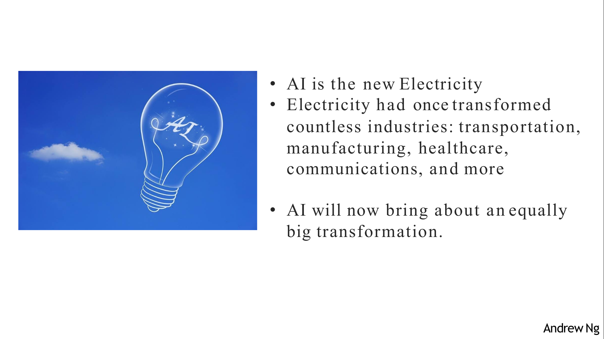

1. First course explains how to build a neural network, including a deep neural network
2. Second course is about improving deep learning perormance
3. Third course explains how to structure a machine learning project (training / development / cross-validation / test). This lesson share a lot of experiences from Andrew Ng
4. Course 4 is about **convolutional neural networks (CNN)**, often applied to images
5. Course 5 explains sequence models and how to apply them to natural language processing and other problems. Sequence models includes **Recurrent Neural Networks (RNN)**, and **Long Short Term Memory models (LSTM)**, often apply for natural **language processing (NLP)** problems, speech recognition, music generations

> 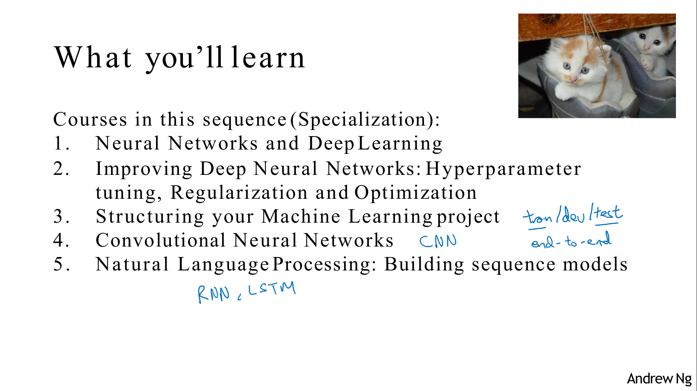

# Introduction to deep leatning

## What is a Neural Network?

To predict price of a house as a function of its size, we can use linear regression
As price cannot be negative, we compose this linear regression with function f(x)=max(0,x) (RELU, rectified linear unit)
This function function predict the housing prices can be considered as a very simple neural network. 

> 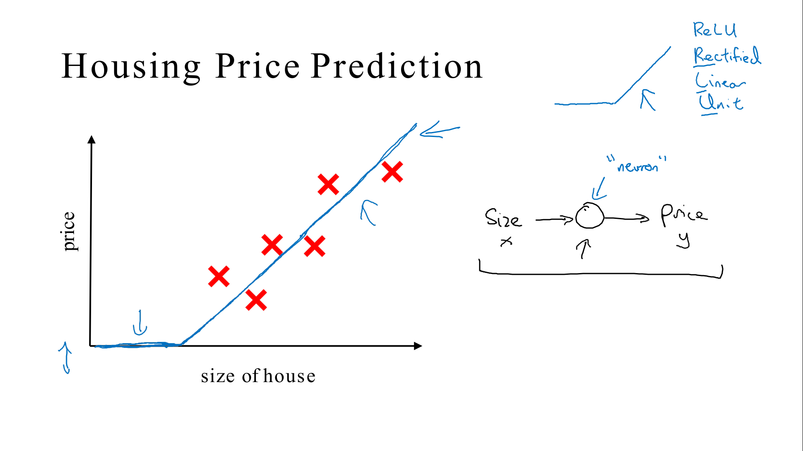

If we add other features (number of bedrooms, zip code, and wealth), we can consider that 
- one of the things that really affects the price of a house is family size. And that the size and the number of bedrooms determines whether or not a house can fit the family's family size.
-  zip code and wealth can estimate the school quality
- ... 

> 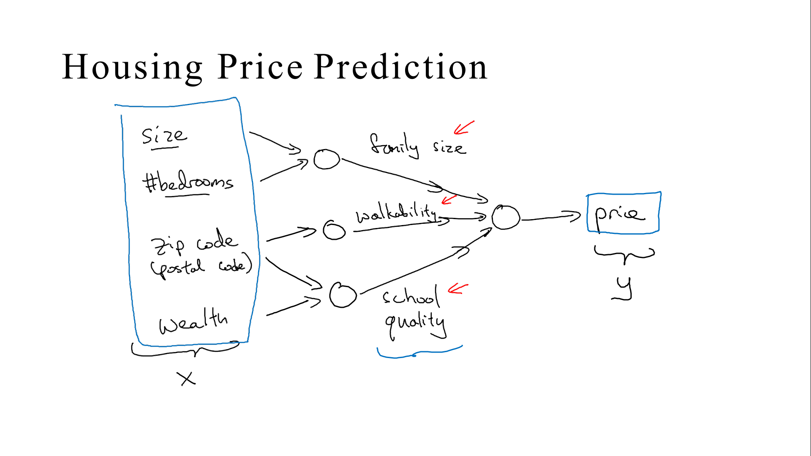

But when working with neural networks, you actually implements the following
The job of the neural network is to predict the price, with features in inputs
Notes that all units in the middle (calles hiddent units of neural networks) are connected to all features

And rather than saying this first node represents family size and family size depends only on the features X1 and X2. Instead, we're going to let the neural network decide whatever this node to be. And we'll give the network all four input features to compute whatever it wants.

Because every input feature is connected to every one of these circles in the middle. And the remarkable thing about neural networks is that, given enough data about x and y, given enough training examples with both x and y, neural networks are remarkably good at figuring out functions that accurately map from x to y.

> 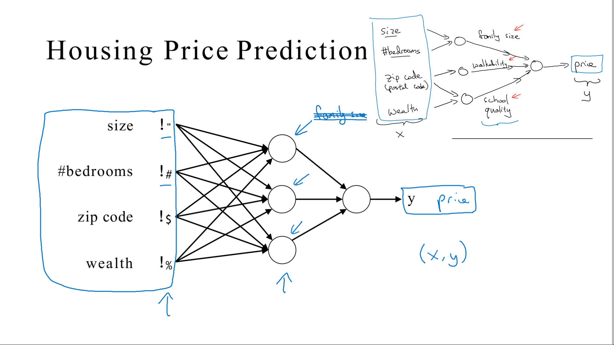

## Supervised Learning with Neural Networks

There's a lot of hype about neural networks, and perhaps some of that hype is justified. Today, almost all the economic value created by neural networks has been through one type of machine learning, called supervised learning.

Supervised machine learning or more commonly, supervised learning, refers to algorithms that learn x to y or input to output mappings.

The key characteristic of supervised learning is that you give your learning algorithm examples to learn from. For a given input x, you give the right answers (the correct label y ) It's by seeing correct pairs of input x and desired output label y that the learning algorithm learns to give a reasonably accurate prediction of the output.

> 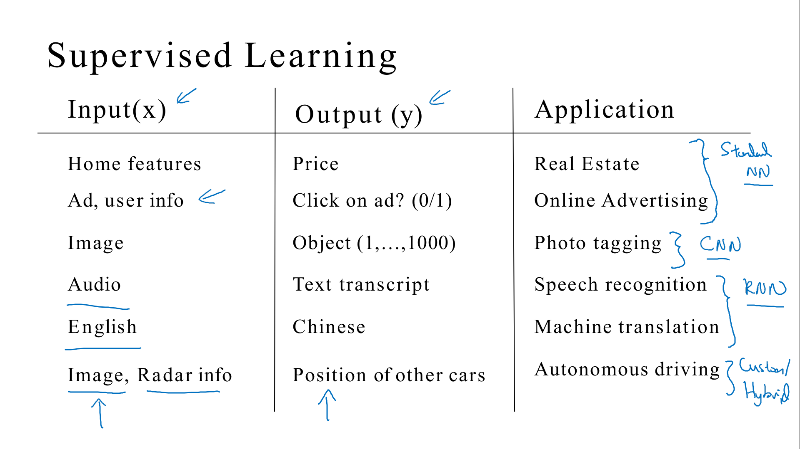

- Standard Neural Network SNN
- Convolutional Neural Network CNN often use for images.
- Recurrent Neural Networks (RNN) are very good for one-dimensional sequence data that has a temporal component.

> 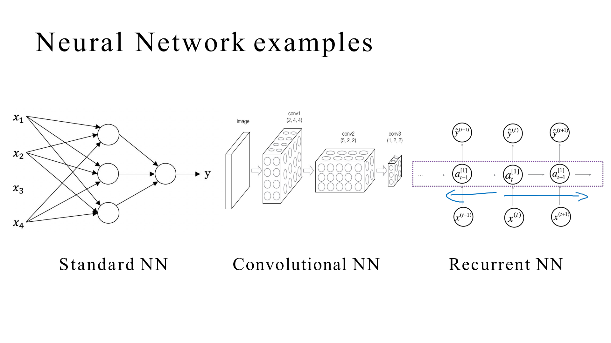

Structured vs unstructured data.

> 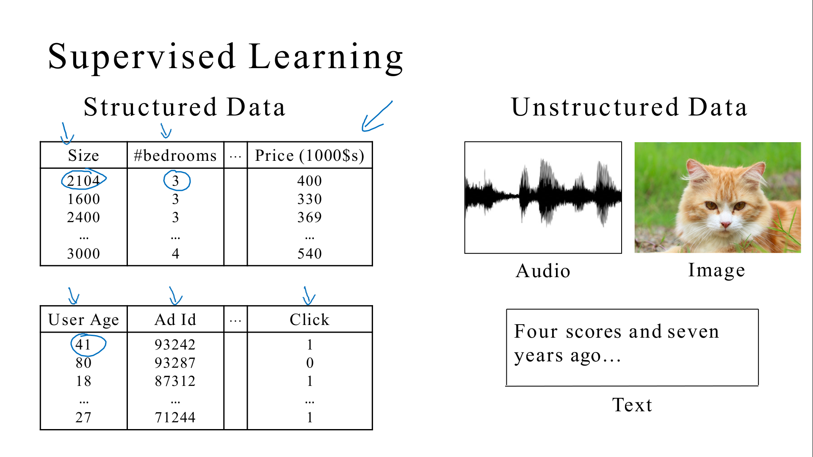

## Why is Deep Learning taking off?

Neural network need data and computer performance

> 

In the early days in their modern rise of deep learning, ability to train very large neural networks increased thanks to performance (CPU or GPU that enabled us to make a lot of progress) and data. But increasingly, especially in the last several years, we've seen tremendous algorithmic innovation (code run much faster)

The other reason that fast computation is important is that the development cycle is much faster.

> 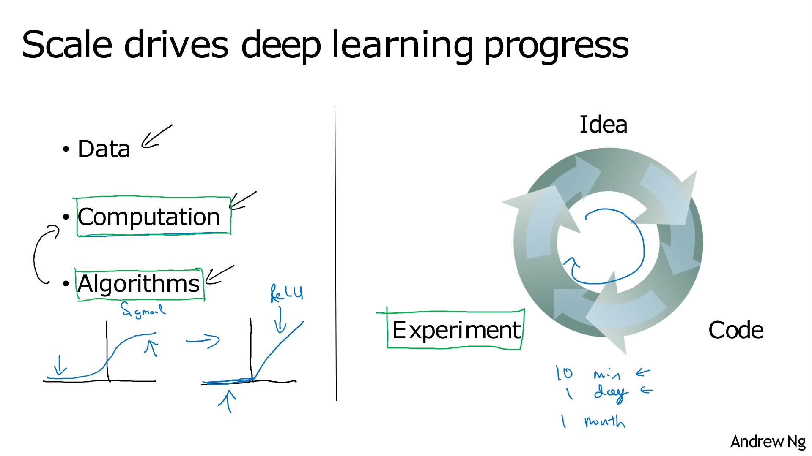

## About this Course

> 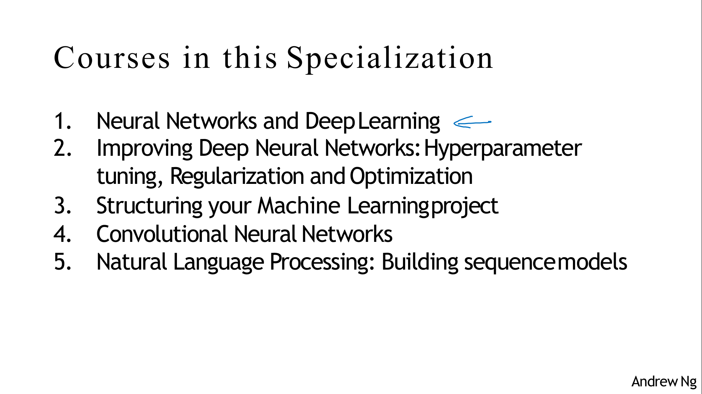

> 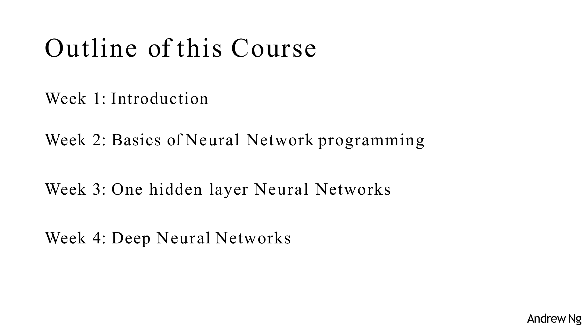

# Heroes of Deep Learning

## Geoffrey Hinton Interview

