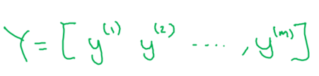

# Neural networks Basics

Set up a machine learning problem with a neural network mindset and use vectorization to speed up your models.

Learning Objectives
- Build a logistic regression model structured as a shallow neural network
- Build the general architecture of a learning algorithm, including parameter initialization, cost function and gradient calculation, and optimization implemetation (gradient descent)
Implement computationally efficient and highly vectorized versions of models
- Compute derivatives for logistic regression, using a backpropagation mindset
- Use Numpy functions and Numpy matrix/vector operations
- Work with iPython Notebooks
- Implement vectorization across multiple training examples
- Explain the concept of broadcasting

# Logistic Regression as a Neural Network

## Binary Classification

Logistic regression is an algorithm for binary classification.
Here's an example of a binary classification problem : image contains a cat (output = 1) or not (output = 0), with an image of 64 pixels x 64 pixels 

> 

- A single training example is represented by a pair, (x,y) where 
    - x is an $n_x$-dimensional feature vector 
    - y, the label, is either 0 or 1
- Training example is $(x^{(1)}, y^{(1)}), (x^{(2)}, y^{(2)}), ... (x^{(m)}, y^{(m)})$
- $m$ or $m_{train}$ the number of train examples
- $m_{test}$ the number of test examples

> 

Finally, to output all of the training examples into a more compact notation, we're going to define a matrix, X with :
- $m$ columns (number of train examples)
- $n_x$ rows, where $n_x$ is the dimemsion of the input feature x

In python $Y.shape=(n_x,m)$

> 

Notice that in other causes, you might see the matrix capital X defined by stacking up the train examples in rows, X1 transpose down to Xm transpose. Implementing neural networks using this first convention makes the implementation much easier.

Concenring label we also use matrix notation. The dimension of the matrix is (1 x m), in python $Y.shape = (1,m)$

> 

## Logistic Regression

 > 

$\hat{y}$ (y hat) is the prediction of y, is the probability of of y=1, given the input x
> 

With w ($n_x$ dimension vector) and b (real number) as parameter, $\hat{y} = w^T.x + b$, with $w^T$ the w transpose (column instead of line for matrix multiplication compataibility)

> 

This is linear regression, that is not correct for binary classification (0 < y < 1). That's why we use the sigmoid function

> 

When we programmed neural networks, we'll usually keep the parameter W and parameter B separate, but there is another convention in which you merge w and b, introducing an extra feature $x_0=1$

> 

## Logistic Regression Cost Function

> 

Logitic regression model

> 

With **loss function** or **error function** we can use to measure how well algorithm is performant.
The following **square error** function doesn't fit for logistic regression, because it's not convex 

> 

That's why we introduce the following loss function, called **cross entropy** 

> 

Loss function is defined to a single train example. **Cost function** is for the whole set of training example

> 

## Gradient Descent

https://github.com/mauvaisetroupe/machine-learning-specialization-coursera/blob/main/c1-supervised-ML-regression-and-classification/week1/README.md#gradient-descent

> 

> 

Inthe code, by convention we use dw and db 
> 

## Derivatives

## More Derivative Examples

## Computation Graph

## Derivatives with a Computation Graph

## Logistic Regression Gradient Descent

## Gradient Descent on m Examples

## Derivation of DL/dz (Optional)

# Python and Vectorization

## Vectorization

## More Vectorization Examples

## Vectorizing Logistic Regression

## Vectorizing Logistic Regression's Gradient Output

## Broadcasting in Python

## A Note on Python/Numpy Vectors

## Quick tour of Jupyter/iPython Notebooks

## Explanation of Logistic Regression Cost Function (Optional)

# Heroes of Deep Learning

## Pieter Abbeel Interview

