# Neural networks Basics
{: .no_toc}

Set up a machine learning problem with a neural network mindset and use vectorization to speed up your models.

Learning Objectives
- Build a logistic regression model structured as a shallow neural network
- Build the general architecture of a learning algorithm, including parameter initialization, cost function and gradient calculation, and optimization implemetation (gradient descent)
Implement computationally efficient and highly vectorized versions of models
- Compute derivatives for logistic regression, using a backpropagation mindset
- Use Numpy functions and Numpy matrix/vector operations
- Work with iPython Notebooks
- Implement vectorization across multiple training examples
- Explain the concept of broadcasting

  

    Table of contents
  

  {: .text-delta }
1. TOC
{:toc}

# Logistic Regression as a Neural Network

## Binary Classification

Logistic regression is an algorithm for binary classification.
Here's an example of a binary classification problem : image contains a cat (output = 1) or not (output = 0), with an image of 64 pixels x 64 pixels 

> 

- A single training example is represented by a pair, (x,y) where 
    - x is an $n_x$-dimensional feature vector 
    - y, the label, is either 0 or 1
- Training example is $(x^{(1)}, y^{(1)}), (x^{(2)}, y^{(2)}), ... (x^{(m)}, y^{(m)})$
- $m$ or $m_{train}$ the number of train examples
- $m_{test}$ the number of test examples

> 

Finally, to output all of the training examples into a more compact notation, we're going to define a matrix, X with :
- $m$ columns (number of train examples)
- $n_x$ rows, where $n_x$ is the dimemsion of the input feature x

In python $Y.shape=(n_x,m)$

> 

Notice that in other causes, you might see the matrix capital X defined by stacking up the train examples in rows, X1 transpose down to Xm transpose. Implementing neural networks using this first convention makes the implementation much easier.

Concenring label we also use matrix notation. The dimension of the matrix is (1 x m), in python $Y.shape = (1,m)$

> 

## Logistic Regression

 > 

$\hat{y}$ (y hat) is the prediction of y, is the probability of of y=1, given the input x
> 

With w ($n_x$ dimension vector) and b (real number) as parameter, $\hat{y} = w^T.x + b$, with $w^T$ the w transpose (column instead of line for matrix multiplication compataibility)

> 

This is linear regression, that is not correct for binary classification (0 < y < 1). That's why we use the sigmoid function

> 

When we programmed neural networks, we'll usually keep the parameter W and parameter B separate, but there is another convention in which you merge w and b, introducing an extra feature $x_0=1$

> 

## Logistic Regression Cost Function

> 

Logitic regression model

> 

With **loss function** or **error function** we can use to measure how well algorithm is performant.
The following **square error** function doesn't fit for logistic regression, because it's not convex 

> 

That's why we introduce the following loss function, called **cross entropy** 

> 

Loss function is defined to a single train example. **Cost function** is for the whole set of training example

> 

## Gradient Descent

https://github.com/mauvaisetroupe/machine-learning-specialization-coursera/blob/main/c1-supervised-ML-regression-and-classification/week1/README.md#gradient-descent

> 

> 

Inthe code, by convention we use **dw** and **db** 
> 

## Derivatives

> 

## More Derivative Examples

> 

> 

## Computation Graph

https://github.com/mauvaisetroupe/machine-learning-specialization-coursera/blob/c1e3ee9a248c4dfa2c129fc1d5bd7d5b64b71f78/c2-advanced-learning-algorithms/week2/README.md#computation-graph-optional

> 

## Derivatives with a Computation Graph

https://github.com/mauvaisetroupe/machine-learning-specialization-coursera/blob/c1e3ee9a248c4dfa2c129fc1d5bd7d5b64b71f78/c2-advanced-learning-algorithms/week2/README.md#computation-graph-optional

<!--
> 
> 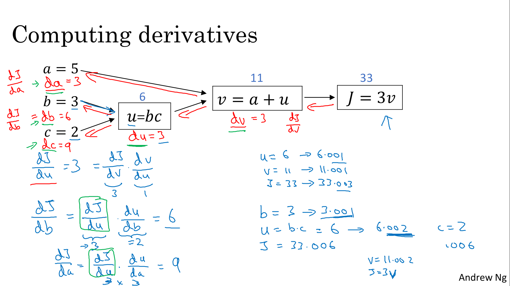
-->

> 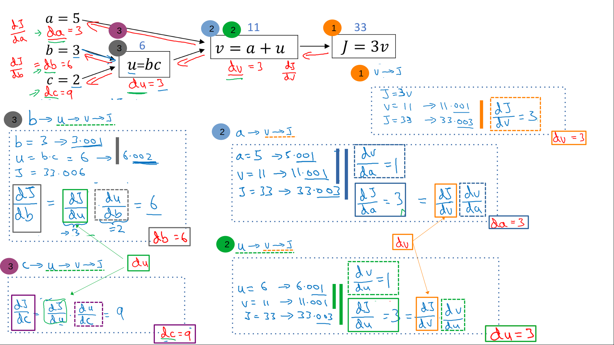

Python convention, dJ/da is denoted da, dJ/dv is denoted dv

> 

In summary :

> 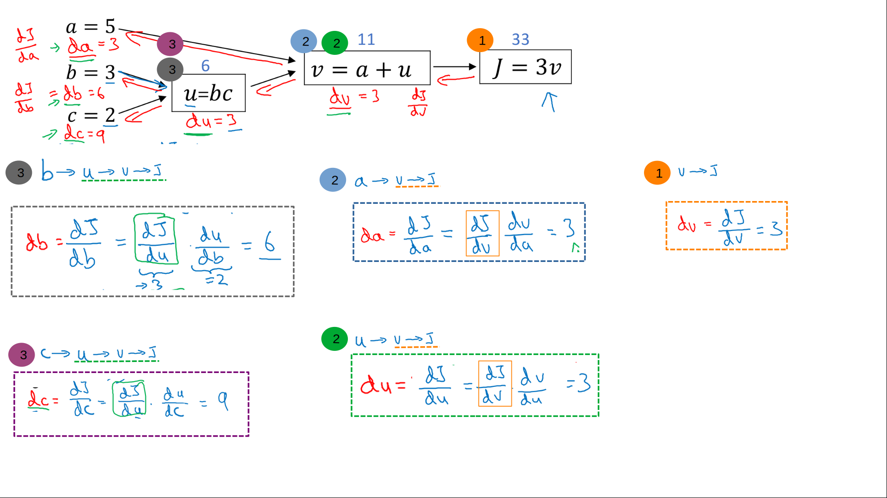

## Logistic Regression Gradient Descent

**This demo don't use backward propagation** (adding a epsilon and check how much computed value increase), but use calculus derivatives, especially chain derivative rules.

> 

<!-- >  -->

We calculate the partial derivatives and apply chain derivatives rules

> 

$dz = a - y$

$dw_1 = x_1 . dz,  \quad   dw_2 = x_2 . dz$

If we put derivatives on the computation graph (summary)

> 

## Gradient Descent on m Examples

> 

One single step of gradient descent, with 2 loops (one for the training example, and another one for the features). This will be avoided by vectorization

Remember :
$dz = a - y, \quad  dw_1 = x_1 . dz, \quad  dw_2 = x_2 . dz$

> 

# Python and Vectorization

## Vectorization

Vectorization is basically the art of getting rid of explicit for loops in your code. 

> 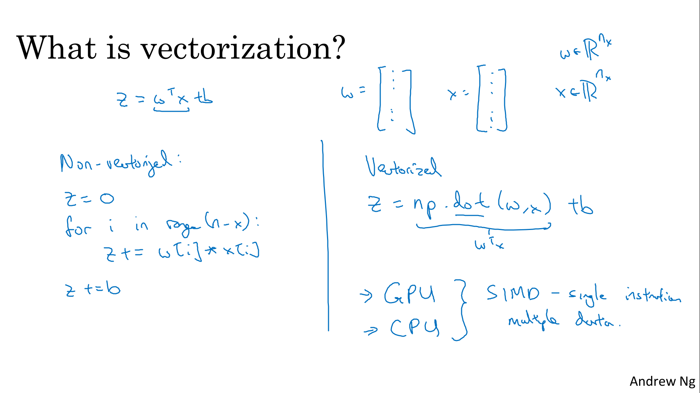

Python code

> 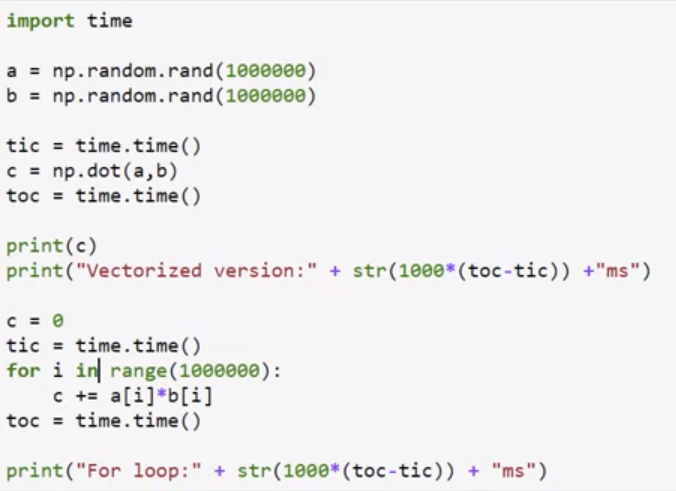

Performance result

> 

## More Vectorization Examples

Example 2 : Matrix x vector

> 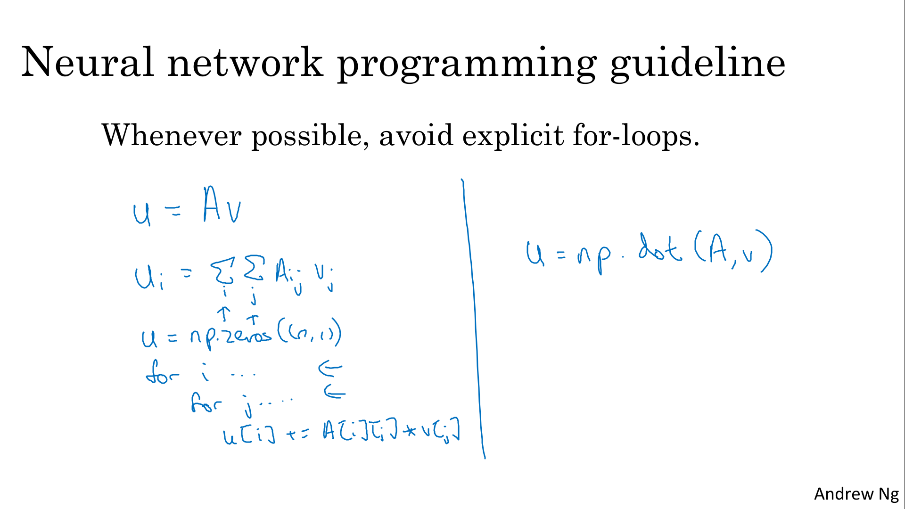

Example 2 : apply operation (exponential, log, ...) on every element of this vector v

> 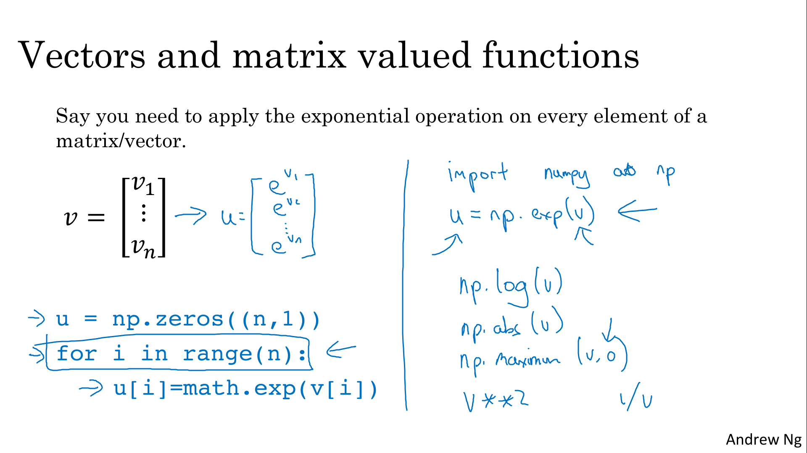

> 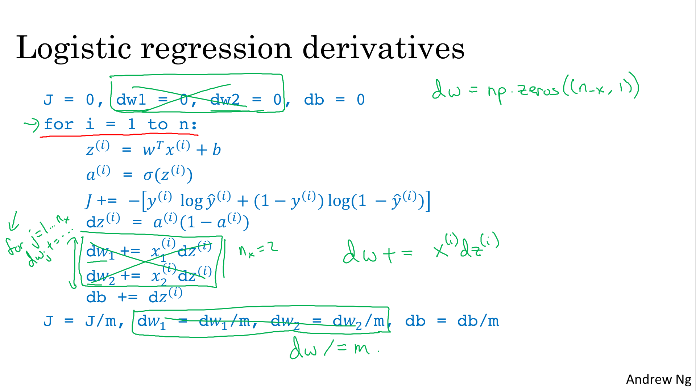

## Vectorizing Logistic Regression

> 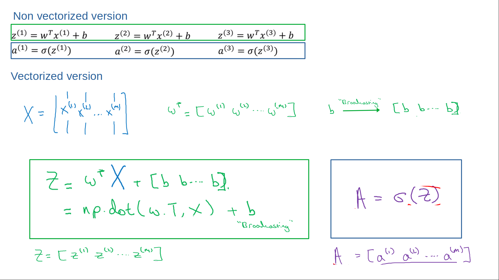

## Vectorizing Logistic Regression's Gradient Output

> 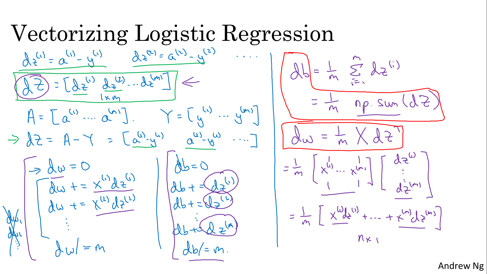

To implement multiple iterations as a gradient descent, we still need a for loop over the number of iterations. 

> 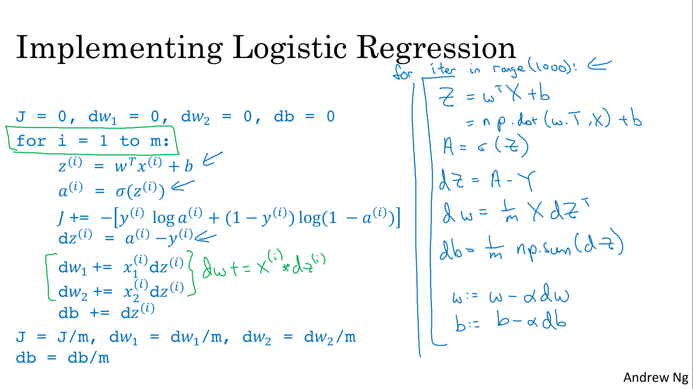

## Broadcasting in Pyhton

Broadcasting is an operation of matching the dimensions of differently shaped arrays in order to be able to perform further operations on those arrays (eg per-element arithmetic).

> 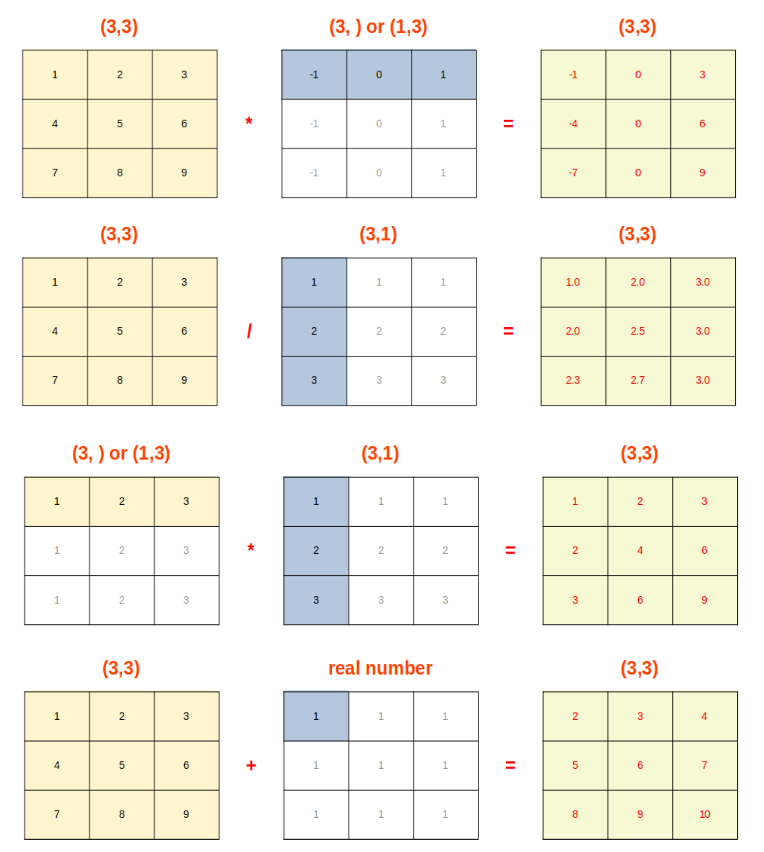

## A Note on Python/Numpy Vectors

- it's a strength because they create expressivity of the language. A great flexibility of the language lets you get a lot done even with just a single line of code. 
The ability of python to allow you to use broadcasting operations and more generally, the great flexibility of the python numpy program language is, both a strength as well as a weakness of the programming language: 
- cut also a weakness because broadcasting and flexibility, sometimes can introduce very subtle bugs. 

> 

## Explanation of Logistic Regression Cost Function (Optional)

> 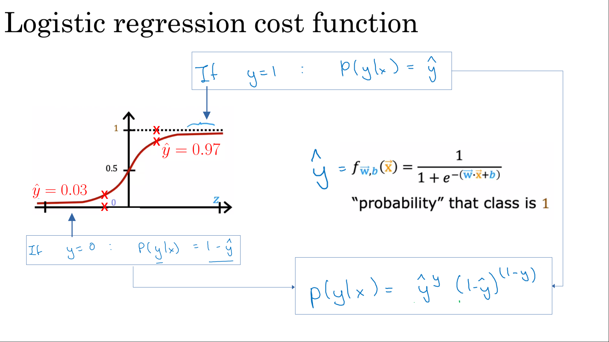

- `log(p(y|x))` = - Loss Function
- Minimizing the loss corresponds with maximizing `log(p(y|x))`

> 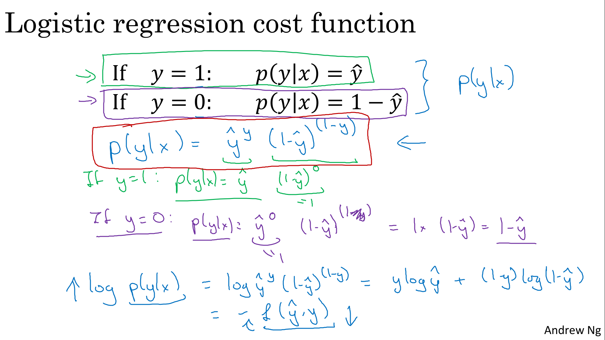

> 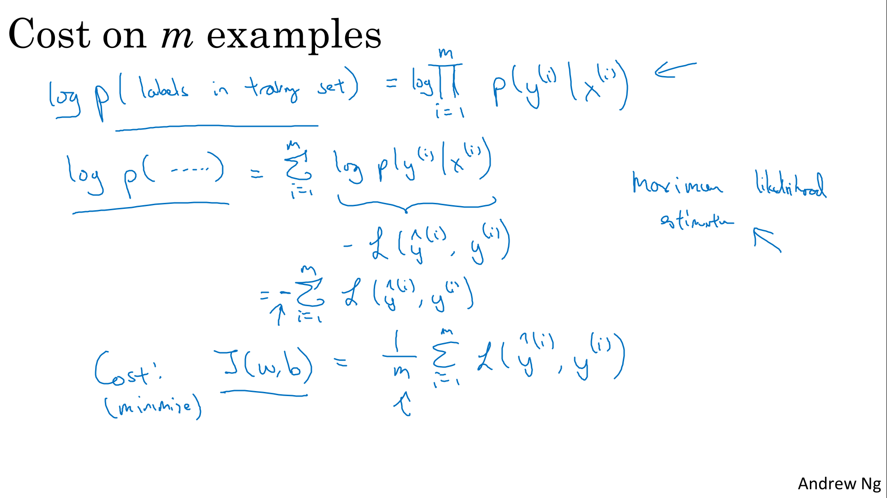

# Heroes of Deep Learning

## Pieter Abbeel Interview

