# Deep L-layer Neural Network
{: .no_toc }

Analyze the key computations underlying deep learning, then use them to build and train deep neural networks for computer vision tasks.

Learning Objectives
- Describe the successive block structure of a deep neural network
- Build a deep L-layer neural network
- Analyze matrix and vector dimensions to check neural network implementations
- Use a cache to pass information from forward to back propagation
- Explain the role of hyperparameters in deep learning
- Build a 2-layer neural network

  

    Table of contents
  

  {: .text-delta }
1. TOC
{:toc}

# Deep L-layer Neural Network

## Deep L-layer Neural Network

Welcome to the fourth week of this course. By now, you've seen 
- forward propagation and back propagation in the context of a neural network, with a single hidden layer, 
- logistic regression, 
- vectorization, 
- and when it's important to initialize the ways randomly. 

If you've done the past couple weeks homework, you've also implemented and seen some of these ideas work for yourself

- **shallow** model (one layer) vs **deep** model (5 hidden layer)

> 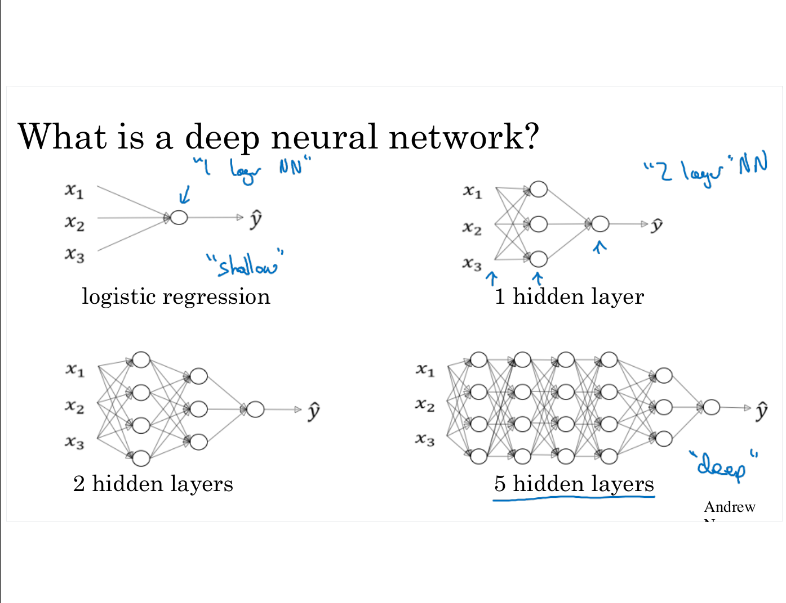

Notation for deep neural network:
- l the number of layer
- $n^{[l]}$ = number of unit in layer l
- $a^{[l]}$ = activation layer in layer l 
- $a^{[l]} = g^{[l]}(z^{[l]})$  with g the activation function
> 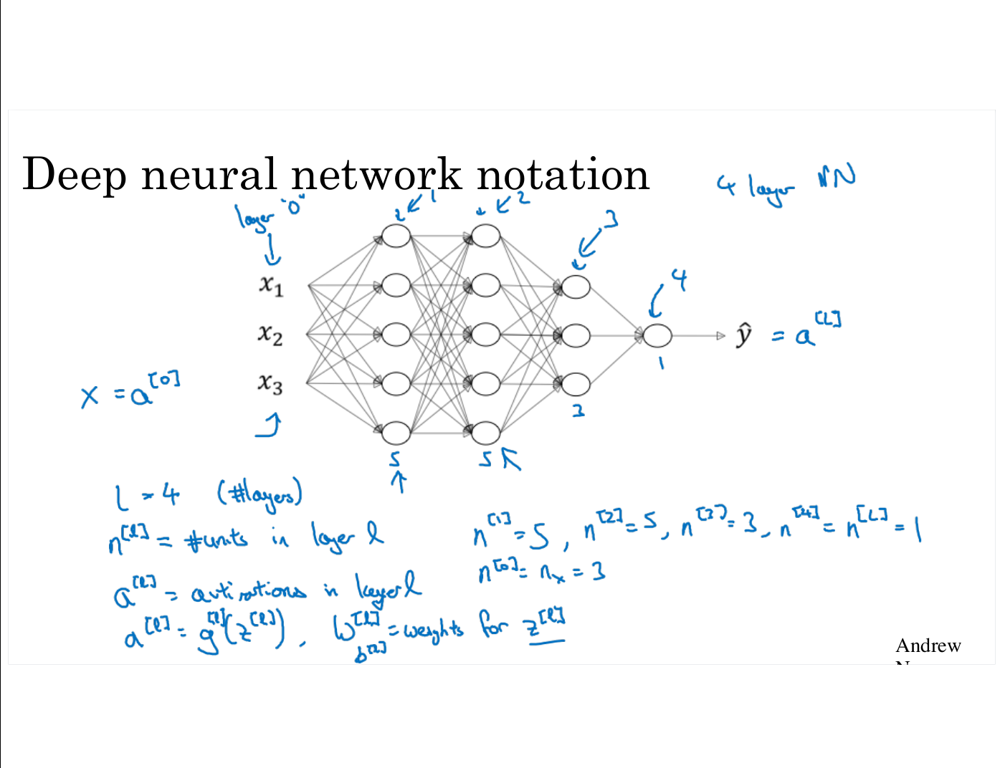

## Forward Propagation in a Deep Network

> 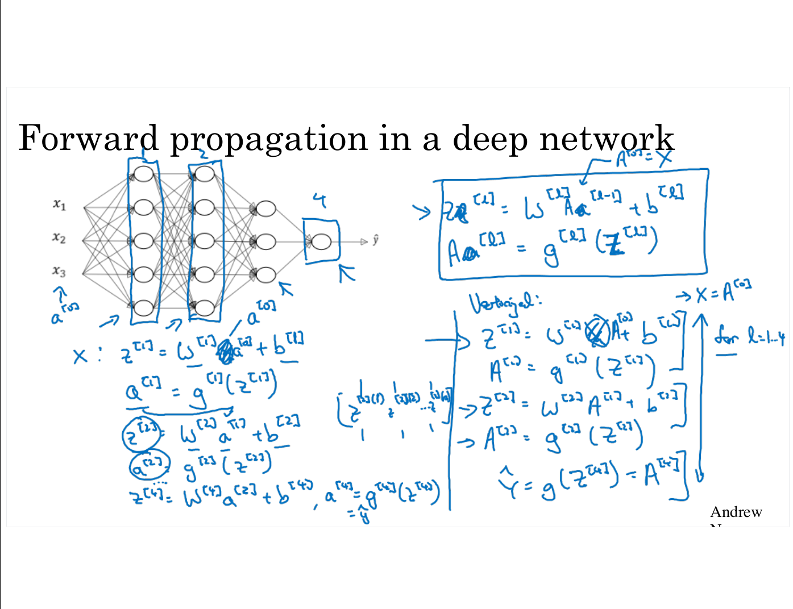

## Getting your Matrix Dimensions Right

> 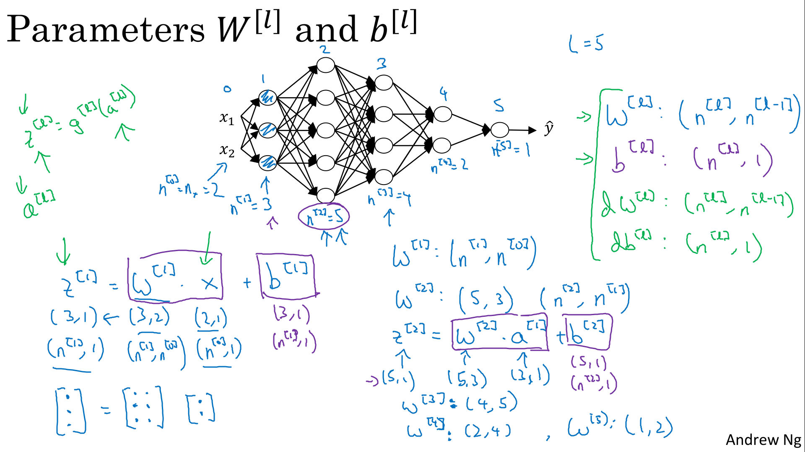

> 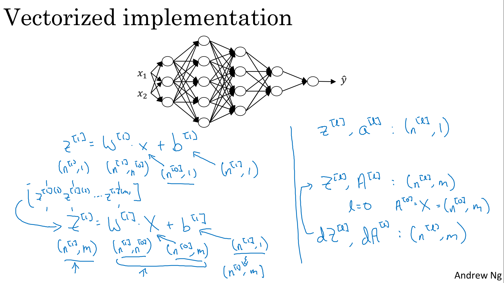

> 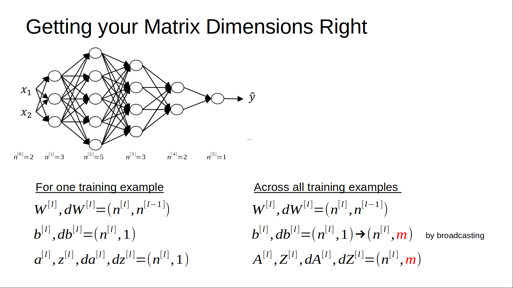

## Why Deep Representations?

> 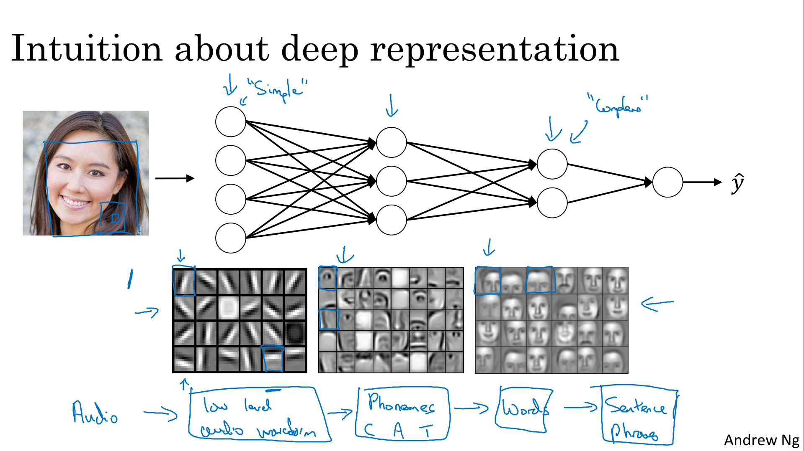

> 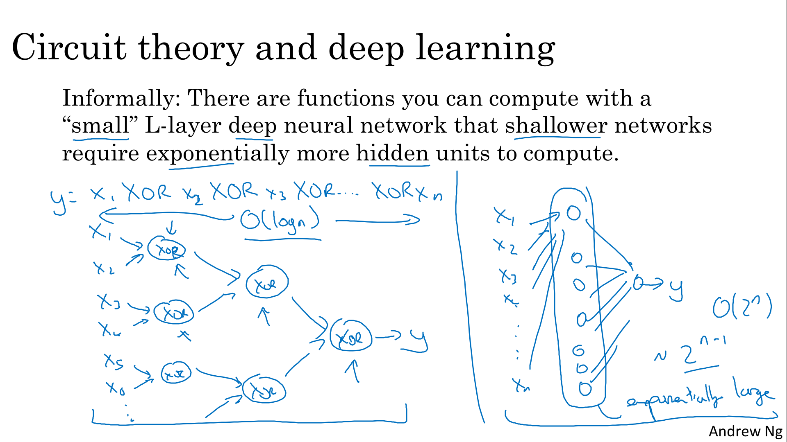

 Now, in addition to this reasons for preferring deep neural networks, to be perfectly honest, I think the other reasons the term deep learning has taken off is just branding. 

## Building Blocks of Deep Neural Networks

In the earlier videos from this week, as well as from the videos from the past several weeks, you've already seen the basic building blocks of forward propagation and back propagation, the key components you need to implement a deep neural network. Let's see how you can put these components together to build your deep net.

Explanation on layer `l`.

> 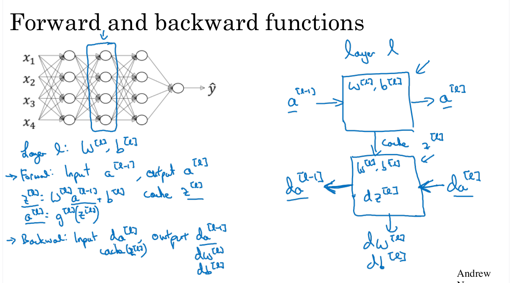

Note that during forward, we cache `Z[l]`, but also `W[l]` and `b[l]`

> 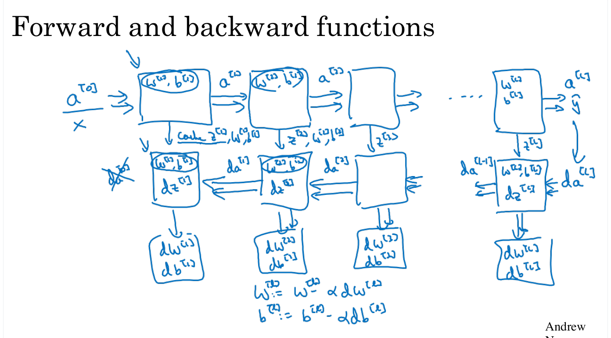

 So you've now seen what are the basic building blocks for implementing a deep neural network. In each layer there's a forward propagation step and there's a corresponding backward propagation step. And has a cache to pass information from one to the other. In the next video, we'll talk about how you can actually implement these building blocks

## Forward and Backward Propagation

> 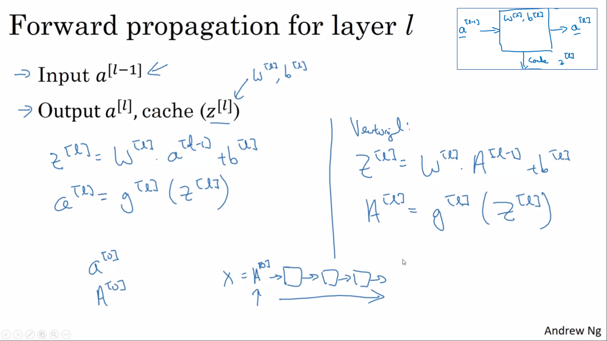

In addition to input value, we have cached values :
- `Z[l]` but also `W[l]` and `b[l]`
- I didn't explicitly put `a[l-1]` in the cache, but it turns out you need this as well 

> 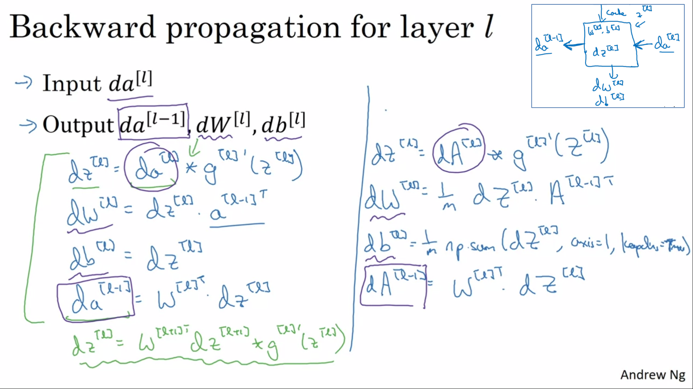

- For the forward recursion, we will initialize it with the input data X
- For backward loop, when using logistic regression (for binary classification), we initialize `da[] = -y/a + (1-y)/1-a)` (see [logistic regression recap](../week2/#logistic-regression-gradient-descent)) 

> 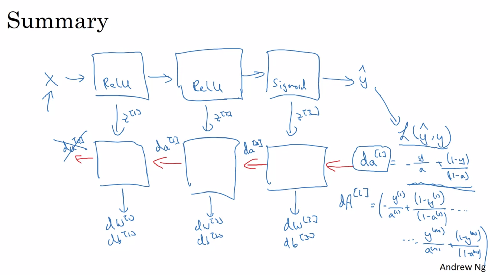

## Parameters vs Hyperparameters

> 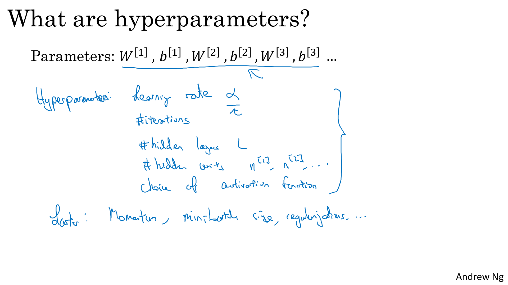

> 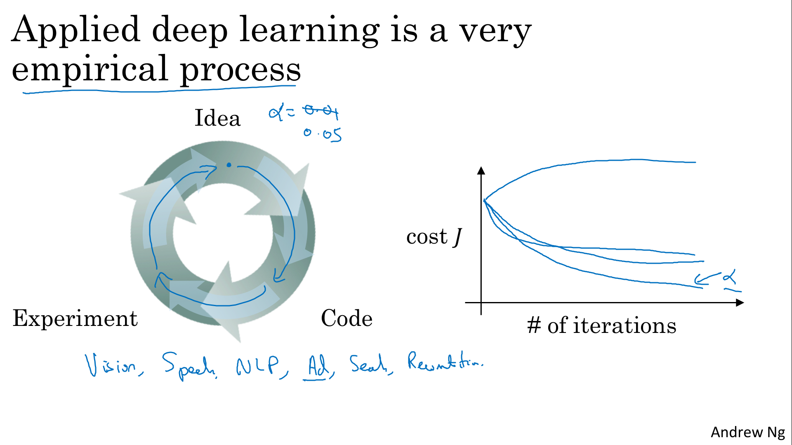
## What does this have to do with the brain?

> 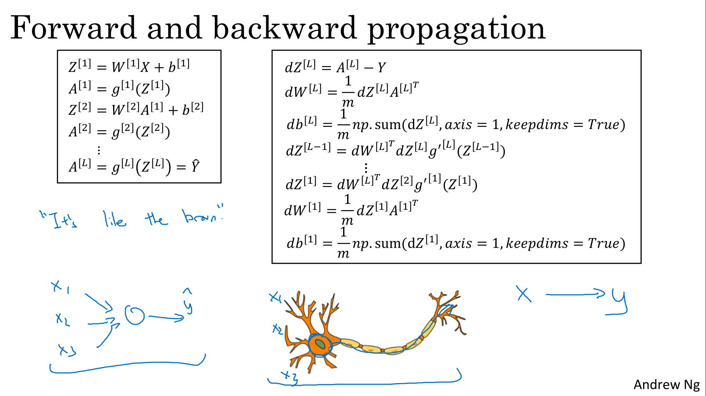
