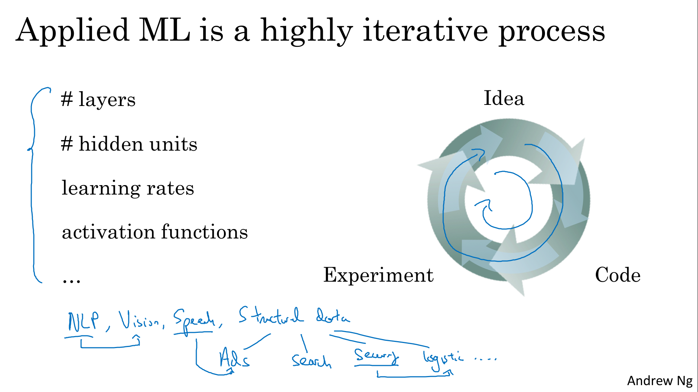
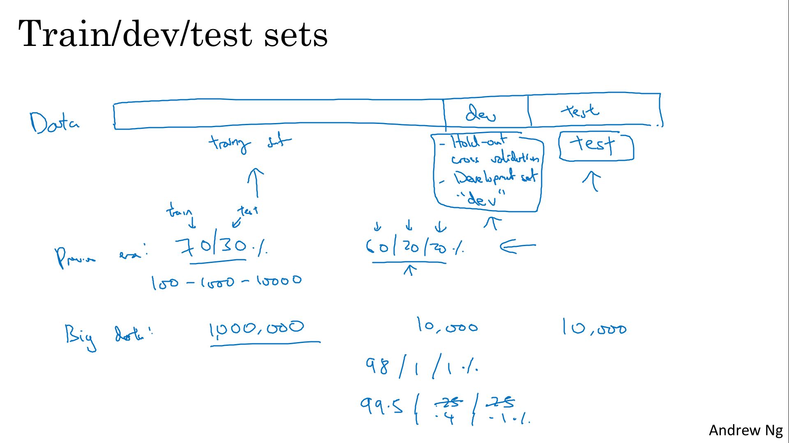
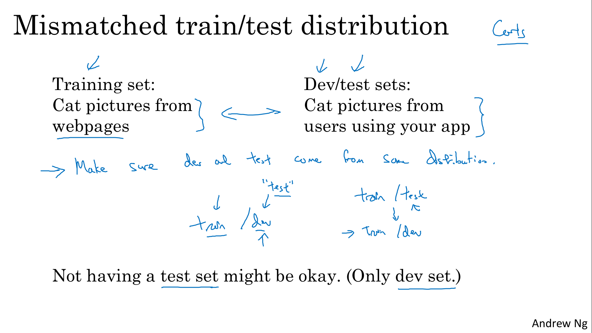
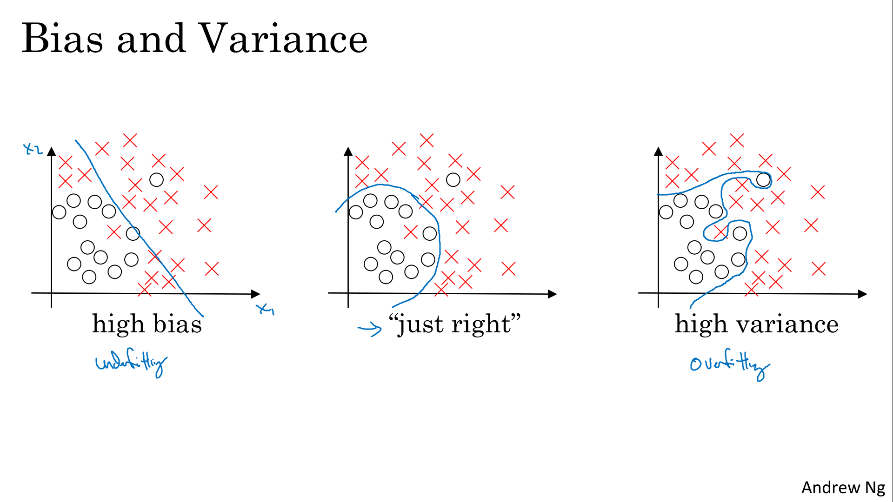
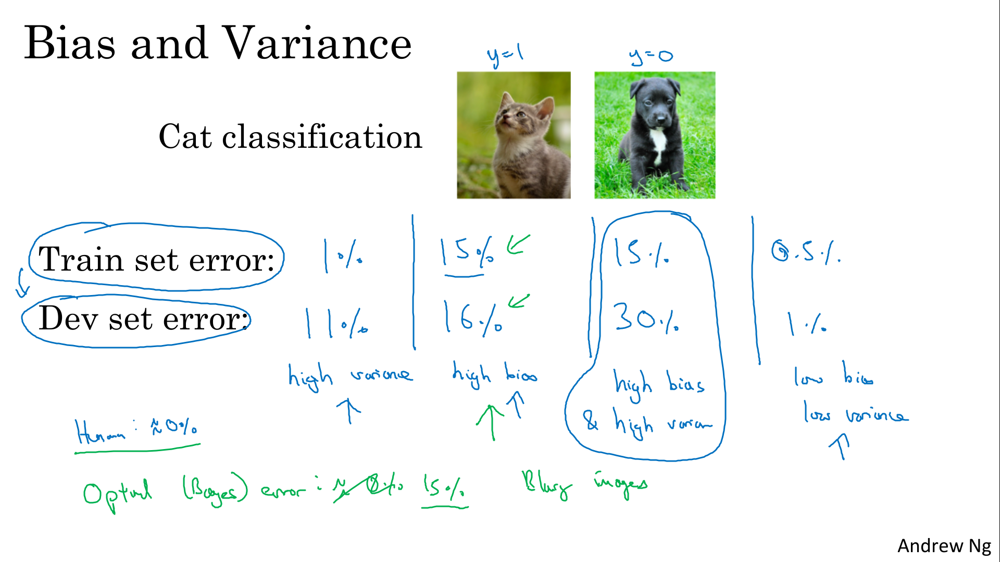
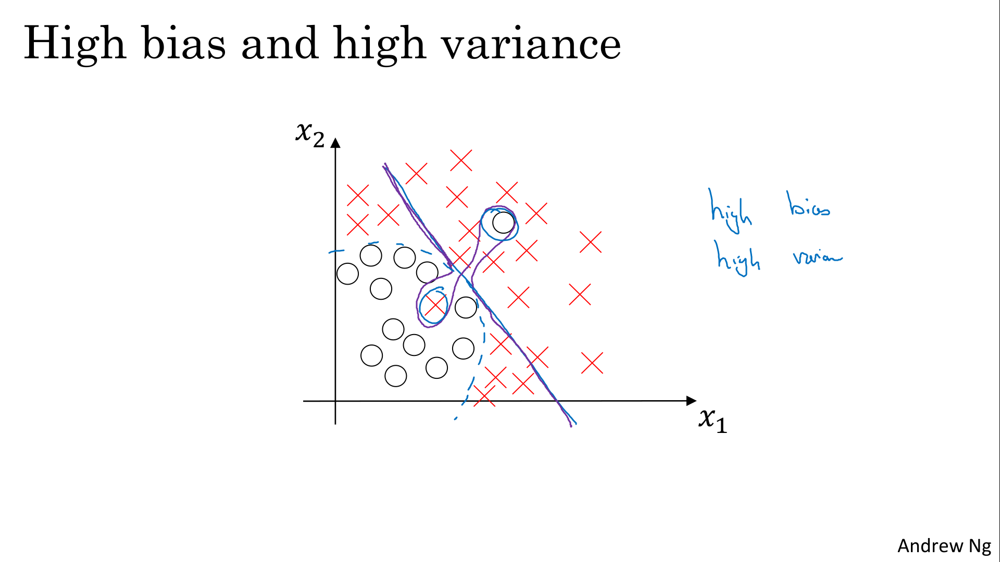
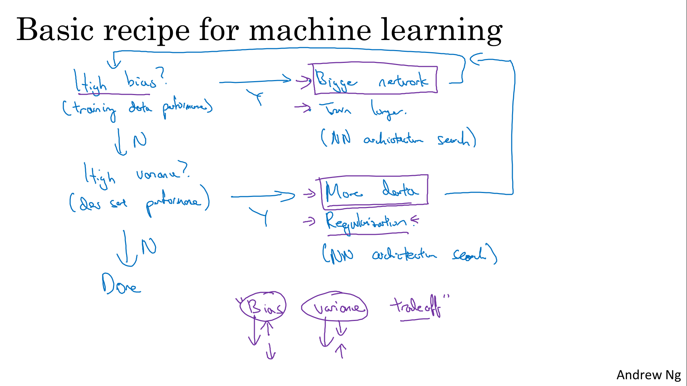

# Practical Aspects of Deep Learning

Discover and experiment with a variety of different initialization methods, apply L2 regularization and dropout to avoid model overfitting, then apply gradient checking to identify errors in a fraud detection model.

Learning Objectives
- Give examples of how different types of initializations can lead to different results
- Examine the importance of initialization in complex neural networks
- Explain the difference between train/dev/test sets
- Diagnose the bias and variance issues in your model
- Assess the right time and place for using regularization methods such as dropout or L2 regularization
- Explain Vanishing and Exploding gradients and how to deal with them
- Use gradient checking to verify the accuracy of your backpropagation implementation
- Apply zeros initialization, random initialization, and He initialization
- Apply regularization to a deep learning model

# Setting up your Machine Learning Application

##  Train / Dev / Test sets

When training a neural network, you have to make a lot of decisions, (how many layers, how many hidden units, ...).
In practice, applied machine learning is a highly iterative process, in which you often start with an idea and then you just have to code it up and try it, by running your code. 

Intuitions from one domain or from one application area often do not transfer to other application areas

> 

Development set is  used to see which of many different models performs best. And then after having done this long enough, when you have a final model that you want to evaluate, you can take the best model you have found and evaluate it on your test set in order to get an unbiased estimate of how well your algorithm is doing. S

| Area | Range of data | Split|
|---|---|---|
|Previous area|100 - 100'000|60%-20%-20%|
|Big Data area|1'000'000|98%-1%-1%|

> 

The rule of thumb I'd encourage you to follow, in this case, is to make sure that the dev and test sets come from the same distribution.

> 

##  Bias / Variance

Bias and Variance is one of those concepts that's easily learned but difficult to master. 

> 

Assumimg that humans achieve 0% errors, 15% is not a good score (**Bayes error rate**)

> 

What does high bias and high variance look like? Example of classifier that is mostly linear, and therefore, underfits the data (we're drawing this is purple), but if somehow your classifier does some weird things, then it is actually overfitting parts of the data as well.

> 

##  Basic Recipe for Machine Learning

> 

# Regularizing your Neural Network

##  Regularization

##  Why Regularization Reduces Overfitting?

##  Dropout Regularization

##  Understanding Dropout

##  Other Regularization Methods

# Setting Up your Optimization Problem

##  Normalizing Inputs

##  Vanishing / Exploding Gradients

##  Weight Initialization for Deep Networks

##  Numerical Approximation of Gradients

##  Gradient Checking

##  Gradient Checking Implementation Notes

# Heroes of deep learning

##  Yoshua Bengio Interview