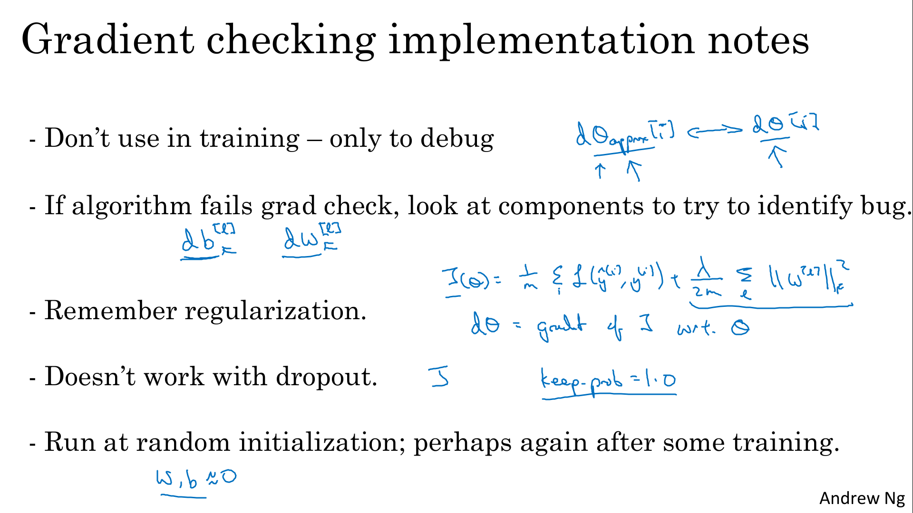

# Practical Aspects of Deep Learning

Discover and experiment with a variety of different initialization methods, apply L2 regularization and dropout to avoid model overfitting, then apply gradient checking to identify errors in a fraud detection model.

Learning Objectives
- Give examples of how different types of initializations can lead to different results
- Examine the importance of initialization in complex neural networks
- Explain the difference between train/dev/test sets
- Diagnose the bias and variance issues in your model
- Assess the right time and place for using regularization methods such as dropout or L2 regularization
- Explain Vanishing and Exploding gradients and how to deal with them
- Use gradient checking to verify the accuracy of your backpropagation implementation
- Apply zeros initialization, random initialization, and He initialization
- Apply regularization to a deep learning model


# Setting up your Machine Learning Application

##  Train / Dev / Test sets


When training a neural network, you have to make a lot of decisions, (how many layers, how many hidden units, ...).
In practice, applied machine learning is a highly iterative process, in which you often start with an idea and then you just have to code it up and try it, by running your code. 

Intuitions from one domain or from one application area often do not transfer to other application areas

> 

Development set is  used to see which of many different models performs best. And then after having done this long enough, when you have a final model that you want to evaluate, you can take the best model you have found and evaluate it on your test set in order to get an unbiased estimate of how well your algorithm is doing. S

| Area | Range of data | Split|
|---|---|---|
|Previous area|100 - 100'000|60%-20%-20%|
|Big Data area|1'000'000|98%-1%-1%|

> 

The rule of thumb I'd encourage you to follow, in this case, is to make sure that the dev and test sets come from the same distribution.

> 


##  Bias / Variance

Bias and Variance is one of those concepts that's easily learned but difficult to master. 

> 

Assumimg that humans achieve 0% errors, 15% is not a good score (**Bayes error rate**)

> 

What does high bias and high variance look like? Example of classifier that is mostly linear, and therefore, underfits the data (we're drawing this is purple), but if somehow your classifier does some weird things, then it is actually overfitting parts of the data as well.

> 


##  Basic Recipe for Machine Learning

If your algorithm has a high bias, you can try 
- increasing the size of the neural network by adding more layers 
- increasing the size of the hidden units
- running it for a longer time 
- using different optimization algorithms. I

f your algorithm has a high variance, you can try 
- collecting more data 
- applying regularization techniques. 

It is recommended to try these methods iteratively until a low bias and low variance are achieved. In the past, there was a "Bias/variance tradeoff," but with the advent of deep learning, there are more options available to address this problem. 

Training a bigger neural network is a viable option to consider.

> 

# Regularizing your Neural Network

##  Regularization

For logistic regression

- L2 regularization : $$Loss = Error(Y - \widehat{Y}) +  \frac{\lambda}{2m}   \sum_1^n w_i^{2}$$
- L1 regularization : $$Loss = Error(Y - \widehat{Y}) +  \frac{\lambda}{2m}   \sum_1^n |w_i|$$

Lambda is a reserved keyword in python (use lambd instead)

> 

We introduce the frobenius norm  : $$\sum_{i=1}^{n^{[l]}}\sum_{j=1}^{n^{l-1}}(w_{ij}^{[l]})^2$$
L2 regularization has an impact onthe calculation od dW
L2 regularization is sometimes also called **weight decay** because it's just like the ordinary gradient descent, where you update w by subtracting alpha, times the original gradient you got from backprop. But now you're also, you know, multiplying w by a factor little bit less than 1

> 

##  Why Regularization Reduces Overfitting?

When lambda increases, the weights of matrices W tend to be set closer to zero.
As a result, this simplified neural network becomes smaller and almost like a logistic regression unit stacked multiple layers deep. The network moves from the overfitting case to the high bias case.

However, the intuition that many hidden units are completely zeroed out is not entirely accurate. Instead, all hidden units are still used, but their impact is significantly reduced.

> 

When lambda is large, the weights of the network are penalized for being too large. smaller weights lead to smaller values of z. causing the TANH function to behave more linearly. This means that each layer of the network will behave more like linear regression, and the entire network will be essentially a linear function.

> 

When using regularization in gradient descent, it is important to plot the cost function with the new regularization term, rather than just the old cost function without the regularization term (could have impact of the decreasing of the function)

##  Dropout Regularization

The dropout regularization eliminates randomly some neurons/weights on each iteration based on a probability (ex. 50%) and youtrain this diminished network (Andrew : "could seem crazy, but it's work!")

> 

The most common way to implement dropout is a technique called **inverted dropout**. 
Number keep.prob is the probability that a given hidden unit will be kept. So keep.prob = 0.8, then this means that there's a 0.2 chance of eliminating any hidden unit. 


```python 
import numpy as np

a3 = np.array([
    [1,2,3],
    [4,5,6],
    [7,8,9]]    
)
keep_prob = 0.8    # 0 <= keep_prob <= 1

# the generated number that are less than 0.8 will be dropped. 80% stay, 20% dropped
d3 = np.random.rand(a3.shape[0], a3.shape[1]) 
#[[0.64317193 0.16611306 0.59219812]
# [0.98879279 0.23947895 0.69108137]
# [0.67739204 0.36399884 0.85111087]]

d3 = d3 < keep_prob
#[[False  True  True]
# [ True  True  True]
# [ True  True  True]
# [ True  True False]]

a3 = np.multiply(a3,d3)   # keep only the values in d3
#[[0 2 3]
# [4 5 6]
# [7 8 9]]

# increase a3 to not reduce the expected value of output
# (ensures that the expected value of a3 remains the same) - to solve the scaling problem
a3 = a3 / keep_prob 

```

This inverted dropout technique by dividing by the keep.prob, ensures that the expected value of a3 remains the same (whatever you choose for keep-prob)

> 

Vector d[l] is used for forward and back propagation and is the same for them, but it is different for each iteration (pass) or training example.

**At test time we don't use dropout**. If you implement dropout at test time - it would add noise to predictions.

> 

##  Understanding Dropout


- A unit can't rely on anyone feature because anyone feature could go away at random
- Dropout can formally be shown to be an adaptive form of L2 regularization.
- Dropout can have different keep_prob per layer
- Dropout is a common regularization technique used in Computer Vision (CV) research due to the large input size of the data and the limited amount of available data, which often leads to overfitting. Therefore, many researchers in CV use dropout to mitigate this issue.
- One potential drawback of using dropout in a neural network is that the cost function J may not be well-defined, making it difficult to debug by plotting J against iteration. To address this, one approach is to temporarily disable dropout by setting all keep_probs to 1, run the code, and ensure that J monotonically decreases. Then, dropout can be re-enabled for further training.
> 


##  Other Regularization Methods

If you are over fitting getting more training data can help, but getting more training data can be expensive and sometimes you just can't get more data. 

Data augmentation is a technique commonly used in computer vision to increase the size of a dataset. 

For instance, in computer vision, flipping all images horizontally or applying random rotations and distortions can generate additional data instances. Similarly, in Optical Character Recognition (OCR), random rotations and distortions can be imposed on digits or letters to create more data. 

Although this technique doesn't produce data that is as good as real independent data, it can still be employed as a regularization technique.

> 

Early stopping is a commonly used technique in machine learning to prevent overfitting. The approach involves plotting the training set and development set cost together for each iteration. At a certain iteration, the development set cost will stop decreasing and start increasing. The best parameters for the model are determined by selecting the point at which the training set error and development set error are at their lowest (i.e., the point with the lowest training cost and the lowest development cost).

- Inconvenient : Early stopping technique simultaneously tries to minimize the cost function and overfit issues, which contradicts the orthogonalization approach (clear separation between minmizing J and managing overfiting)
- Advantage: you don't need to search a hyperparameter like in other regularization approaches (lambda in L2 regularization).

> 


# Setting Up your Optimization Problem

##  Normalizing Inputs

Normalizing the inputs can significantly accelerate the training process of a machine learning model.

Normalization involves several steps:
1. calculate the mean of the training set
2. the mean is subtracted from each input, which centers the inputs around 0
3. the variance of the training set is calculated
4. finally, the variance is normalized by dividing each input by the variance

These steps should be applied to training, dev, and testing sets (but using mean and variance of the train set).

> 

Normalizing the inputs is important because it ensures that the cost function is not elongated and inconsistent in shape. As a result, optimization is faster and more efficient.

> 


##  Vanishing / Exploding Gradients

The Vanishing / Exploding gradients occurs when your derivatives become very small (vanishing) or very big (exploding)

Demontration with a specific case : 
- z=W.a (b=0) 
- g(z)=z

If W > I (Identity matrix - particular example...) the activation and gradients will explode

And If W < I (Identity matrix) the activation and gradients will vanish.  

> 

##  Weight Initialization for Deep Networks

A partial solution to the Vanishing / Exploding gradients is the choice of the random initialization of weights. 

Demonstration is done for a single neurone, with the sipmplification of b=0. We want ```Z = W1X1 + W2X2 + ... + WnXn``` not blow up and not become too small, so the larger n is, the smaller we want Wi to be (if you sum up a lot of term, you want each of term to be small)

One reasonable thing to do would be to set the variance ```Var(W)=1/n```, where n is the number of input features. The intuition is that 
- if the input features of activations are roughly mean 0 and variance 1 
- variance(W) = 1/n, so each of the weight matrices W, is close to 1 
- then this would cause z to also take on a similar scale 

Differents formulas :
- Generally for layer l, we set ```W[l]=np.random.randn(shape) * np.sqrt(1/n[l-1]).``` (Xavier initialization)
- For relu activation, it's better to set ```Var(W)=2/n```, and so we have ```W[l]=np.random.randn(shape) * np.sqrt(2/n[l-1])``` (He initialization or He-et-al Initialization)
- For tanh activation, Xavier initialization is used
- ```W[l]=np.random.randn(shape) * np.sqrt(2/(n[l-1]+n[l]))``` can also be used (Yoshua Bengio)

This variance parameter could be another thing that you could tune with your hyperparameters (generally modest size effect)

Some explanation about variance :
- python function ```numpy.random.randn(d0, d1, ..., dn)``` generates an array of shape (d0, d1, ..., dn), filled with random floats sampled from a univariate “normal” (Gaussian) distribution of mean 0 and variance 1
- for random samples from the normal distribution with mean mu and standard deviation sigma, use ```sigma * np.random.randn(...) + mu```
- if $$\sigma$$  is its standard deviation, the variance of the distribution is $$\sigma ^{2}$$
- So ```np.random.randn(shape) * np.sqrt(2/n)``` give a variance of ```2/n```


> 

##  Numerical Approximation of Gradients

Idea is to **numerically** verify the implementation of derivative of a function to detect a bug in the backpropagation implementation.

In order to compute the derivation, we can use :
- **one side** formula, that is the classical definnition, f'(θ) = lim(f(θ+ε)-f(θ)) / ε
- **two-side** formula, f'(θ)=lim (f(θ+ε)-f(θ-ε)) / 2ε

Two-sided difference formula is much more accurate, ans as ε < 1, O(ε^2) < O(ε):
- In one side case, error term ~ O(ε) (order of epsilon)
- In two side case, error term ~ O(ε^2) 

> 

##  Gradient Checking

- Take ```W[1],b[1],...,W[L],b[L]``` and reshape into a big vector ```θ```
- Take ```dW[1],db[1],...,dW[L],db[L]``` and reshape into a big vector ```dθ```
- Now we have : ```J(θ) = J(W[1],b[1],...,W[L],b[L])```
- and ```dθ``` is the gradient (or slope) of J(θ)

> 

For each i (i is the size(θ)= size(w1) + size(b1) + size (W2) + ...) ): 
- dθ_approx[i] = (J(θ1,θ2,...,***θi+ε***,...)-J(θ1,θ2,...,***θi-ε***,...))/(2ε), we are using **two-side** approximation
- check that ```dθ_approx[i] ≈ dθ[i]```       

In order to check equality, we use $$diff = \lVert d\theta_{approx}-d\theta \rVert / ( \lVert d\theta_{approx} \rVert  +  \lVert d\theta \rVert  )$$  with the 2-norm (or Euclidean norm)

1. diff ≈ 10^-7, great, backprop is very likely correct.
2. diff ≈ 10^-5, maybe OK, better check no component of this difference is particularly large.
3. diff ≈ 10^-3, worry, check if there is a bug.

> 


##  Gradient Checking Implementation Notes

> 


# Heroes of deep learning

##  Yoshua Bengio Interview