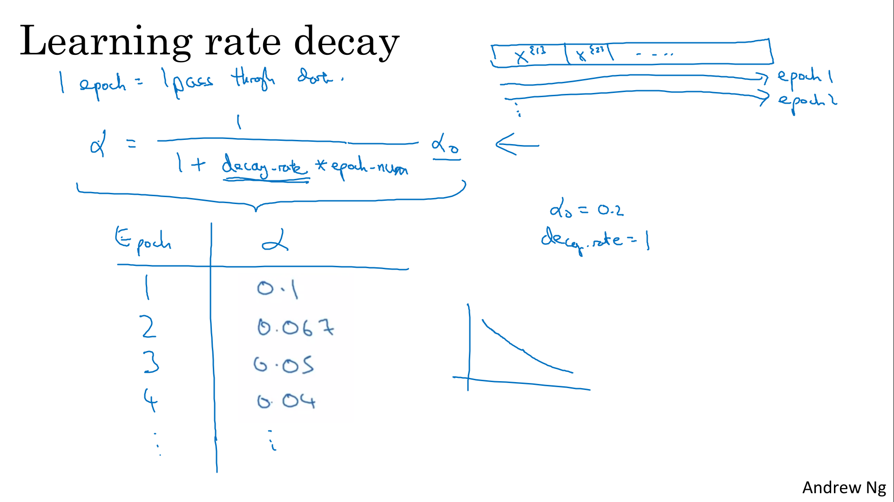

# Optimization Algorithms
{: .no_toc}

Develop your deep learning toolbox by adding more advanced optimizations, random minibatching, and learning rate decay scheduling to speed up your models.

Learning Objectives
- Apply optimization methods such as (Stochastic) Gradient Descent, Momentum, RMSProp and Adam
- Use random minibatches to accelerate convergence and improve optimization
- Describe the benefits of learning rate decay and apply it to your optimization

<details open markdown="block">
  <summary>
    Table of contents
  </summary>
  {: .text-delta }
1. TOC
{:toc}
</details>

# Optimization Algorithms

## Mini-batch Gradient Descent

Vectorization allows processing a large number of examples relatively quickly. However, even with vectorization, processing large datasets (5,000,000 samples), can still be slow, requiring processing the entire training set before taking one step of gradient descent.

Mini-batch gradient descent is a technique to process large datasets by splitting them into smaller batches, allowing the algorithm to start making progress before processing the entire training set. 

In the given example, with 5 million training samples, we can split the data into 5000 mini-batches with 1000 examples each. 

Notations:
- (i): the i-th training sample
- [l]: the l-th layer of the neural network
- {t}: the t-th mini batch

> 

With mini-batch gradient descent, a single pass through the training set is one epoch, which in the above 5 million example, means 5000 gradient descent steps. 
- In Batch gradient descent we run the gradient descent on the whole dataset.
- While in Mini-Batch gradient descent we run the gradient descent on the mini datasets.

```
for t = 1:nb_batches
	cost, caches    = forward_propagation(X{t}, Y{t})
	gradients       = backward_propagation(X{t}, Y{t}, caches)
	update_parameters(gradients)
```
> 

## Understanding Mini-batch Gradient Descent

Unlike the batch gradient descent, the cost function in mini-batch algorithm may not decrease with each step and may exhibit some fluctuations. However, in general, it is expected to decrease over time.

With batch gradient descent on every iteration you go through the entire training set and you'd expect the cost to go down on every single iteration.

On mini batch gradient descent though, if you plot progress on your cost function, then it may not decrease on every iteration. In particular, on every iteration you're processing some `X{t}`, `Y{t}` and so if you plot the cost function `J{t}`, which is computer using just `X{t}`, `Y{t}`. Then it's as if on every iteration you're training on a different training set or really training on a different mini batch

> 

<table>
	<thead>
		<tr>
			<th>method</th>
			<th>description</th>
			<th>batch size</th>
		</tr>
	</thead>
	<tbody>
		<tr>
			<td>stochastic gradient descent</td>
			<td>size=1</td>
			<td>
                <ul>
                    <li>lose advantage of vectorization</li>
                </ul>
            </td>
		</tr>
		<tr>
			<td>mini-batch gradient descent</td>
			<td>1 < size < m</td>
			<td>
                <ul>
                    <li>vectorization advantage</li>
                    <li>make progress without waiting to process the entire training set</li>
                    <li>doesn't always exactly converge (oscelates in a very small region, but you can reduce learning rate)</li>
                </ul>           
            </td>
		</tr>
		<tr>
			<td>batch gradient descent</td>
			<td>on single batch (size=m)</td>
			<td>
                <ul>
                    <li>too long per iteration</li>
                </ul>
            </td>
		</tr>
	</tbody>
</table>

> 

Guidelines for choosing mini-batch size:
- If small training set (< 2000 examples) - use batch gradient descent.
- Batch size : because of the way computer memory is layed out and accessed, sometimes your code runs faster if your mini-batch size is a power of 2. 
- Make sure that mini-batch fits in CPU/GPU memory

> 

## Exponentially Weighted Averages

They are faster than gradient descent. In order to understand those algorithms, we need to be able they use something called **exponentially weighted averages** or **exponentially weighted moving averages** in statistics

```V(t) = β * v(t-1) + (1-β) * θ(t)```

> 

If we plot this it will represent averages over about (1 / (1 - β)) entries:
- ```β = 0.9``` will average last ```10``` entries
- ```β = 0.98``` will average last ```50``` entries
- ```β = 0.5``` will average last ```2``` entries

> 


## Understanding Exponentially Weighted Averages

If we start with the following 
- β = 0.90 - red line
- β = 0.98 - green line
- β = 0.50 - yellow line

> 

The exponentially weighted average adds a fraction β of the current value to the some of past values with a decay factor that gives more weight to recent values than to past values. The contribution from the t−nth value is wighted by $\beta^n(1-\beta)$

$\lim_{a->0}(1-a)^{1/a} = 1/e \approx 0.35$ explains that we for β = 0.9, 0.9^10 = (1-0.1)^10 = (1-0.1)^(1/0.1) -> 1/e, so negligeable 

https://en.wikipedia.org/wiki/E-folding

> 

It's really not the most accurate way to compute an average. But the code is more efficient and faster using the exponentially weighted averages algorithm (requires lass memory)

> 

## Bias Correction in Exponentially Weighted Averages

Because we implement the exponentially weighted moving average with V0=0, the start of the iteration is inacurate (for β = 0.98, we won't  get the green curve but the purple one) 

This can be corrected dividing the previous formulaith (1-β^t) that becomes close to 1 after the first iterations.

$
V_t = \beta * V_{t-1} + (1-\beta) * \theta_t
$

becomes :

$
V_t = \frac{\beta * V_{t-1} + (1-\beta) * \theta_t}{1-\beta^t}
$

> 


## Gradient Descent with Momentum

There's an algorithm called momentum, or gradient descent with momentum that almost always works faster than the standard gradient descent algorithm. The basic idea is using an exponentially weighted average of the gradients instead of the gradient itself.

Usually, standard gradient descent  “oscillates” toward convergence (blue arrows). These oscillations slow down gradient descent algorith and prevents from using a much larger learning rate (purple arrows)

Another way of viewing this problem is that on the vertical axis you want your learning to be a bit slower, but you want faster learning on the horizontal axis (red arrows)

```
vdW = 0, vdb = 0
on iteration t:
	compute dw, db on current mini-batch                			
	vdW = β * vdW + (1 - β) * dW
	vdb = β * vdb + (1 - β) * db
	W = W - α * vdW
	b = b - α * vdb
```

> 

- β is another hyperparameter
- β = 0.9 is very common and works very well
- in practice bias correction is not implemented

Often the term (1 - β) is omited (because only a constant that could be represented is a slightly different α learning rate):

```
	vdW = β * vdW + (1 - β) * dW
	vdb = β * vdb + (1 - β) * db
```

becomes:

```
	vdW = β * vdW + dW
	vdb = β * vdb + db
```

> 


## RMSprop

RMSprop (Root Mean Squared) is another algorithm that has similar effects to gradient descent with momentum and can help to decrease the oscillations in gradient descent (especially in mini batch)

```
sdW = 0, sdb = 0
on iteration t:
	compute dw, db on current mini-batch	
	sdW = (β * sdW) + (1 - β) * dW^2  # squaring is element-wise
	sdb = (β * sdb) + (1 - β) * db^2  # squaring is element-wise
	W = W - α * dW / sqrt(sdW + ε)
	b = b - α * db / sqrt(sdb + ε)
```

An intuition is that 
- ```db``` is larger than ```dW```,
- so ```sdb``` is larger than ```sdW```, 
- so ```α * dW / sqrt(sdW)``` is larger than ```db / sqrt(sdb)```. 
- this acceleration is larger on horizontal axis
- inp  practice, we have more than a 2-D graph (W1, W2, ... b1, b2, ...)

We add ε (about 10^-8) to avoid dividing by zero

> 

## Adam Optimization Algorithm

Adam (Adaptive Moment Estimation) is basically putting momentum and RMSprop together
Adam optimization and RMSprop are among the optimization algorithms that worked very well with a lot of NN architectures.

```
vdW = 0, vdW = 0, sdW = 0, sdb = 0
on iteration t:
	compute dw, db on current mini-batch                
			
    # momentum
	vdW = (β1 * vdW) + (1 - β1) * dW     
	vdb = (β1 * vdb) + (1 - β1) * db
			
    # RMSprop            
	sdW = (β2 * sdW) + (1 - β2) * dW^2
	sdb = (β2 * sdb) + (1 - β2) * db^2

    # bias correction        	
	vdW_corrected = vdW / (1 - β1^t)
	vdb_corrected = vdb / (1 - β1^t)			
	sdW_corrected = sdW / (1 - β2^t)
	sdb_corrected = sdb / (1 - β2^t)
					
	W = W - α * vdW / (sqrt(sdW_corrected) + ε)
	b = B - α * vdb / (sqrt(sdb_corrected) + ε)
```

How we combine momentum and RMSprop :

```
	W = W - α * vdW                     # momentum
	W = W - α * dW  / sqrt(sdW + ε)     # RMSprop
	W = W - α * vdW / (sqrt(sdW) + ε)   # Adam

```

> 


Hyperparameters for Adam

| parameter | description | default |
|--|--|--| 
| α  | Learning rate               | to be tuned |
| β1 |  parameter of the momentum  | 0.9 is recommended by default | 
| β2 |  parameter of the RMSprop   | 0.999 is recommended by default |
| ε  |                             | 10^-8 is recommended by default |

> 


## Learning Rate Decay

Mini-batch gradient descent could never really converge.

The intuition behind slowly reducing Alpha is that :
- during the initial steps of learning, you could afford to take much bigger steps, 
- but then as learning approaches convergence, then having a slower learning rate allows you to take smaller steps. 


> 

Reminder : an **epoch** is one pas over all data (not a single mini-batch), so epoch_num is incremented after last mini-batch

We define learning rate : ```α = (1 / (1 + decay_rate * epoch_num)) * α0```

> 


Other learning rate decay methods

> 

# The problem of local optima

In the early days of deep learning, people used to worry a lot about the optimization algorithm getting stuck in bad local optima. But as this theory of deep learning has advanced, our understanding of local optima is also changing

Most points of zero gradients are not local optima (left schema) but instead saddle point (right schema)


> 

**Local optima** is not a real problem. In a very high dimensional space (20'000 dimemsions), a point is a local optima need to be a local optima for each of the dimensions (which is highly unlikely)


**Plateau** is a region where the derivative is close to zero for a long time and plateaus can really slow down learning. This is where algorithms like momentum, RMSprop or Adam can help.


> 


## Yuanqing Lin Interview


