# Hyperparameter Tuning, Batch Normalization and Programming Frameworks

Explore TensorFlow, a deep learning framework that allows you to build neural networks quickly and easily, then train a neural network on a TensorFlow dataset.

Learning Objectives
- Master the process of hyperparameter tuning
- Describe softmax classification for multiple classes
- Apply batch normalization to make your neural network more robust
- Build a neural network in TensorFlow and train it on a TensorFlow dataset
- Describe the purpose and operation of GradientTape
- Use tf.Variable to modify the state of a variable
- Apply TensorFlow decorators to speed up code
- Explain the difference between a variable and a constant


# Hyperparameter Tuning

## Tuning Process

Hyperparameters importance are (for Andrew Ng):


<table>
	<thead>
		<tr>
			<th>importance level</th>
			<th>hyperparameters</th>
		</tr>
	</thead>
	<tbody>
		<tr>
			<td>first</td>
			<td>learning rate&nbsp;<code>alpha</code></td>
		</tr>
		<tr>
			<td>second</td>
			<td>momentum term&nbsp;<code>beta</code><br />
			mini-batch size<br />
			number of hidden units</td>
		</tr>
		<tr>
			<td>third</td>
			<td>number of layers<br />
			learning rate decay<br /></td>
		</tr>
		<tr>
			<td>quite never tuned</td>
			<td>Adam&nbsp;<code>beta1, beta2, epsilon</code></td>
		</tr>
	</tbody>
</table>


> 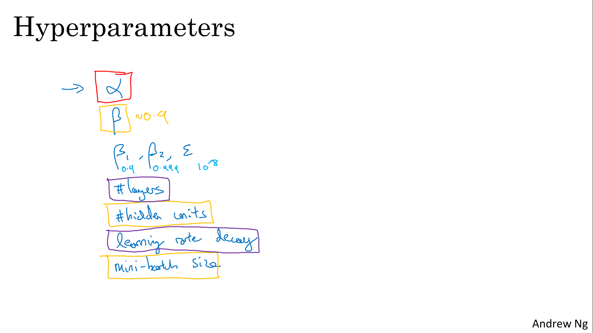

- One of the ways to tune could be to sample a grid with N hyperparameters and then try all combinations (worked in the pasrt with few hyperparameters)
- In practice, it's hard to decide which hyperparameter is the most important in a problem. So it's better to choose points at random, not in a grid

> 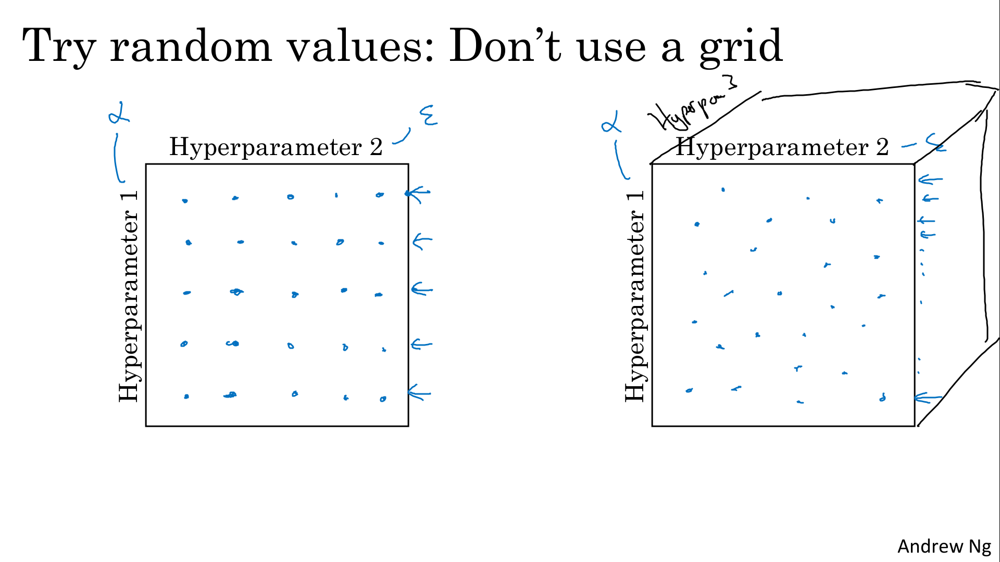

You can use **coarse to fine** sampling scheme.
1. pick up points randomly
2. When you find some hyperparameters values that give you a better performance, zoom into a smaller region around these values and sample more densely within this space

> 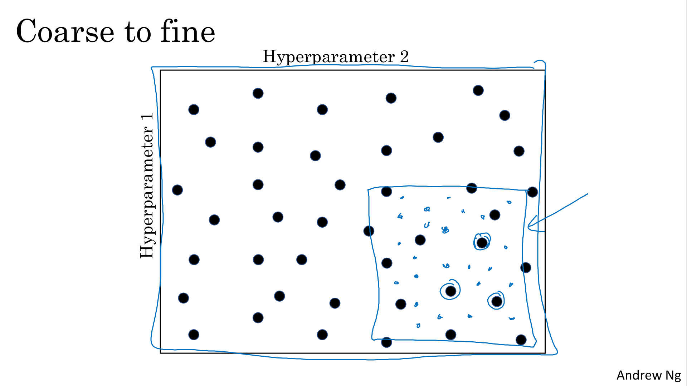

## Using an Appropriate Scale to pick Hyperparameters

Sampling at random doesn't mean sampling uniformly at random, over the range of valid values. Instead, it's important to pick the appropriate scale on which to explore the hyperparameters.

There is a couple examples where sampling uniformly at random over the range might be a reasonable thing to do:
- number of hidden units, n[l], for a given layer l from 50 to 100.
- number of layers in your neural network between 2 to 4

> 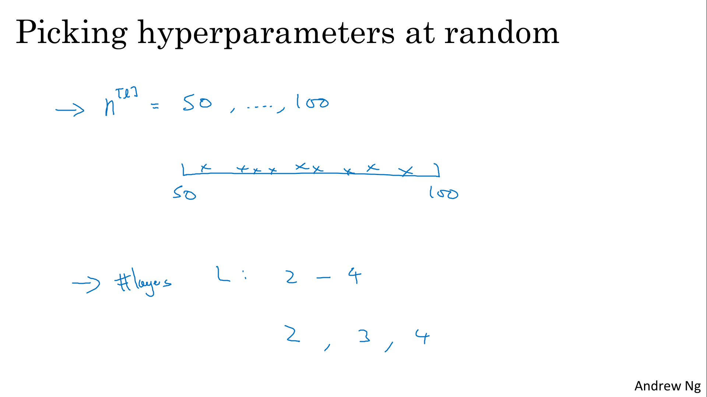

If we want to find an hyperparameter from 0.0001 and 1
- if we use a limear random method, 90 % of the value will be between 0.1 and 1
- Instead, it seems more reasonable to search for hyperparameters on a log scale : 0.0001 0.001 0.01 0.1 and 1

In python : 
``` 
r = -4 * np.random.rand()   # r in [-4,0]
α = 10^r                    # alpha in [10^-4, 1]
```

More generally for an intervalle [i1, i2] we can calculate a and b to have value in intervalle [10^a, 10^b]:
```
a = log(i1), b= log(i2)        # i1 = 10^a, i2 = 10^b
r = (b-a) * np.random.rand()   # r in [a,b]
α = 10^r                       # alpha in [10^a, 10^b]
```

> 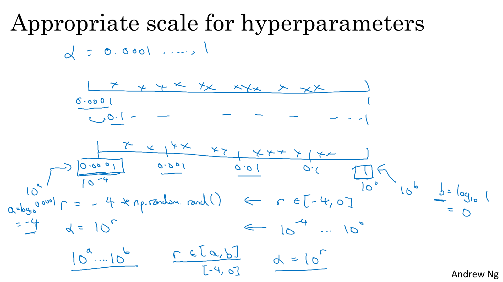

Finally, one other tricky case is sampling the hyperparameter beta, used for computing exponentially weighted average
- β in [0.9 to 0.999]
- (1-β) in [0.001 to 0.1], same approach that previously

Why having a log scale for a range between 0.9 and 0.999 in case of weighted average ?
- 0.9000 to 0.9005, not big deal because correspond to 10 values
- 0.9999 to 0.9995, huge impact from correspond to 1000 to 2000 values,
- so the idea is to sample more **densely in the region of when beta is close to 1**.


> 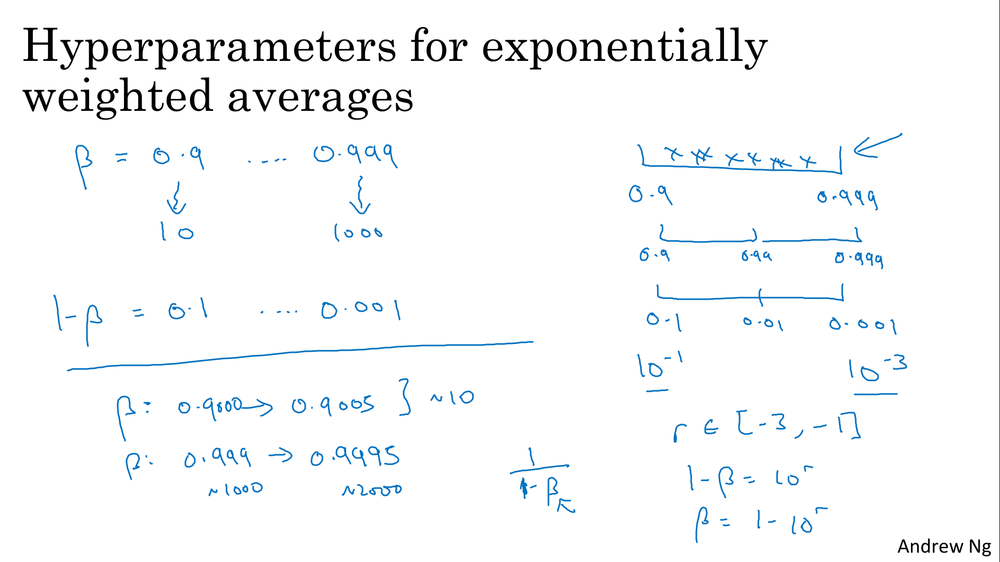

## Hyperparameters Tuning in Practice: Pandas vs. Caviar

Intuitions about hyperparameter settings from one DL area may or may not transfer to a different one.
Even if you work on just one problem, you might have found a good setting for the hyperparameters and kept on developing your algorithm, or maybe seen your data gradually change over the course of several months, or maybe just upgraded servers in your data center. And because of those changes, the best setting of your hyperparameters can get stale.

> 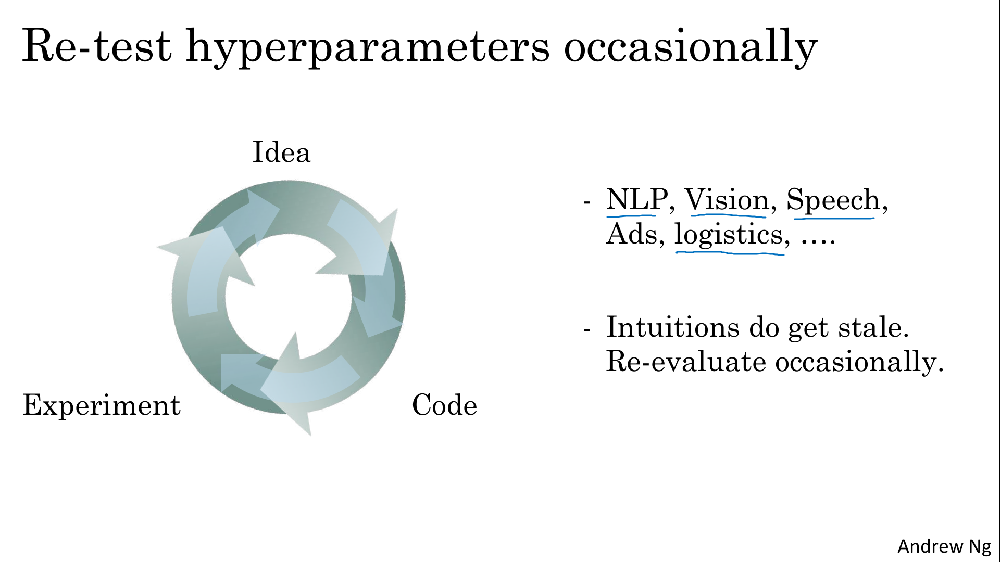

Strategy depends on if you have enough computational capacity to train a lot of models at the same time:
- Panda approach (very few children): Not enough computational capacity: babysitting one model
- Caviar approach (100 million eggs): training many models in parallel

> 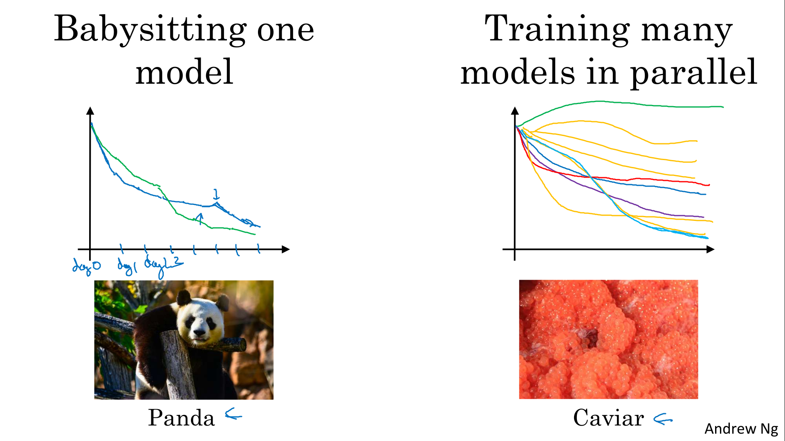


# Batch Normalization

## Normalizing Activations in a Network

In the rise of deep learning, one of the most important ideas has been an algorithm called batch normalization, created by two researchers, Sergey Ioffe and Christian Szegedy. Batch normalization makes your hyperparameter search problem much easier and your neural network much more robust. The choice of hyperparameters is a much bigger range of hyperparameters that work well, and will also enable you to much more easily train even very deep networks.

We previously see [how to normalize input](../week1/README.md/#normalizing-inputs)


What batch norm does is it applies that normalization process not just to the input layer, but to the values in some hidden layer in the neural network. We want to normalize A[l] to train W[l+1], b[l+1] faster.

There are some debates in the deep learning literature about whether you should normalize values before the activation function Z[l] or after on values A[l]. In practice, normalizing Z[l] is done much more often.

One difference between the training input and hidden unit values is that you might not want your hidden unit values be forced to have mean 0 and variance 1 (for example, if you have a sigmoid activation function). That's the reason we introduce parameters gamma and beta that control means and variance of hidden layer. Parameters gamma and beta are learnable parameters of the model (that should be find with gradient descent or some other algorithm, like the gradient descent of momentum, ...)

> 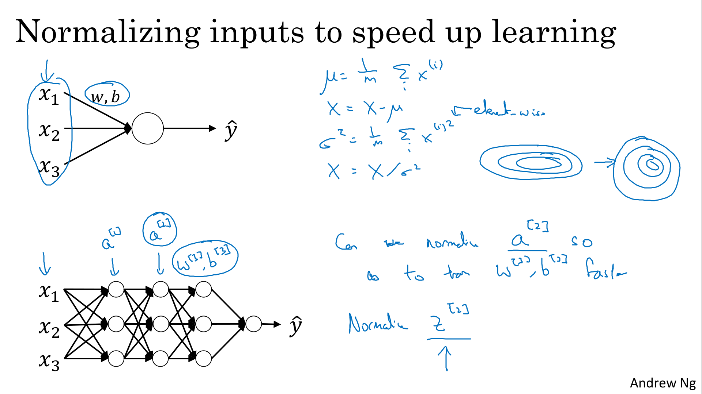

Algorithm:
```
Given Z[l] = [z(1), ..., z(m)], i = 1 to m (for each input)
    Compute mean = 1/m * sum(z[i])
    Compute variance = 1/m * sum((z[i] - mean)^2)
    Z_norm[i] = (z[i] - mean) / np.sqrt(variance + epsilon) 
        # add epsilon for numerical stability if variance = 0
        # Forcing the inputs to a distribution with zero mean and variance of 1.
    Z_tilde[i] = gamma * Z_norm[i] + beta
        # To make inputs belong to other distribution (with other mean and variance).
    use Z_tilde instead of Z
```

Note: if gamma = sqrt(variance + epsilon) and beta = mean then Z_tilde[i] = z[i]


> 

## Fitting Batch Norm into a Neural Network

Neural network has now following variables :
- W[1], b[1], ..., W[L], b[L],
- β[1], γ[1], ..., β[L], γ[L]

β[1], γ[1], ..., β[L], γ[L] are updated using any optimization algorithms (Gradient descent, Gradient descent with momentum, RMSprop, Adam)

Deep learning framework implement batch norm. In Tensorflow you can add a single instruction ```tf.nn.batch-normalization()```

> 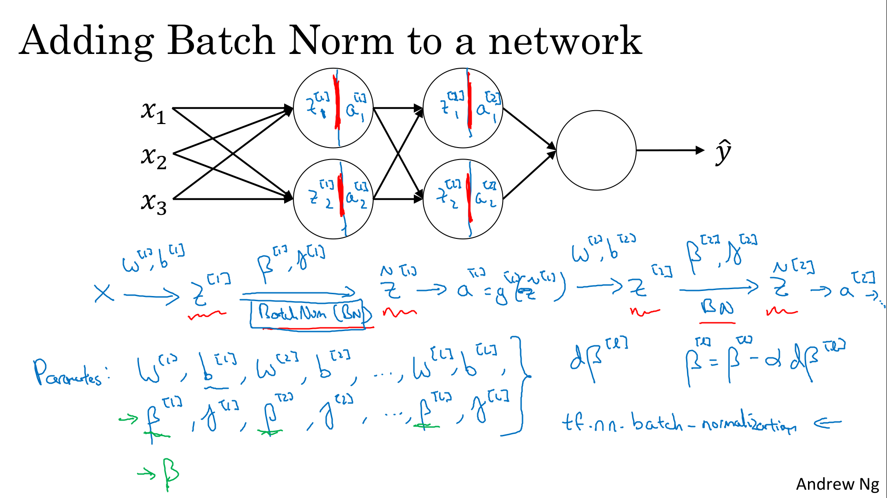

With mini-batches approach, you apply batch normalization for all mini-batches.

With batch normalization, the parameter b[l] can be eliminated (when mean subtraction, all constants have no effects). Algorithm becomes :
```
Z[l] = W[l]A[l-1]                      # step 1, without b[l]
Znorm[l] =                             # step 2, Z normalized with mean=0, variance=1
Ztilde[l]= γ[l]*Znorm[l] β[l]          # step 3, use alpha and gamma for chnaging variance and mean
```

𝛽[l],𝛾[l] have the shape with z[l] : (n[l], m) with n[l] the number of units in layer l.

> 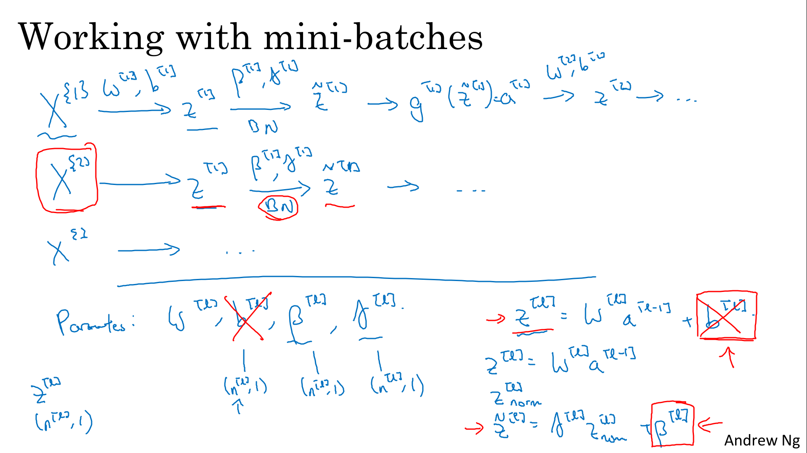

So, let's put all together and describe how you can implement gradient descent using Batch Norm, assuming we're using mini-batch gradient descent

> 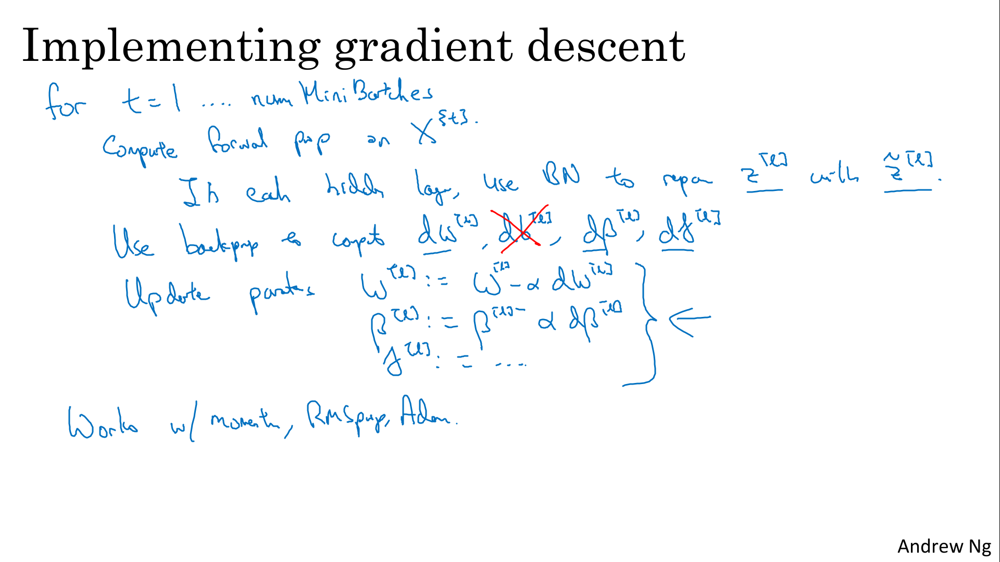

## Why does Batch Norm work?

First intuition. Normalizing input features X, to take on a similar range of values speeds up learning. So batch normalization is doing a similar thing for values in hidden units.

A second reason why batch norm works, is that it makes weights of deeper layers (ex. layer 10) more robust to changes to weights in earlier layers of the neural network (ex. layer 1).

In order to undertand, let's see an example
1. you've trained your data sets on all images of black cats
2. you try now to apply this network to data with colored cats

You might not expect a module trained on the data on the left to do very well on the data on the right. You wouldn't expect your learning algorithm to discover that green decision boundary, just looking at the data on the left.

***Covariate shift*** refers to the change in the distribution of the input variables present in the training and the test data. In that case, you might need to retrain your learning algorithm even if the function remains unchanged.

> 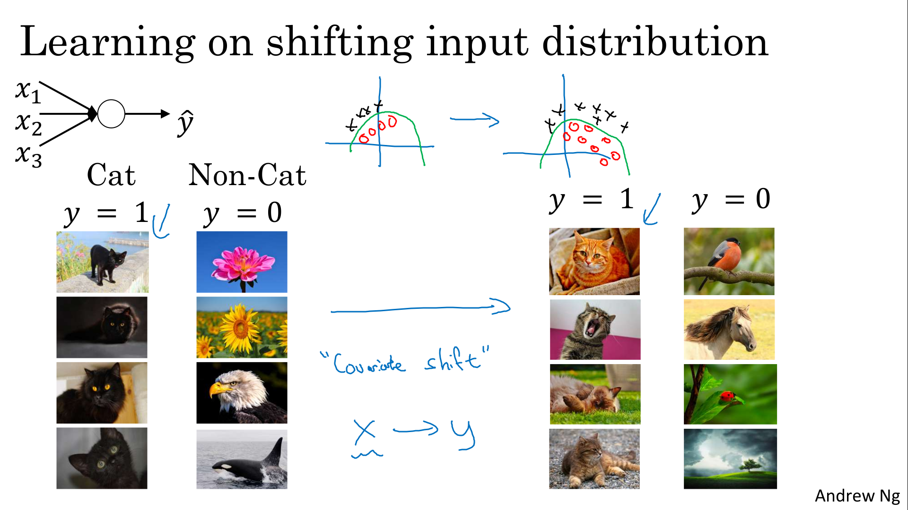

How does this problem of covariate shift apply to a neural network?
Let's look at the learning process from the perspective of the third hidden layer, its inputs are changing all the time, and so it's suffering from the problem of covariate shift that we talked about on the previous slide. So what batch norm does, is it reduces the amount that the distribution of these hidden unit values shifts around. Batch norm ensures is that no matter how it changes, **the mean and variance remain the same**. It limits the amount to which updating the parameters in the earlier layers can affect the distribution of values that the third layer receive.

> 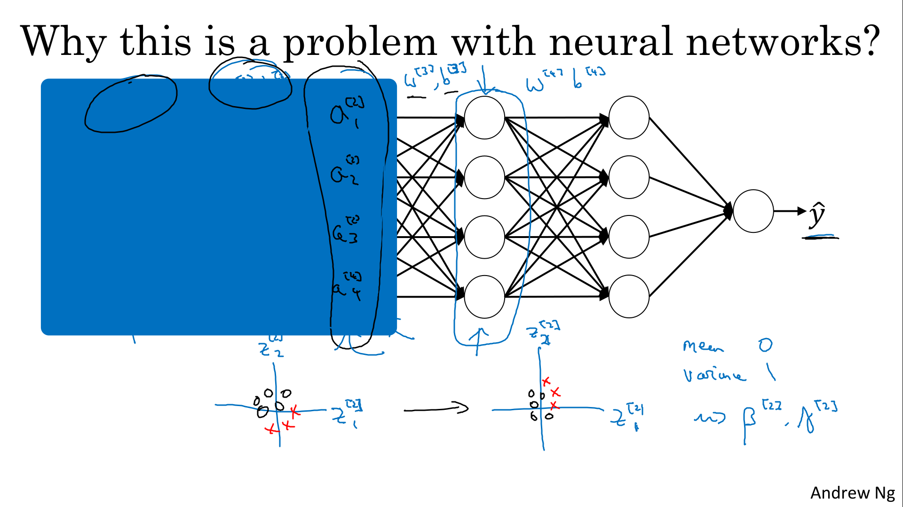

In mini-batch, the mean and variance of the batch is a little bit noisy because, because it's estimated with just a relatively small sample of data (similar to dropout)

Batch norm also has a slight regularization effect. Using bigger mini-batch size can reduce noise and therefore reduce regularization effect.

Don't rely on batch normalization as a regularization. It's intended for normalization of hidden units and speeding up learning. For regularization use other regularization techniques (L2 or dropout)

> 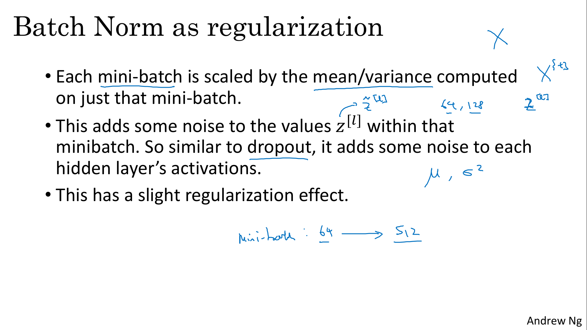

## Batch Norm at Test Time

When we train a network with Batch normalization, we compute the mean and the variance of the mini-batch. But when testing we might need to process examples one at a time.

You could in theory run your whole training set through your final network to get mu and sigma squared. But in practice, people usually implement an **exponentially weighted average** (also sometimes called the **running average**) where we just keep track of the 𝜇 and 𝜎^2 we're seeing **during training**. And we will use the estimated values of the mean and variance during test.

> 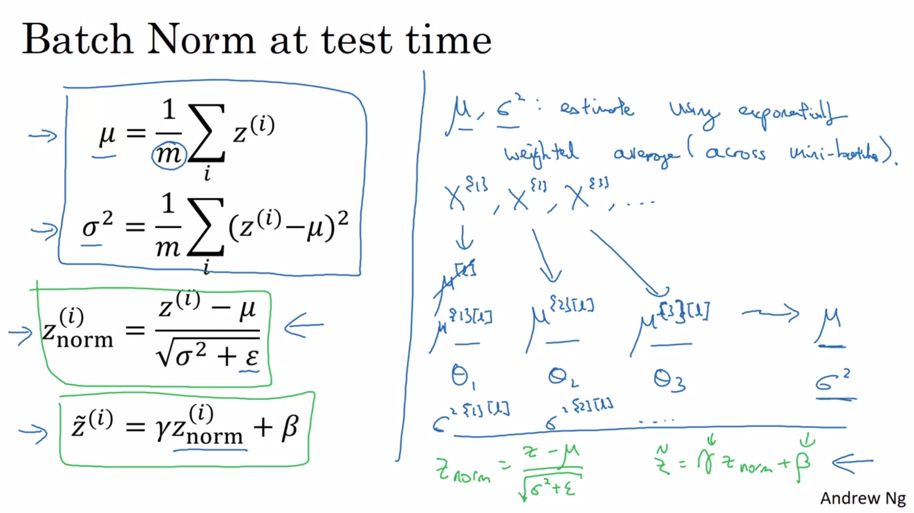


# Multi-class Classification

## Softmax Regression

There are a generalization of logistic regression called Softmax regression that is used for multiclass classification/regression.

Each of C values in the output layer will contain a probability of the example to belong to each of the classes.

> 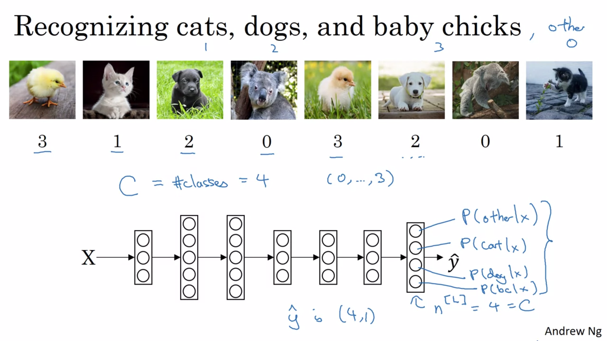

The standard model for getting your network to do this uses what's called a **Softmax layer** for the output layer.

Softmax activation equations:
```
def softmax(z):
    t = exp(z[L])                      # shape(4, 1)
    a[l] = exp(z[l]) / sum(t)          # shape(4, 1)
    return a[l]
```

Vectorized version:
```
def softmax(z):
    return np.exp(z) / sum(np.exp(z))  # shape(4, 1)
```

> 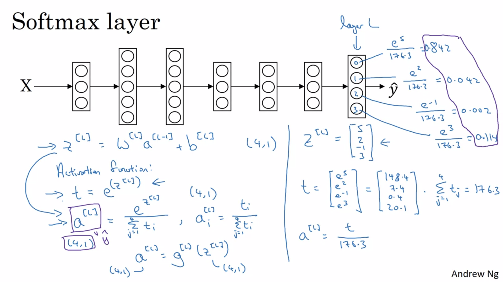

Some examples of multi-class classification that is a generalization of binary classification

> 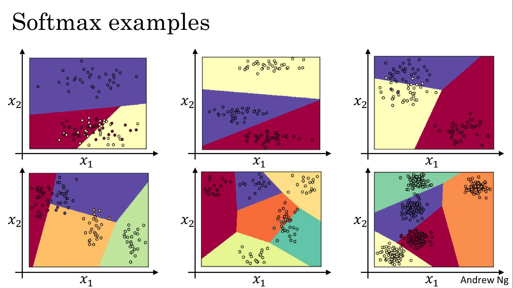

## Training a Softmax Classifier

- The Softmax name came from softening the values and not harding them like hard max (1 for max, 0 for others)
- Softmax generalizes logistic regeression to C classes 
- If C = 2 softmax reduces to logistic regression (no proof in the video)


> 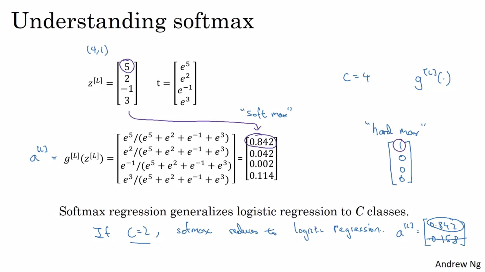

It's a form of maximum likelyhood estimation in statistics.

Loss function :
$$
L(y,\hat{y}) = -\sum_{j=1}^C y_j\log(\hat{y}_j)
$$

The cost function is based on the sum for all training example of the loss function.

> 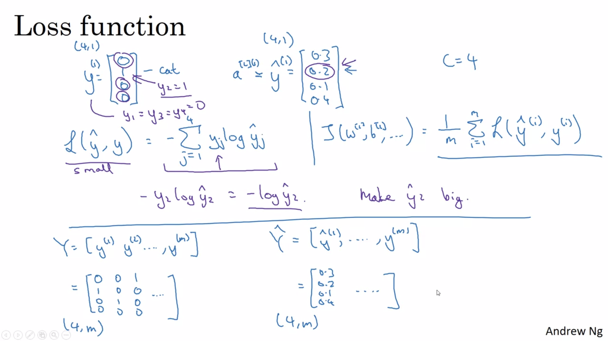

If you are an expert in calculus, you can derive this yourself.
$$
dz^{[l]} = \hat{y} - y
$$

When using a deep learning program frameworks, usually you just need to focus on getting the forward prop right. The framework will figure out how to do the backward pass for you.

> 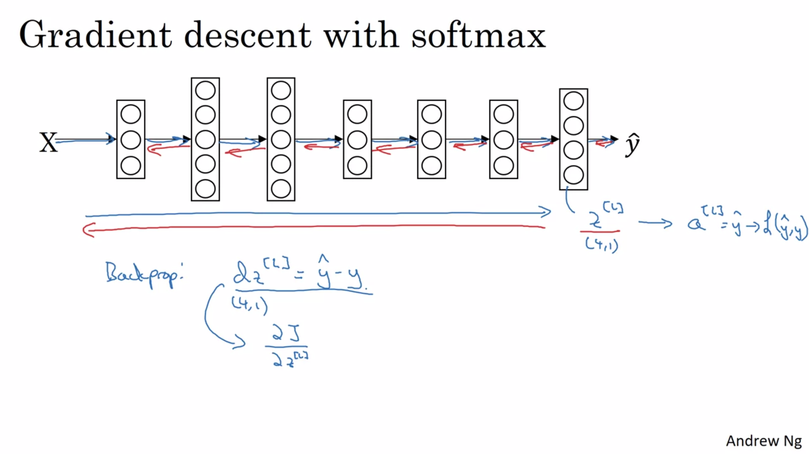

# Introduction to Programming Frameworks

## Deep Learning Frameworks

We've learned to implement deep learning algorithms more or less from scratch using Python and NumPY. Fortunately, there are now many good deep learning software frameworks that can help you implement these models. 

Each of these frameworks has a dedicated user and developer community and I think each of these frameworks is a credible choice for some subset of applications. 

> 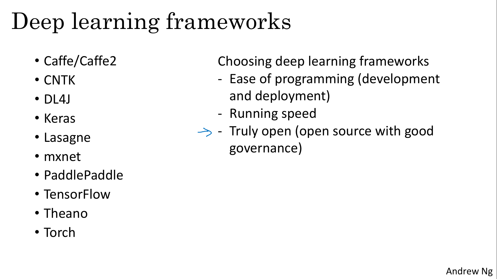

## TensorFlow

> 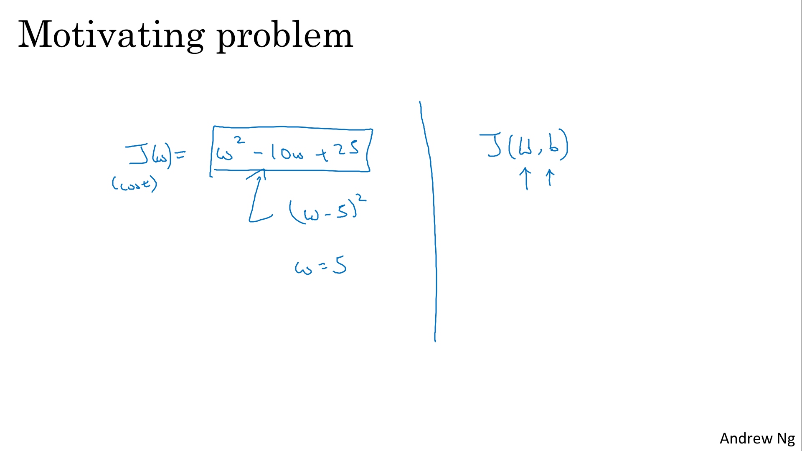
> 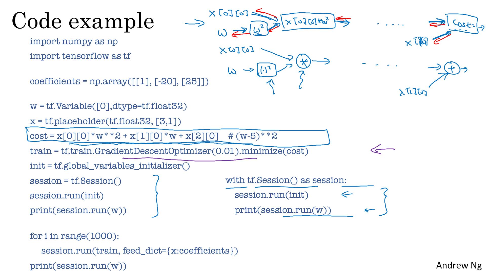
https://www.bil.com/Documents/mail-disclaimer.html

