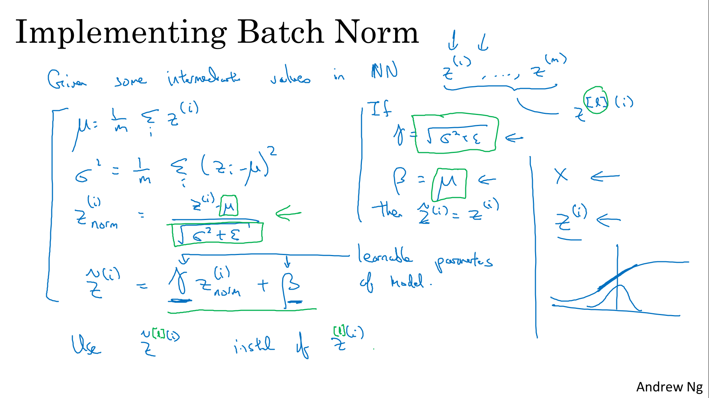

# Hyperparameter Tuning, Batch Normalization and Programming Frameworks

Explore TensorFlow, a deep learning framework that allows you to build neural networks quickly and easily, then train a neural network on a TensorFlow dataset.

Learning Objectives
- Master the process of hyperparameter tuning
- Describe softmax classification for multiple classes
- Apply batch normalization to make your neural network more robust
- Build a neural network in TensorFlow and train it on a TensorFlow dataset
- Describe the purpose and operation of GradientTape
- Use tf.Variable to modify the state of a variable
- Apply TensorFlow decorators to speed up code
- Explain the difference between a variable and a constant


# Hyperparameter Tuning

## Tuning Process

Hyperparameters importance are (for Andrew Ng):


<table>
	<thead>
		<tr>
			<th>importance level</th>
			<th>hyperparameters</th>
		</tr>
	</thead>
	<tbody>
		<tr>
			<td>first</td>
			<td>learning rate&nbsp;<code>alpha</code></td>
		</tr>
		<tr>
			<td>second</td>
			<td>momentum term&nbsp;<code>beta</code><br />
			mini-batch size<br />
			number of hidden units</td>
		</tr>
		<tr>
			<td>third</td>
			<td>number of layers<br />
			learning rate decay<br /></td>
		</tr>
		<tr>
			<td>quite never tuned</td>
			<td>Adam&nbsp;<code>beta1, beta2, epsilon</code></td>
		</tr>
	</tbody>
</table>


> 

- One of the ways to tune could be to sample a grid with N hyperparameters and then try all combinations (worked in the pasrt with few hyperparameters)
- In practice, it's hard to decide which hyperparameter is the most important in a problem. So it's better to choose points at random, not in a grid

> 

You can use **coarse to fine** sampling scheme.
1. pick up points randomly
2. When you find some hyperparameters values that give you a better performance, zoom into a smaller region around these values and sample more densely within this space

> 

## Using an Appropriate Scale to pick Hyperparameters

Sampling at random doesn't mean sampling uniformly at random, over the range of valid values. Instead, it's important to pick the appropriate scale on which to explore the hyperparameters.

There is a couple examples where sampling uniformly at random over the range might be a reasonable thing to do:
- number of hidden units, n[l], for a given layer l from 50 to 100.
- number of layers in your neural network between 2 to 4

> 

If we want to find an hyperparameter from 0.0001 and 1
- if we use a limear random method, 90 % of the value will be between 0.1 and 1
- Instead, it seems more reasonable to search for hyperparameters on a log scale : 0.0001 0.001 0.01 0.1 and 1

In python : 
``` 
r = -4 * np.random.rand()   # r in [-4,0]
α = 10^r                    # alpha in [10^-4, 1]
```

More generally for an intervalle [i1, i2] we can calculate a and b to have value in intervalle [10^a, 10^b]:
```
a = log(i1), b= log(i2)        # i1 = 10^a, i2 = 10^b
r = (b-a) * np.random.rand()   # r in [a,b]
α = 10^r                       # alpha in [10^a, 10^b]
```

> 

Finally, one other tricky case is sampling the hyperparameter beta, used for computing exponentially weighted average
- β in [0.9 to 0.999]
- (1-β) in [0.001 to 0.1], same approach that previously

Why having a log scale for a range between 0.9 and 0.999 in case of weighted average ?
- 0.9000 to 0.9005, not big deal because correspond to 10 values
- 0.9999 to 0.9995, huge impact from correspond to 1000 to 2000 values, 
- so the idea is to sample more **densely in the region of when beta is close to 1**.


> 

## Hyperparameters Tuning in Practice: Pandas vs. Caviar

Intuitions about hyperparameter settings from one DL area may or may not transfer to a different one.
Even if you work on just one problem, you might have found a good setting for the hyperparameters and kept on developing your algorithm, or maybe seen your data gradually change over the course of several months, or maybe just upgraded servers in your data center. And because of those changes, the best setting of your hyperparameters can get stale. 

> 

Strategy depends on if you have enough computational capacity to train a lot of models at the same time:
- Panda approach (very few children): Not enough computational capacity: babysitting one model
- Caviar approach (100 million eggs): training many models in parallel

> 


# Batch Normalization

## Normalizing Activations in a Network

> 
> 

## Fitting Batch Norm into a Neural Network

> 
> 
> 

## Why does Batch Norm work?

> 
> 
> 

## Batch Norm at Test Time


# Multi-class Classification

## Softmax Regression

> 
> 
> 

## Training a Softmax Classifier


# Introduction to Programming Frameworks

## Deep Learning Frameworks

> 

## TensorFlow

> 
> 
