# ML Strategy

Streamline and optimize your ML production workflow by implementing strategic guidelines for goal-setting and applying human-level performance to help define key priorities.

Learning Objectives
- Explain why Machine Learning strategy is important
- Apply satisficing and optimizing metrics to set up your goal for ML projects
- Choose a correct train/dev/test split of your dataset
- Define human-level performance
- Use human-level performance to define key priorities in ML projects
- Take the correct ML Strategic decision based on observations of performances and dataset

# Introduction to ML Strategy

## Why ML Strategy

There is a lot of ideas for how to improve your deep learning system.

> 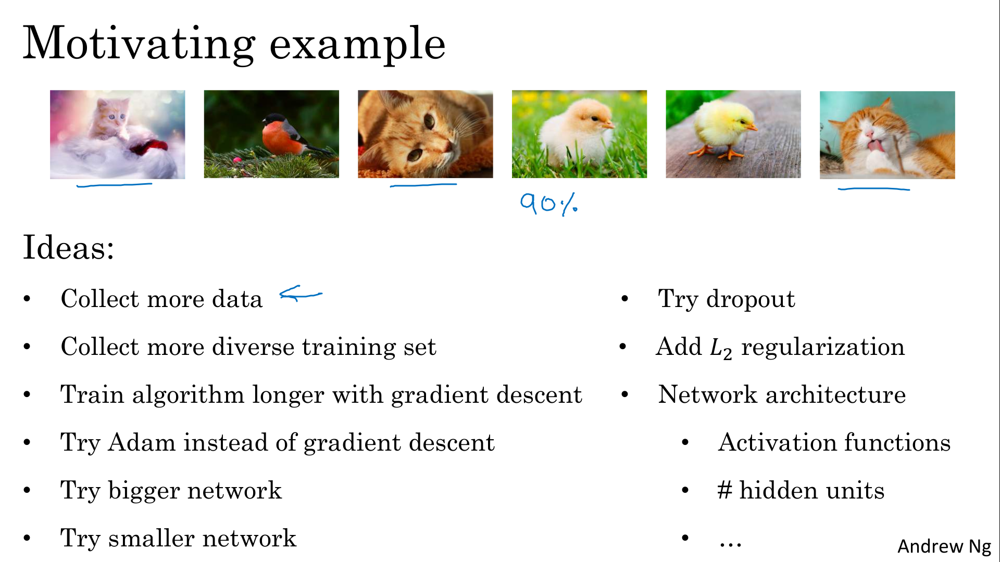

## Orthogonalization

See pdf notes provided by Courseara : [1-Orthogonalization.pdf](./1-Orthogonalization.pdf)

- Each knob has a relatively interpretable function. Imagine a signle knob that would change everything at same time, should be almost impossible to tune the TV. In that context orthogonalization  refers to the fact that TV designer have designed the knobs to do only one thing
- Other example is about the 3 controls (steering wheel, acceleration, and braking) in a car with well indentified actions. But now imagine if someone build a car with a joystick, where one axis of the joystick controls 0.3 x your steering angle,- 0.8 x your speed. And you had a different control that controls 2 x the steering angle, + 0.9 x the speed of your car. In theory, by tuning these two knobs, you could get your car to steer at the angle and at the speed you want. But it's much harder than if you had just one single control for controlling the steering angle, and a separate, distinct set of controls for controlling the speed.
- Orthogonalization is having one dimension by knobs

> 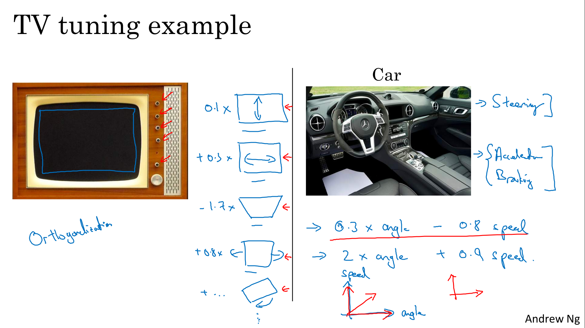

<table>
        <thead>
                <tr>
                        <th>Chain of assumptions in ML</th>
                        <th>Possible tuning</th>
                </tr>
        </thead>
        <tbody>
                <tr>
                        <td>Fit training set well on cost function</td>
                        <td>- Bigger network 
                        - Better optimization algorithm like Adam</td>
                </tr>
                <tr>
                        <td>Fit dev set well on cost function</td>
                        <td>- Regularization 
                        - Bigger training set</td>
                </tr>
                <tr>
                        <td>Fit test set well on cost function</td>
                        <td>- bigger dev set</td>
                </tr>
                <tr>
                        <td>Performs well in real world</td>
                        <td>- change dev set or cost function </td>
                </tr>
        </tbody>
</table>

> 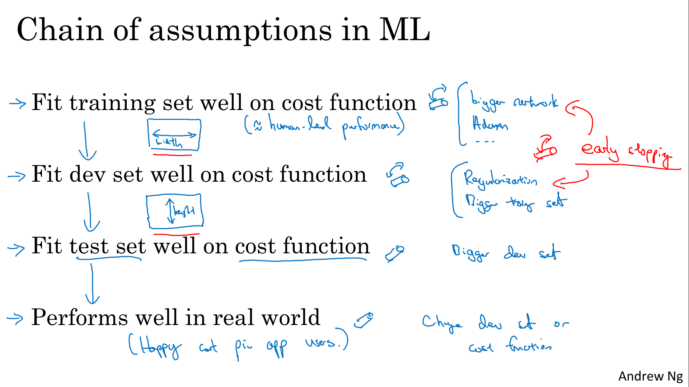

# Setting Up your Goal

## Single Number Evaluation Metric

See pdf notes provided by Courseara : [2-Single_number_evaluation_metric-2.pdf](./2-Single_number_evaluation_metric-2.pdf)

You'll find that your progress will be much faster if you have a single real number evaluation metric that lets you quickly tell if the new thing you just tried is working better or worse than your last idea.

In the following exemple, it's easier to work with F1-score mmore than working on Precision and Record (that could evlolve in a opposite directions)

| metric        | definition    |
| :-:           | :--           |
| Precision     | percentage of true positive in predicted positive |
| Recall        | percentage of true positive predicted in all real positive |
| F1 score      | harmonic mean of precision and recall |

> 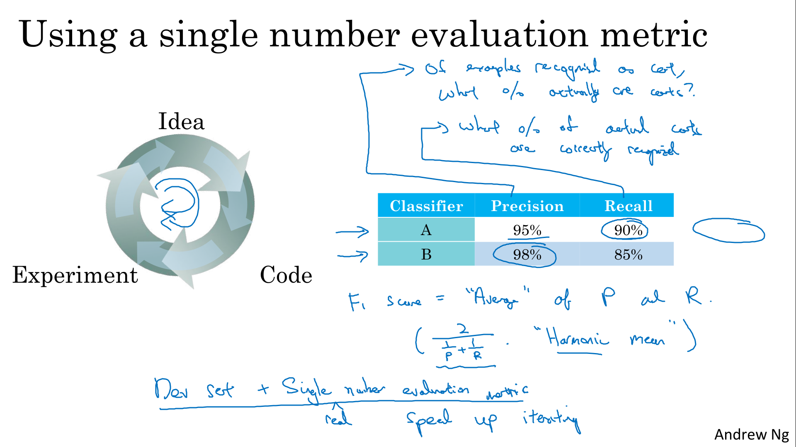

Other example. It's very difficult to look at these numbers and quickly decide if algorithm A or algorithm B is superior.  So what I recommend in this example is, in addition to tracking your performance in the four different geographies, to also compute the average. And assuming that average performance is a reasonable single real number evaluation metric, by computing the average, you can quickly tell that it looks like algorithm C has a lowest average error.

> 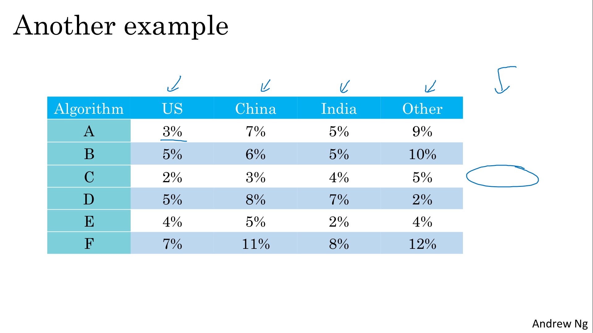

## Satisficing and Optimizing Metric

See pdf notes provided by Courseara : [3-Satisficing_and_optimizing_metric.pdf](./3-Satisficing_and_optimizing_metric.pdf)

First example (left column on the slide) : cat classifier :
1. accurancy is to optimize (get best value)
2. response time is to satisfy (< 1000 ms)

Second example is aout voice recognition and wakewords ("ok google"):
1. optimize accutacy
2. accepr one false positive by 24 hours

More generally :
1. Maximizing 1 value       # optimizing metric (one optimizing metric)
2. Satisfying N-1 values    # satisficing metric (N-1 satisficing metrics)

> 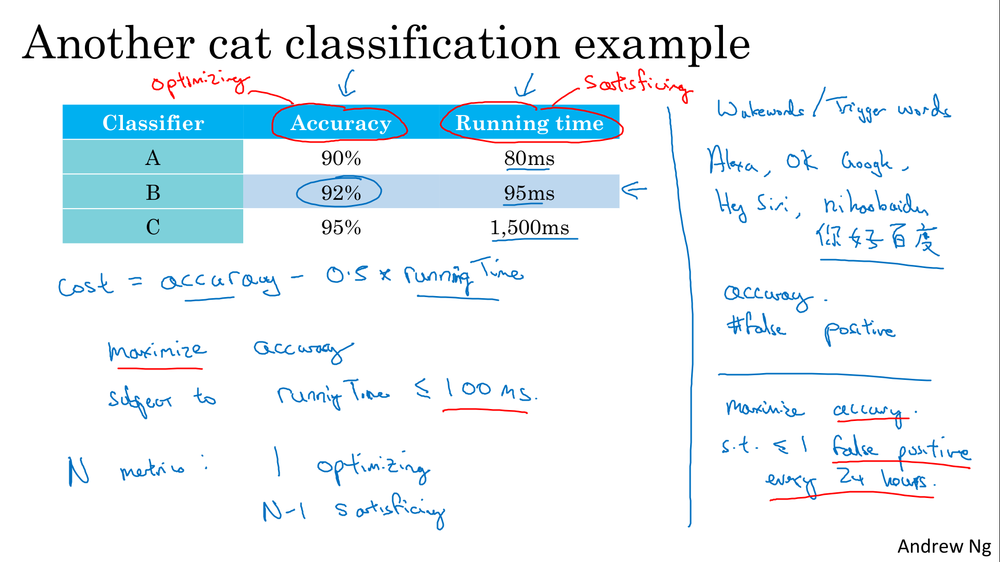

## Train/Dev/Test Distributions

See pdf notes provided by Courseara : [4-Training_development_and_test_distributions.pdf](./4-Training_development_and_test_distributions.pdf)

Taking data for DEV in some region and data for test in other regions is a very bad idea because dev and test sets come from different distributions.

Define what target you want to aim at :
 - setting up the dev set, 
 - defining the single role number evaluation metric
The team can then innovate very quickly, try different ideas, run experiments and very quickly use the dev set and the metric to evaluate crossfires and try to pick the best one. 

> 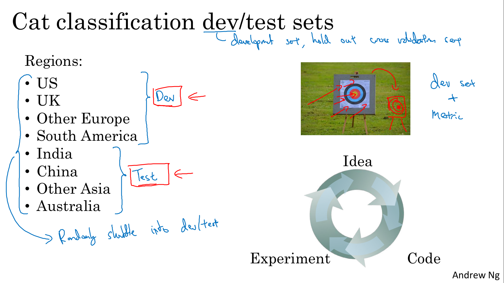

3 months lost because of a bad data distribution  

> 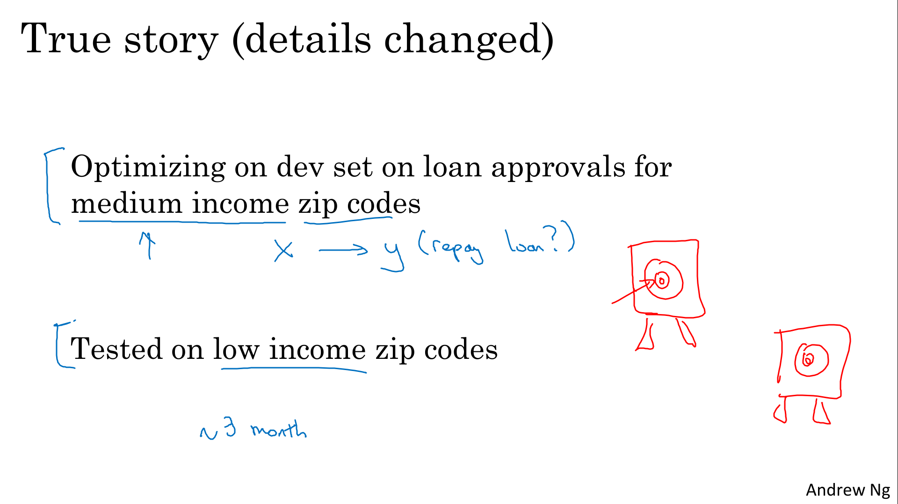

Choose dev set and test set to reflect data you expect to get in the future and consider important to do well on.

> 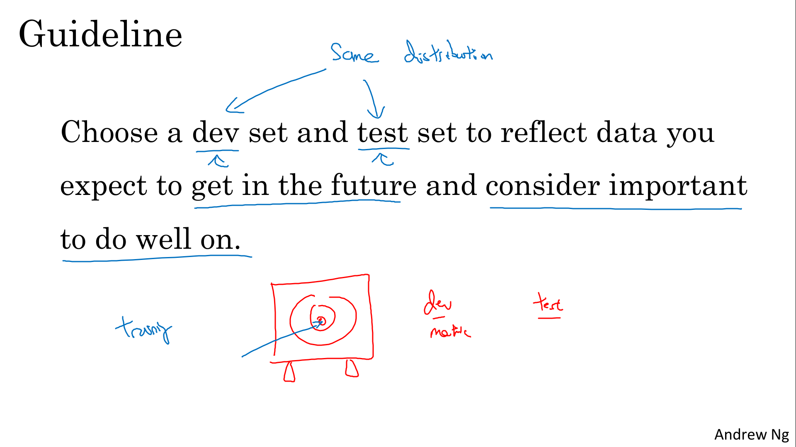

## Size of the Dev and Test Sets

See pdf notes provided by Courseara : [5-Size_of_the_development_and_test_sets.pdf](./5-Size_of_the_development_and_test_sets.pdf)

An old way of splitting the data was 
- 70% training, 30% test 
- or 60% training, 20% dev, 20% test

But in the modern machine learning era, we are now used to working with much larger data set sizes (1 million training examples), it might be quite reasonable to have 98% in the training set, and 1% dev, and 1% test.

> 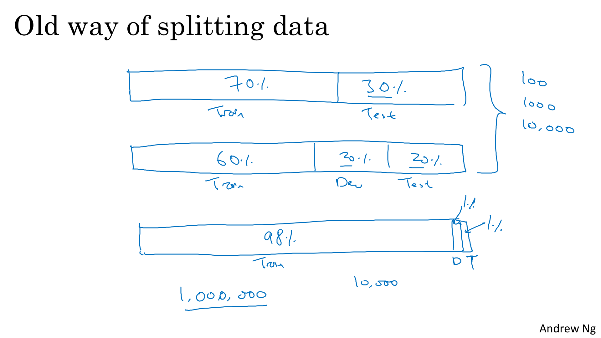

The guideline is, to set your test set to big enough to give high confidence in the overall performance of your system.

> 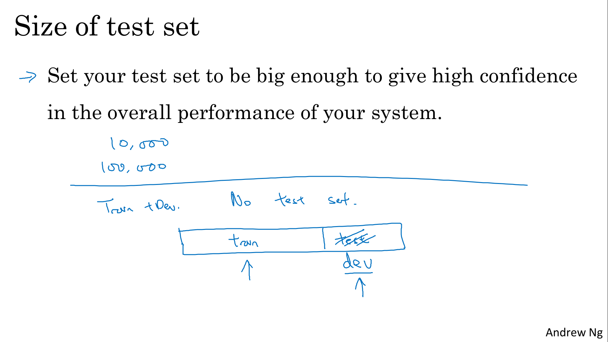

## When to Change Dev/Test Sets and Metrics?

See pdf notes provided by Courseara : [6-When_to_change_develpment_test_sets_and_metrics.pdf](./6-When_to_change_develpment_test_sets_and_metrics.pdf)

One way to change this evaluation metric would be if you add a weight term here :
- 1 if x(i) is non-porn 
- 10 or 100 if x(i) is porn

So this way you're giving a much larger weight to examples that are pornographic so that the error term goes up much more if the algorithm makes a mistake on classifying a pornographic image as a cat image

> 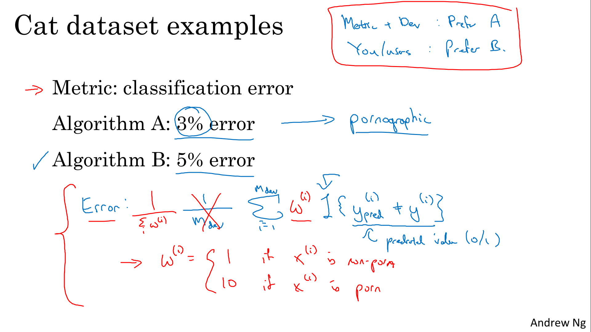

This is actually an example of an orthogonalization where I think you should take a machine learning problem and break it into distinct steps.
- First step : place the tarhet - define a metric that captures what you want to do
- Second step : shoot the target - think about how to actually do well on this metric

> 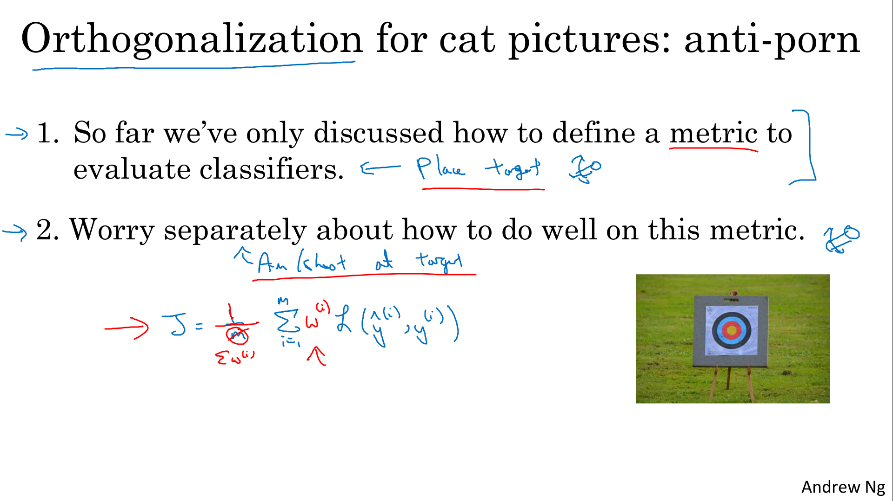

In conclusion, if you are doing well on your metric and dev/test set doesn't correspond to doing well in your application :
 - change your metric 
 - and/or change your dev/test set.

> 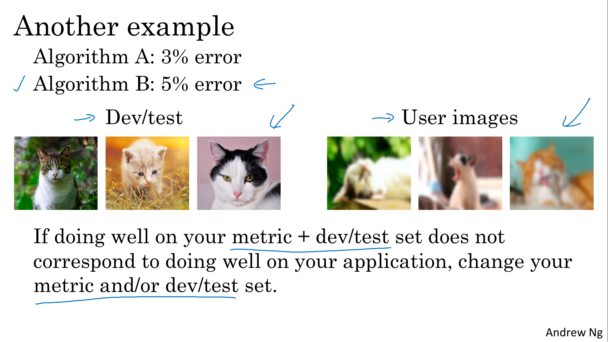

# Comparing to Human-level Performance

## Why Human-level Performance?

See pdf notes provided by Courseara : [7-Why_human_level_performance.pdf](./7-Why_human_level_performance.pdf)

We compare to human-level performance because of two main reasons:
1. machine learning algorithms are working much better and so it has become much more feasible to actually become competitive with human-level performance.
2. workflow of designing and building a machine learning system is much more efficient when we're trying to do something that humans can also do.

And over time, as you keep training the algorithm, maybe bigger and bigger models on more and more data, the performance approaches but never surpasses some theoretical limit, which is called the Bayes optimal error.

So, the perfect level of accuracy may not be 100% :
- for speech recognition, some audio is just so noisy it is impossible to tell what is in the correct transcription
- for cat recognition, some images are so blurry, that it is just impossible for anyone or anything to tell whether or not there's a cat in that picture. 

Progress is often quite fast until you surpass human level performance and often slows down after.

There are two reasons for that, for why progress often slows down when you surpass human level performance. 

One reason is that human level performance is for many tasks not that far from Bayes' optimal error. People are very good at looking at images and telling if there's a cat or listening to audio and transcribing it. 

> 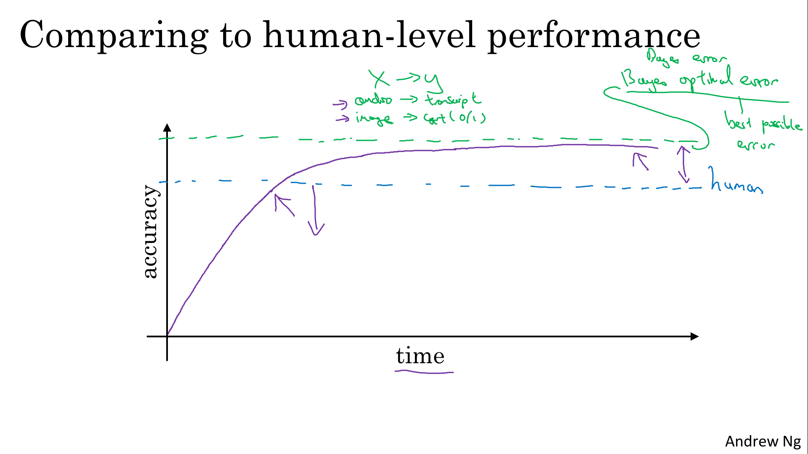

The second reason is that so long as your performance is worse than human level performance, then there are actually certain tools you could use to improve performance that are harder to use once you've surpassed human level performance.

> 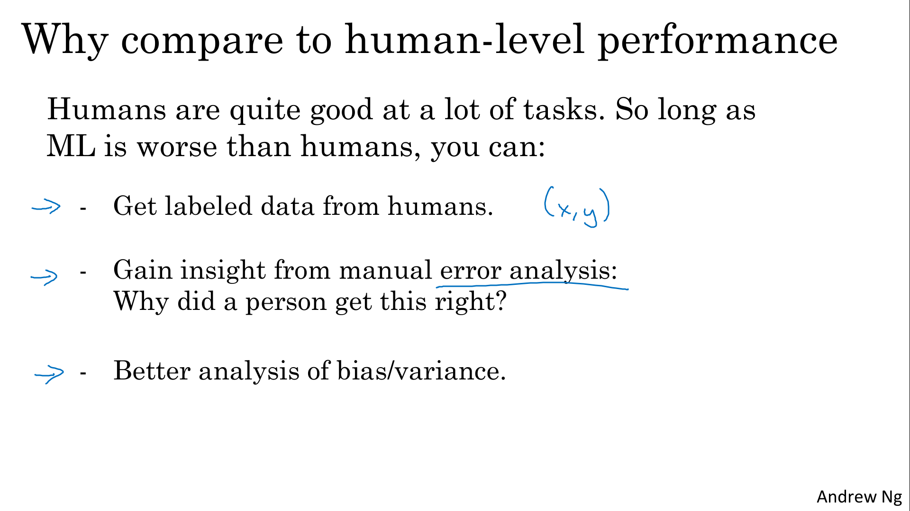

## Avoidable Bias

See pdf notes provided by Courseara : [8-Avoidable_bias.pdf](./8-Avoidable_bias.pdf)

In this case, the human-level error as a proxy for Bayes error because humans are good to identify images

- In the left example, human level error is 1%, then focus on the bias.
- In the right example, human level error is 7.5%, then focus on the variance.

Depending on what we think is achievable, with the same training error and dev error, we decided to focus on bias reduction or on variance reduction tactics. 

- The difference between approximation of Bayes error and the training error is called avoidable bias (not widely used terminology)
- Variance is the difference between training error and dev error

> 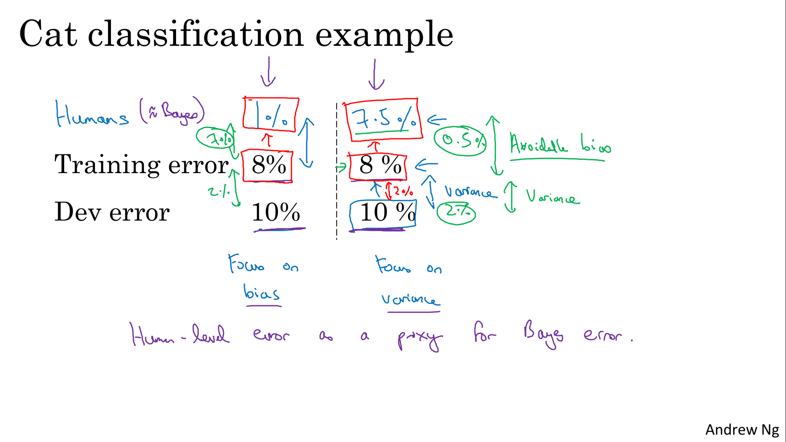

<!--
> 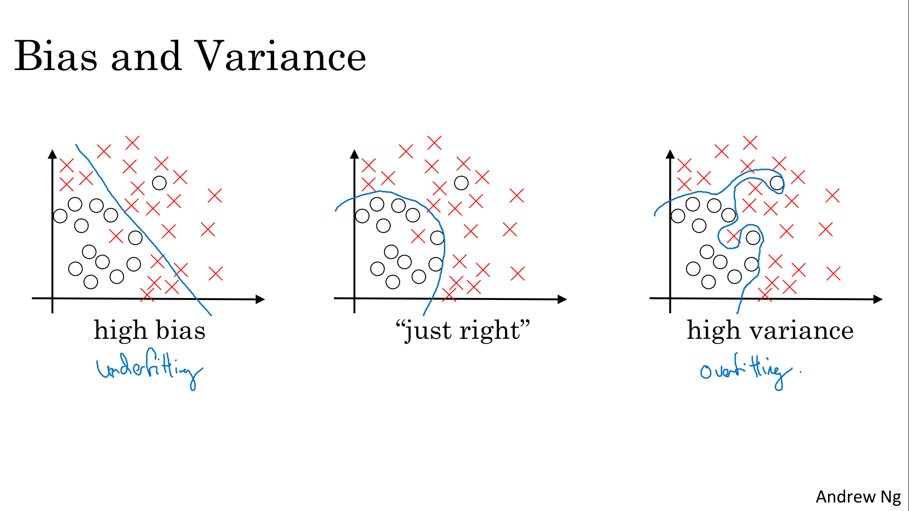
> 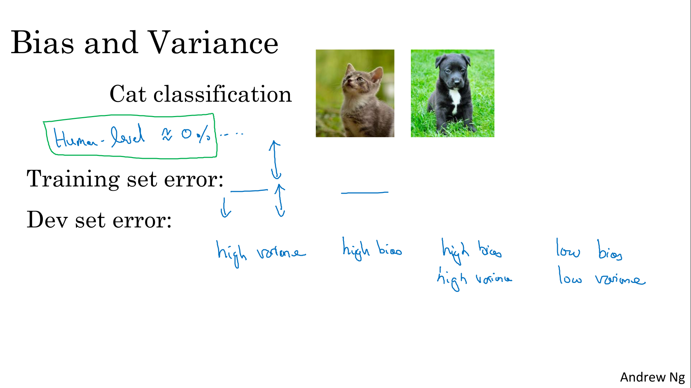
-->

## Understanding Human-level Performance

See pdf notes provided by Courseara : [9-Understanding_human_level_performance.pdf](./9-Understanding_human_level_performance.pdf)

The term **human-level performance** is sometimes used casually in research articles. But let me show you how we can define it a bit more precisely.

- If you want a proxy or an estimate for Bayes error, then given that a team of experienced doctors discussing and debating can achieve 0.5% error, we know that Bayes error is less than equal to 0.5%.
- For the purpose of deploying a system, maybe there's a different definition of human-level error that you can use which is so long as you surpass the performance of a typical doctor (1%)

When choosing human-level performance, it has to be chosen in the terms of what you want to achieve with the system.

> 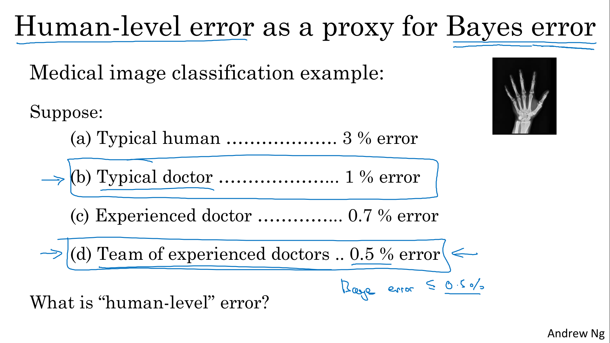

- In the first example, it doesn't really matter which of the definitions of human-level error you use, you should clearly focus on bias reduction techniques such as train a bigger network.

- In the second example, the difference between training error and the development error is bigger than the difference between the human-level error and the training error, no matter the hume-level performance we choose. The focus should be on variance reduction technique

- In the third example, there is only 1% between training and test, so choosing the good human-level is important. We should consider that the best human performance (0.5%) is an approximation of the Bayes error. Maybe both the bias and variance are both problems but maybe the avoidable bias is a bit bigger of a problem. 

Im the third example, 0.5% as we discussed on the previous slide was the best measure of Bayes error, because a team of human doctors could achieve that performance. If you use 0.7 as your proxy for Bayes error, you would have estimated avoidable bias as pretty much 0%, and you might have missed that

> 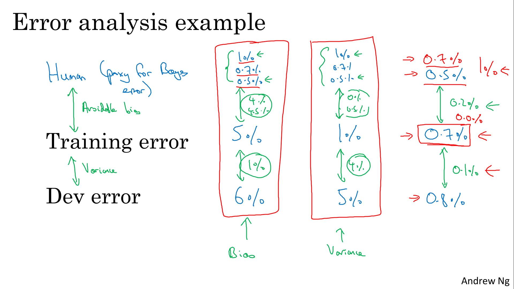

And the big difference between our discussion here and what we saw in an earlier course was that instead of comparing training error to 0%,
and just calling that the estimate of the bias, we have a more nuanced analysis in which there is no particular expectation that you should get 0% error

These techniques will tend to work well until you surpass human-level performance, whereupon you might no longer have a good estimate of Bayes error that still helps you make this decision really clearly.

> 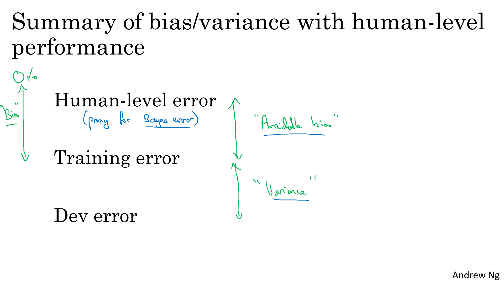

## Surpassing Human-level Performance

See pdf notes provided by Courseara : [10-Surpassing_human_level_performance.pdf](./10-Surpassing_human_level_performance.pdf)

In the second example case, training error surpassed this 0.5%. There is not enough information to know if bias reduction or variance reduction has to be done on the algorithm. 

> 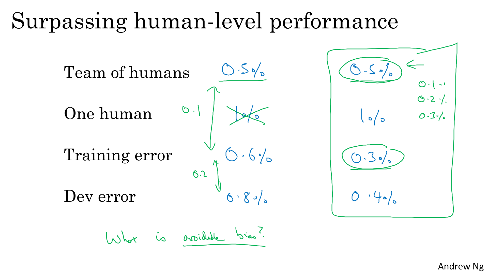

There are many problems where machine learning significantly surpasses human-level performance (especially in **structured data**)
And these are not natural perception problems, so these are not computer vision, or speech recognition, or natural language processing task. Humans tend to be very good in natural perception task and it's just a bit harder for computers to surpass human-level performance on natural perception task

> 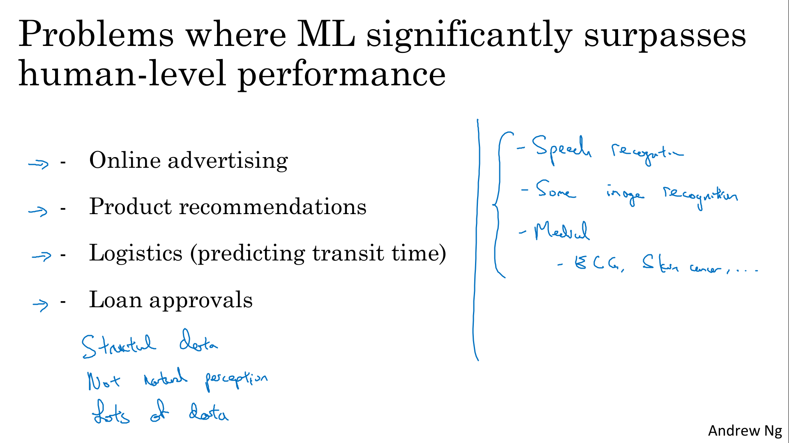

## Improving your Model Performance

See pdf notes provided by Courseara : [11-Improving_your_model_performance.pdf](./11-Improving_your_model_performance.pdf)

There are two fundamental assumptions of supervised learning.

1. You can fit the training set pretty well (achieve low avoidable bias).
2. The training set performance generalizes pretty well to the dev/test set (variance is not too bad)
> 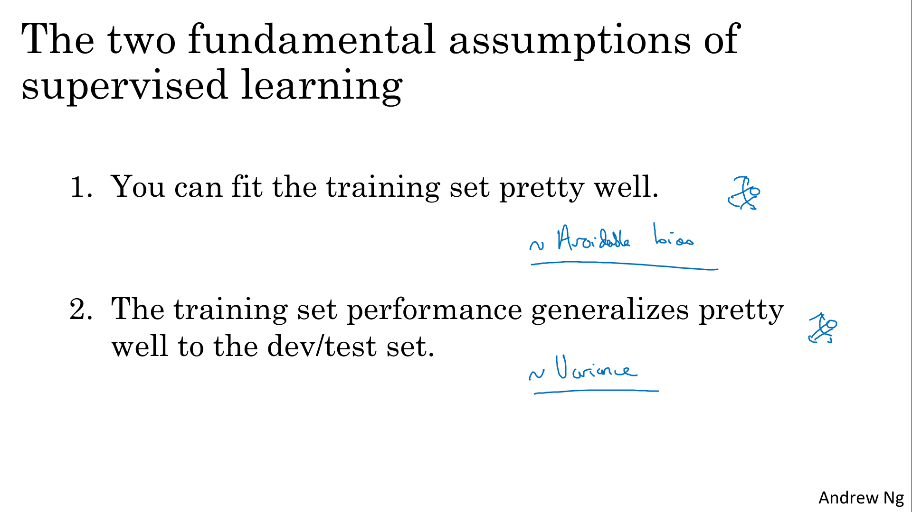

Technics to work on avoidable bias and variance reductions.

> 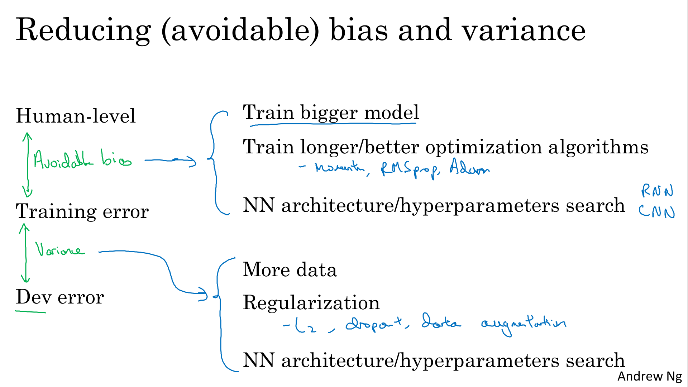

# Heroes of Deep Learning (Optional)

## Andrej Karpathy Interview