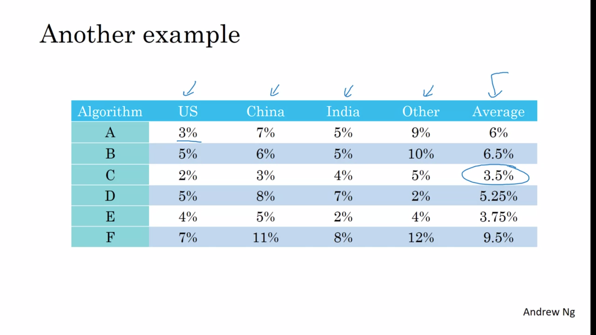

# ML Strategy

Streamline and optimize your ML production workflow by implementing strategic guidelines for goal-setting and applying human-level performance to help define key priorities.

Learning Objectives
- Explain why Machine Learning strategy is important
- Apply satisficing and optimizing metrics to set up your goal for ML projects
- Choose a correct train/dev/test split of your dataset
- Define human-level performance
- Use human-level performance to define key priorities in ML projects
- Take the correct ML Strategic decision based on observations of performances and dataset

# Introduction to ML Strategy

## Why ML Strategy

> 

## Orthogonalization

> 
> 

# Setting Up your Goal

## Single Number Evaluation Metric

> 
> 

## Satisficing and Optimizing Metric

> 

## Train/Dev/Test Distributions

> 
> 
> 

## Size of the Dev and Test Sets

> 
> 
> 

## When to Change Dev/Test Sets and Metrics?

> 
> 
> 

# Comparing to Human-level Performance

## Why Human-level Performance?

> 
> 

## Avoidable Bias

> 
> 
> 

## Understanding Human-level Performance

> 
> 
> 

## Surpassing Human-level Performance

> 
> 

## Improving your Model Performance

> 
> 

# Heroes of Deep Learning (Optional)

## Andrej Karpathy Interview