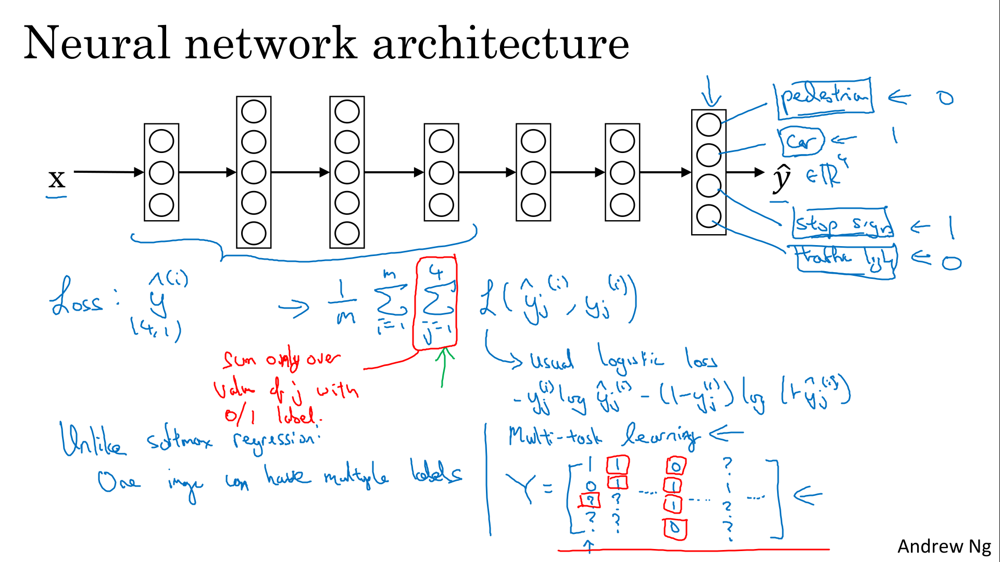
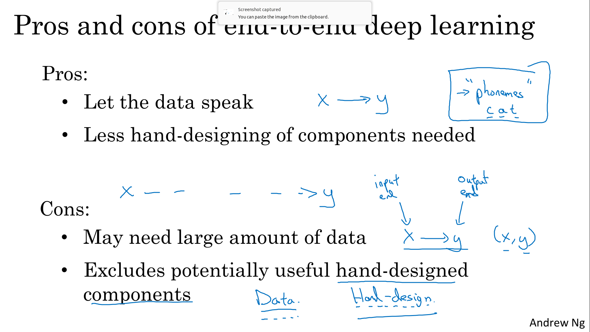

# ML Strategy

Develop time-saving error analysis procedures to evaluate the most worthwhile options to pursue and gain intuition for how to split your data and when to use multi-task, transfer, and end-to-end deep learning.

Learning Objectives
- Describe multi-task learning and transfer learning
- Recognize bias, variance and data-mismatch by looking at the performances of your algorithm on train/dev/test sets

# Error Analysis

##  Carrying Out Error Analysis

If you're trying to get a learning algorithm to do a task that humans can do. And if your learning algorithm is not yet at the performance of a human. Then manually examining mistakes that your algorithm is making, can give you insights into what to do next. This process is called error analysis.

Error analysis approach:
- get about, say 100 mislabeled dev set examples, 
- Count up how many are dogs
    - if 5 of 100 are dogs then training your classifier to do better on dogs will decrease your error up to 9.5% (called ceiling), which can be too little.
    - if 50 of 100 are dogs then you could decrease your error up to 5%, which is reasonable and you should work on that

> 

Sometimes, you can evaluate multiple error analysis ideas in parallel and choose the best idea. 
Create a spreadsheet to do that and decide

For example, clearly in this example, a lot of the mistakes were made on blurry images, and quite a lot on were made on great cat images

> 

##  Cleaning Up Incorrectly Labeled Data

Deep learning algorithms are quite robust to **random** errors in the training set

> 

My advice is, if it makes a significant difference to your ability to evaluate algorithms on your dev set, then go ahead and spend the time to fix incorrect labels. But if it doesn't make a significant difference to your ability to use the dev set to evaluate classifiers, then it might not be the best use of your time

> 

Guidelines :

> 

##  Build your First System Quickly, then Iterate

See pdf notes provided by Courseara : [1-Build_System_Quickly.pdf](./1-Build_System_Quickly.pdf)

Depending on the area of application, the guideline below will help you prioritize when you build your
system.

Guideline
1. Set up development/ test set and metrics
    - Set up a target
2. Build an initial system quickly
    - Train training set quickly: Fit the parameters
    - Development set: Tune the parameters
    - Test set: Assess the performance
3. Use Bias/Variance analysis & Error analysis to prioritize next steps

> 

# Mismatched Training and Dev/Test Set

##  Training and Testing on Different Distributions

See pdf notes provided by Courseara : [2-Training_and_testing_on_different_distributions.pdf](./2-Training_and_testing_on_different_distributions.pdf)

So in this video, we see examples of when allowing your training set data to come from a different distribution than your dev and test set allows you to have much more training data (sometime you cannot avoid working mixing real data and data fron purchase or other...)

First option is to shuffle the data tand extract randomly training and dev/test sets.
- (+) All the sets now come from the same distribution.
- (-) real world distribution that was in the dev/test sets will occur less in the new dev/test sets and that might be not what you want to achieve.

Second option: take some of the dev/test  examples and add them to the training set.
- (+) the distribution important for your application is your targey
- (-) different distributions

First example with cat classifier

> 

Second exemple with rearview mirror

> 

##  Bias and Variance with Mismatched Data Distributions

See pdf notes provided by Courseara : [3-Bias_and_variance_with_mismatched_data_distributions.pdf](./3-Bias_and_variance_with_mismatched_data_distributions.pdf)

Bias and Variance analysis changes when training and Dev/test set is from the different distribution.

Suppose you've worked in the example and reached this
- Human error: 0%
- Train error: 1%
- Dev error: 10%

With training error is 1%, and dev error is 10% and data data coming from the same distribution, you would say that here you have a large variance problem. But in the setting where your training data and your dev data comes from a different distribution, you can no longer safely draw this conclusion. Maybe there isn't a variance problem and this just reflects that the dev set contains images that are much more difficult to classify accurately.

To solve this issue we create a new set called **train-dev set** as a random subset of the training set (same distribution) 

If you have now :
- Human error: 0%
- Train error: 1%
- **Train-dev error: 9%**
- **Dev error: 10%**

Now we are sure that this is a high variance problem because the gap between train-dev and train errors

Suppose we have a different situation:
- Human error: 0%
- Train error: 1%
- **Train-dev error: 1.5%**
- **Dev error: 10%**

In this case we have **Data mismatch** problem.

> 

The key quantities I would look at are :
1. Human-level error (proxy for Bayes error)
2. Train error
    - Avoidable bias = training error - human level error
3. Train-dev error
    - variance = training-dev error - training error
4. Dev error
    - data mismatch = dev error - train-dev error
5. Test error
    - degree of overfitting to dev set = test error - dev error
    - dev set and test set come from the same distribution
    - so if this difference is big then maybe you need to find a bigger dev set 

> 

In red, the key quantities described above, but other table entries can help in diagnostic too.

> 

##  Addressing Data Mismatch

See pdf notes provided by Courseara : [4-Adressing_data_mismatch.pdf](./4-Adressing_data_mismatch.pdf)

> 
> 
> 

# Learning from Multiple Tasks

##  Transfer Learning

See pdf notes provided by Courseara : [5-Transfer_Learning.pdf](./5-Transfer_Learning.pdf)

> 
> 

##  Multi-task Learning

See pdf notes provided by Courseara : [6-Multi_Task_Learning.pdf](./6-Multi_Task_Learning.pdf)

> 
> 
> 

# End-to-end Deep Learning

##  What is End-to-end Deep Learning?

See pdf notes provided by Courseara : [7-What_is_end_to_end_deep_learning.pdf](./7-What_is_end_to_end_deep_learning.pdf)

> 
> 
> 

##  Whether to use End-to-end Deep Learning

See pdf notes provided by Courseara : [8-Whether_to_use_end_to_end_deep_learning.pdf](./8-Whether_to_use_end_to_end_deep_learning.pdf)

> 
> 

# Heroes of Deep Learning (Optional)

##  Ruslan Salakhutdinov Interview
