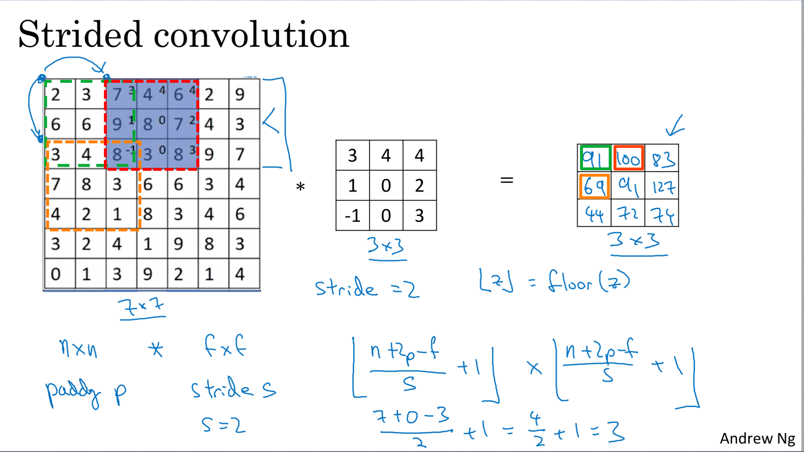

Implement the foundational layers of CNNs (pooling, convolutions) and stack them properly in a deep network to solve multi-class image classification problems.

Learning Objectives
- Explain the convolution operation
- Apply two different types of pooling operations
- Identify the components used in a convolutional neural network (padding, stride, filter, ...) and their purpose
- Build a convolutional neural network
- Implement convolutional and pooling layers in numpy, including forward propagation
- Implement helper functions to use when implementing a TensorFlow model
- Create a mood classifer using the TF Keras Sequential API
- Build a ConvNet to identify sign language digits using the TF Keras Functional API
- Build and train a ConvNet in TensorFlow for a binary classification problem
- Build and train a ConvNet in TensorFlow for a multiclass classification problem
- Explain different use cases for the Sequential and Functional APIs


# Convolutional Neural Networks

## Computer Vision

Computer vision is one of the areas that's been advancing rapidly thanks to deep learning : 
- self-driving cars 
- face recognition 
- unlock a phone or a door
- enabling new types of art t

Deep learning for computer vision is exciting because:
- rapid advances in computer vision are enabling new applications
- even if you don't end up building computer vision systems, because the computer vision research community has been so creative and so inventive in coming up with new neural network architectures and algorithms, it inspires other areas


Examples of a computer vision problems includes:
- Image classification.
- Object detection with localization (draw boxes around them)
- Neural style transfer (changes the style of a __content__ image using another __style__ image)

> 


One of the challenges of computer vision problems is that the inputs can get really big. A 1000x1000 image will be represented by 3 millions feature. 

With 1000 units in the first hidden layer, we will work with a (1000 x 3'000,000) matrix


And with that many parameters, it's difficult 
- to get enough data to prevent a neural network from **overfitting**
- **memory requirements** to train a neural network with three billion parameters is just a bit infeasible

To solve that, you need to implement the **convolution operation**, which is one of the fundamental building blocks of convolutional neural networks.


> 

## Edge Detection Example

The convolution operation is one of the fundamental building blocks of a convolutional neural network.
For a computer to figure out what are the objects in this picture, the first thing you might do is maybe detect horizontal and vertical edges in the image.

> 

An example of convolution operation to detect vertical edges

All the deep learning frameworks that have a good support for computer vision will have some functions for implementing this convolution operator:
- In tensorflow cf. ```tf.nn.conv2d```
- keras ```conv2d```

> 

Why is this doing vertical edge detection?

If you plot this right most matrix's image it will look like that where there is this lighter region right in the middle and that corresponds to this having detected this vertical edge down the middle of your 6 by 6 image. 

Dimensions here seem a little bit wrong, that's only because we are working with very small images in this example. If you are using a 1000 x 1000 image rather than a 6 x 6 image then you find that this does a pretty good job, really detecting the vertical edges in your image. 

> 

## More Edge Detection

But this particular filter does make a difference between the light to dark versus the dark to light edges. And if you don't care which of these two cases it is, you could take absolute values of this output matrix. 

> 

This three by three filter we've seen allows you to detect vertical edges. So maybe it should not surprise you too much that this three by three filter will allow you to detect horizontal edges. 

> 

Different filters allow you to find vertical and horizontal edges. The three by three vertical edge detection filter we've used is just one possible choice. Historically, in the computer vision literature, there was a fair amount of debate about what is the best set of numbers to use.

```
Sobel filter:           Scharr filter:

1, 0, -1                 3, 0, -3
2, 0, -2                10, 0, -10
1, 0, -1                 3, 0, -3
```

The advantage of these filters is there is more weight to the central row, the central pixel, and this makes it maybe a little bit more robust. 

You also have Sobel and Scharr filter for horizontal edge detection by flipping rgem 90 degrees,

And so by just letting all of these numbers be parameters and learning them automatically from data, we find that neural networks can actually learn low level features, can learn features such as edges, even more robustly than computer vision researchers are generally able to code up these things by hand.

```
w1, w2, w3
w4, w5, w6
w7, w8, w9
```
But underlying all these computations is still this convolution operation

> 

## Padding

In order to build deep neural networks one modification to the basic convolutional operation that you need to really use is padding.

Convolition filter change the size of your image.

|image size|convolution size|after convolution|
|--|--|--|
|6 x 6|3 x 3|4 x 4|
|n x n|f x f|(n-f+1) x (n-f+1)|


The two downsides of a convolutional operator : 
- your image shrinks (after a hundred layers you end up with a very small image)
- you're throwing away a lot of the information near the edge of the image

To solve theses problem, we use padding 

> 

|image size|convolution size|padding size|after convolution|
|--|--|--|--|
|6 x 6|3 x 3||4 x 4|
|n x n|f x f||(n-f+1) x (n-f+1)|
|n x n|f x f|p|(n+2p-f+1) x (n+2p-f+1)|
|6 x 6|3 x 3|1|6 x 6|

(padding with 2 pixel, p = 2, is also possible)

> 

 In terms of how much to pad, two common choices:
 - **Valid** convolutions (no padding)
 - **Same** convolutions (output size is the same as the input size)

In computer vision f (size of the filter) is usually odd. Some of the reasons is that its have a center value.

> 

## Strided Convolutions

Stride convolutions is another piece of the basic building block of convolutions as using convolution neural networks.
The filter must lie entirely within the image or the image plus the padding region.

> 

Stride convolution divide the size of the image by 2.

Output size after convolution: floor((n+2p-f)/s+1) x floor((n+2p-f)/s+1)
- after convolution with padding : ```(n+2p-f+1)```
- after convolution with padding and strided : ```floor(1 + (n+2p-f)/s) ```

> 

In math textbooks the conv operation is **filpping** the filter before using it both horizontaly and verticaly.

The way we've defined the convolution operation in these videos is that we've skipped this mirroring operation.

It turns out that in signal processing or in certain branches of mathematics, doing the flipping in the definition of convolution causes convolution operator to enjoy associativity. This is nice for some signal processing applications. But for deep neural networks, it really doesn't matter, and so omitting this double mirroring operation just simplifies the code.

By convention, in machine learning, we usually do not bother with this flipping operation. Technically this operation is maybe better called **cross-correlation**. But most of the deep learning literature just causes the convolution operator.

> 

## Convolutions Over Volume

We see how convolution works with 2D images, now lets see if we want to convolve 3D images (RGB image)

Filter has 3 dimensions : ```height x width x channel``` , channel dimension corresponds to the red, green, and blue channels.

In term of dimensions, we have ```6x6x6 * 3x3x3 = 4x4 ``` 

> 

Last crucial idea  for building convolutional neural networks : we don't just wanted to detect vertical edges, but also horizontal edges, maybe 45 degree edges, maybe 70 degree edges as well

In other words, what if you want to use multiple filters at the same time.

> 

## One Layer of a Convolutional Network

> 
> 
> 

## Simple Convolutional Network Example

> 
> 

## Pooling Layers

> 
> 
> 
> 

## CNN Example

> 
> 

## Why Convolutions?

> 
> 
> 

# Heroes of Deep Learning (Optional)

## Yann LeCun Interview