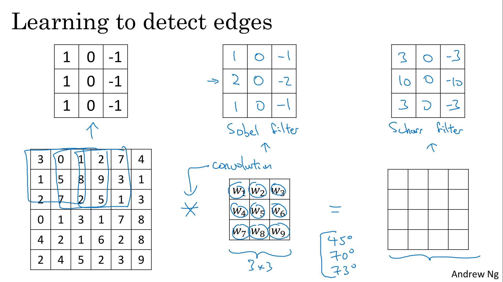
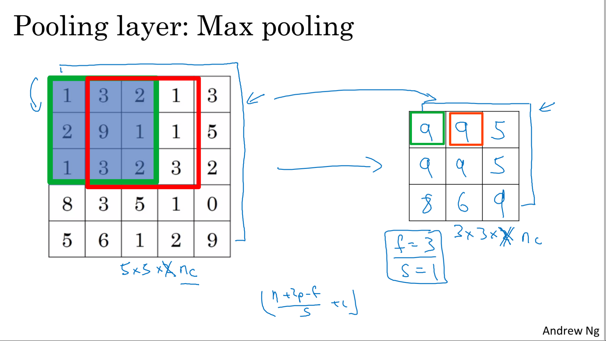

Implement the foundational layers of CNNs (pooling, convolutions) and stack them properly in a deep network to solve multi-class image classification problems.

Learning Objectives
- Explain the convolution operation
- Apply two different types of pooling operations
- Identify the components used in a convolutional neural network (padding, stride, filter, ...) and their purpose
- Build a convolutional neural network
- Implement convolutional and pooling layers in numpy, including forward propagation
- Implement helper functions to use when implementing a TensorFlow model
- Create a mood classifer using the TF Keras Sequential API
- Build a ConvNet to identify sign language digits using the TF Keras Functional API
- Build and train a ConvNet in TensorFlow for a binary classification problem
- Build and train a ConvNet in TensorFlow for a multiclass classification problem
- Explain different use cases for the Sequential and Functional APIs

# Convolutional Neural Networks

## Computer Vision

> 
> 
> 

## Edge Detection Example

> 
> 
> 

## More Edge Detection

> 
> 
> 

## Padding

> 
> 

## Strided Convolutions

> 
> 
> 

## Convolutions Over Volume

> 
> 
> 

## One Layer of a Convolutional Network

> 
> 
> 

## Simple Convolutional Network Example

> 
> 

## Pooling Layers

> 
> 
> 
> 

## CNN Example

> 
> 

## Why Convolutions?

> 
> 
> 

# Heroes of Deep Learning (Optional)

## Yann LeCun Interview