# Deep Convolutional Models: Case Studies

Discover some powerful practical tricks and methods used in deep CNNs, straight from the research papers, then apply transfer learning to your own deep CNN.

Learning Objectives
- Implement the basic building blocks of ResNets in a deep neural network using Keras
- Train a state-of-the-art neural network for image classification
- Implement a skip connection in your network
- Create a dataset from a directory
- Preprocess and augment data using the Keras Sequential API
- Adapt a pretrained model to new data and train a classifier using the Functional API and MobileNet
- Fine-tine a classifier's final layers to improve accuracy


# Case Studies

## Why look at case studies?


[Last week](../week1/README.md) we learned about the basic building blocks, such as convolutional layers, pooling layers, and fully connected layers of convnet. 

In the past few years, a lot of computer vision research has been done to put together these basic building blocks to form effective convolutional neural networks. 

As many may have learned to write code by reading other people's codes, a good way to gain intuition and how the build confidence is to read or to see other examples of effective confidence. It turns out that a neural network architecture that works well on one computer vision tasks often works well on other tasks as well.

We will see the following 
- standard networks :
    - LeNet-5
    - AlexNet
    - VGG
- ResNet, neural network trained a very deep 152 layer neural network
- Inception 

After seeing these neural networks, I think you have much better intuition about how to build effective convolutional neural networks. Even if you don't end up building computer vision applications yourself, I think you'll find some of these ideas very interesting and helpful for your work.

> 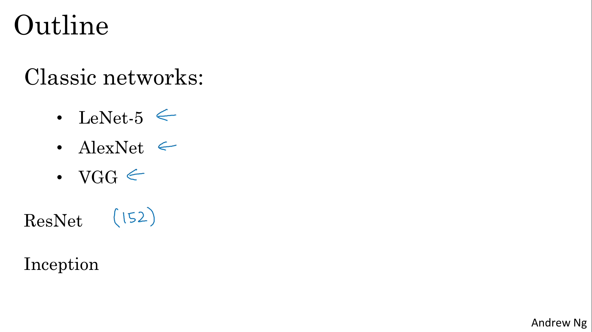

## Classic Networks

The goal of LeNet-5 was to recognize handwritten digits. This neural network architecture is actually quite similar to the last [example you saw last week](../week1/README.md#cnn-example).
- Paper was written in **1998**, people didn't really use padding, which is why convolutional layer decrease width and height (28x28 -> 14x14 -> 10x10 -> 5x5)
- The number of channels does increase.
- A modern version of this neural network, we'll use a softmax layer with a 10 way classification output. Although back then, LeNet-5 actually use a different classifier at the output layer, one that's useless today.
- his neural network was small by modern standards, had about 60,000 parameters (10 million to 100 million parameters today is a standard)
- This type of arrangement of layers (CONV, POOL, CONV, POOL, FC, FC, OUTPUT) is quite common. 

Red comments are only for who wants to read the original paper :
- The activation function used in the paper was Sigmoid and Tanh. Modern implementation uses RELU in most of the cases.
- to save on computation as well as some parameters, the original LeNet-5 had some crazy complicated way where different filters would look at different channels of the input block.

> 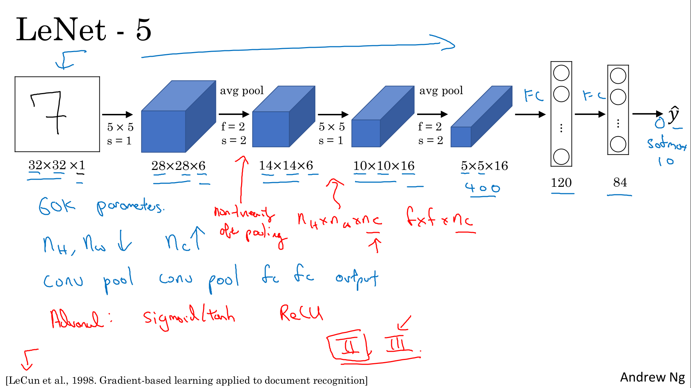

The second example of a neural network I want to show you is AlexNet, named after Alex Krizhevsky, who was the first author of the paper describing this work (**2012**)
- So this neural network actually had a lot of similarities to LeNet, but it was much bigger ( 60,000 parameters VS 60 million parameters)
- It used the RELU activation function.
- when this paper was written, GPUs was still a little bit slower, so it had a complicated way of training on two GPUs. 
- The original AlexNet architecture also had another set of a layer called a Local Response Normalization. And this type of layer isn't really used much


> 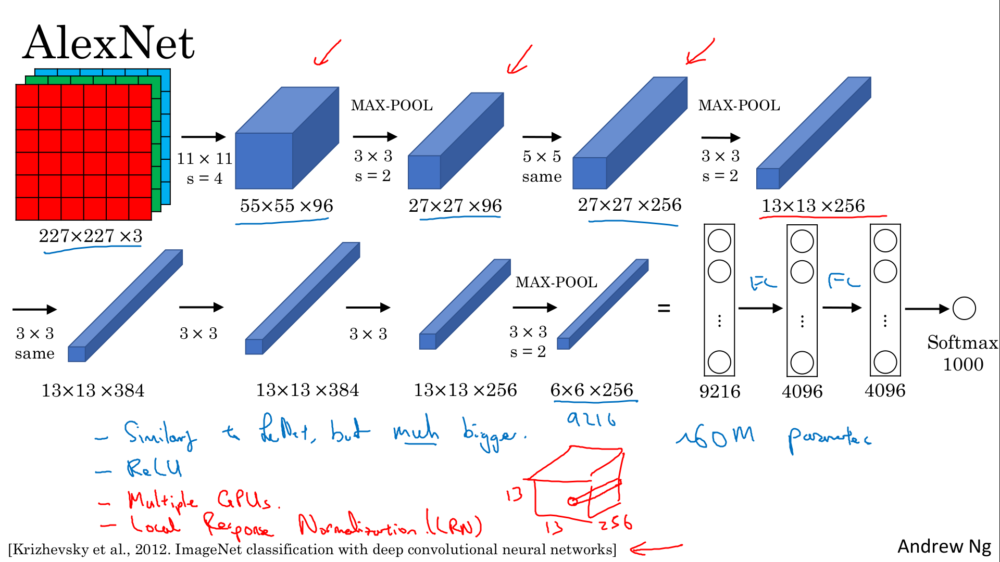

- Instead of having a lot of hyperparameters lets have some simpler network. The simplicity of the VGG-16 architecture (quite uniform) made it quite appealing. 
    - CONV = 3 X 3 filter, s = 1, same
    - MAX-POOL = 2 X 2 , s = 2
- The 16 in the VGG-16 refers to the fact that this has 16 layers that have weights
- And this is a pretty large network, this network has a total of about 138 million parameters (pretty large even by modern standards). 


> 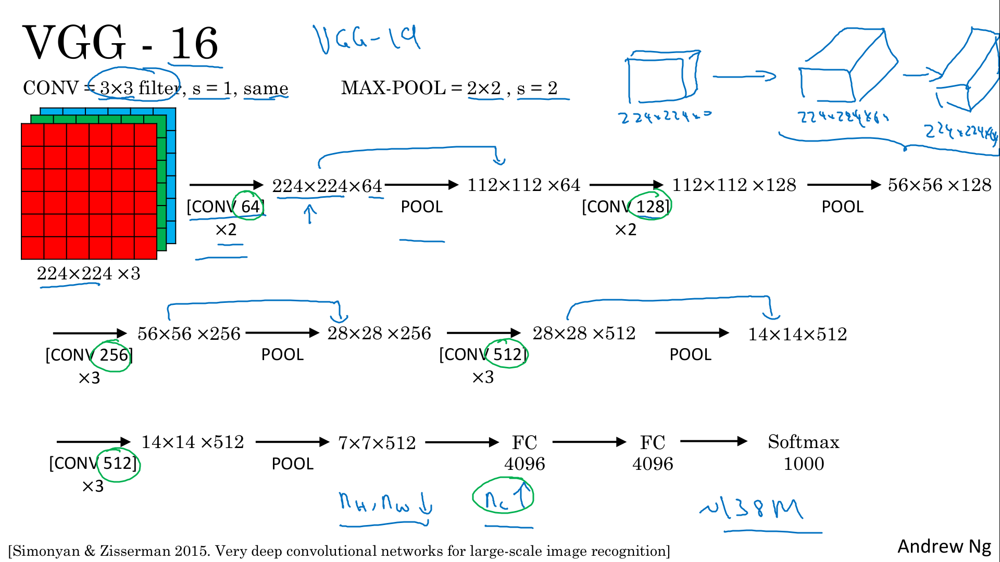

But next, let's go beyond these classic networks and look at some even more advanced, even more powerful neural network architectures. Let's go onto the next video.

## ResNets

Very, very deep neural networks are difficult to train, because of vanishing and exploding gradient types of problems.

A residual block is a stack of layers set in such a way that the output of a layer is taken and added to another layer deeper in the block. The non-linearity is then applied after adding it together with the output of the corresponding layer in the main path. 

This by-pass connection is known as the shortcut or the skip-connection.

> 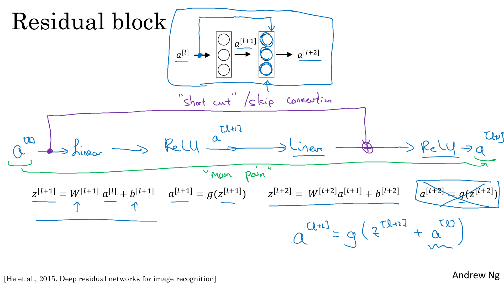

This residual network is composed of 5 residual blocks.

With normal **plain networks**, because of the vanishing and exploding gradients problems, the performance decrease when the the network become too deep. With residual networks, the performance of the training keep on going down when adding more layers

> 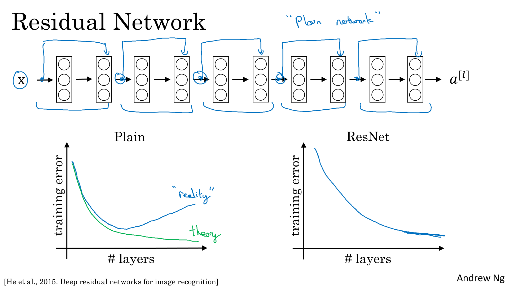

## Why ResNets Work?

A residual block is a fundamental building block in deep neural networks, especially in CNNs, that helps to address the vanishing gradient problem **during training**. Let's go through one example that illustrates why ResNets work so well.

We saw that if you make a network deeper, it can hurt your ability to train the network to do well on the training set.

For the sake our argument, let's say throughout this network we're using the ReLU activation functions. So, all the activations are going to be greater than or equal to zero, with the possible exception of the input X. 

```
a[l+2] = g( z[l+2] + a[l] )
	   = g( W[l+2] a[l+1] + b[l+2] + a[l] )
```

If we use L2 regularization, the value of W[l+2],b[l+2] shrink to zero ```a[l+2] ≈ g(a[l])```

As  we use ReLU and a[l] is also positive, ```a[l+2] ≈ g(a[l])```

That means that **identity function** is easy for a residual block to learn because of the shortcut connection, that's why adding these 2 additional layers doesn't hurt performance


But of course our goal is to not just not hurt performance, is to help performance and so you can imagine that if all of these heading units if they actually learned something useful then maybe you can do even better than learning the identity function

One more detail in the residual network that's worth discussing which is through this edition here, we're assuming that z[l+2] and a[l] have the same dimension. that's why ResNet use "same convolution" with padding

> 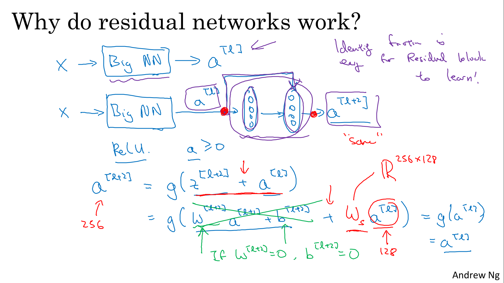

Example of a plain network and a associated ResNet,

> 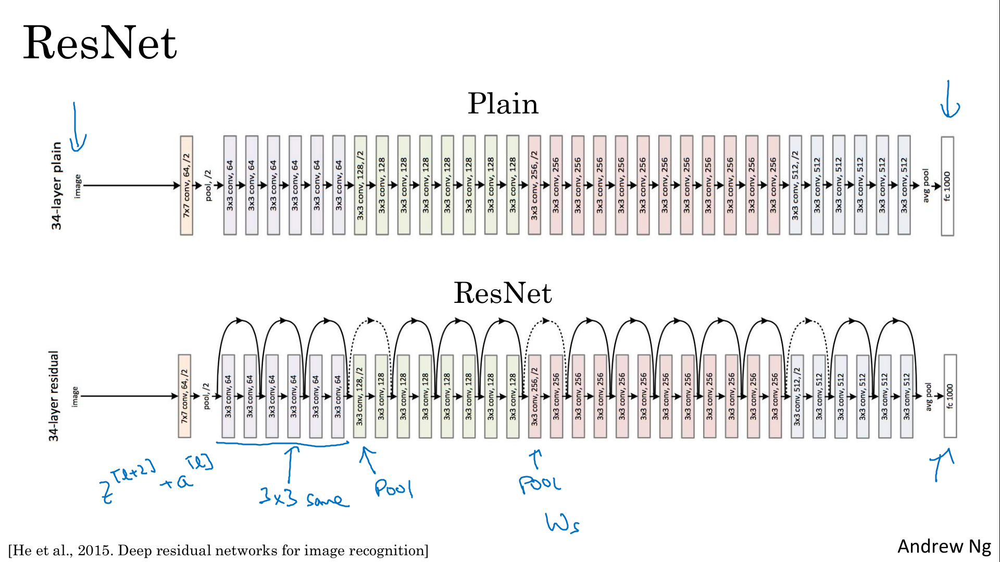

## Networks in Networks and 1x1 Convolutions

With only one channel, one-by-one convolution doesn't make sense (exemple with 6x6x1)

But with an input 6x6x32, we can use a 1x1x32 convolution that perform an element-wise product then apply a ReLU non linearity.

- One way to think about a one-by-one convolution is that it is basically having a fully connected neural network that applies to each of the 62 different positions. 
- One-by-one convolution is sometimes also called network in network
- If using many filter, the outpu will have #filters channels

> 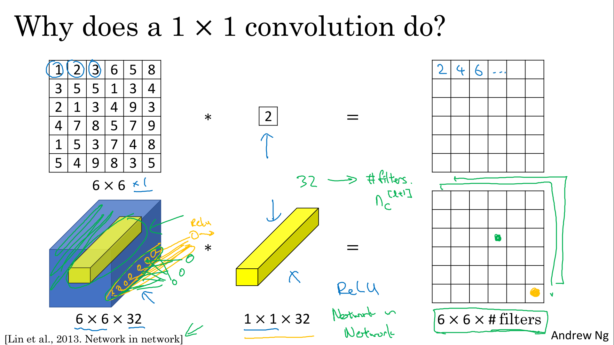

Example of where one-by-one convolution is useful. 
- If you want to shrink the height and width, you can use a pooling layer. 
- But to shrink the number of channel, you can use 32 filters (from 192 to 32 channels) 

> 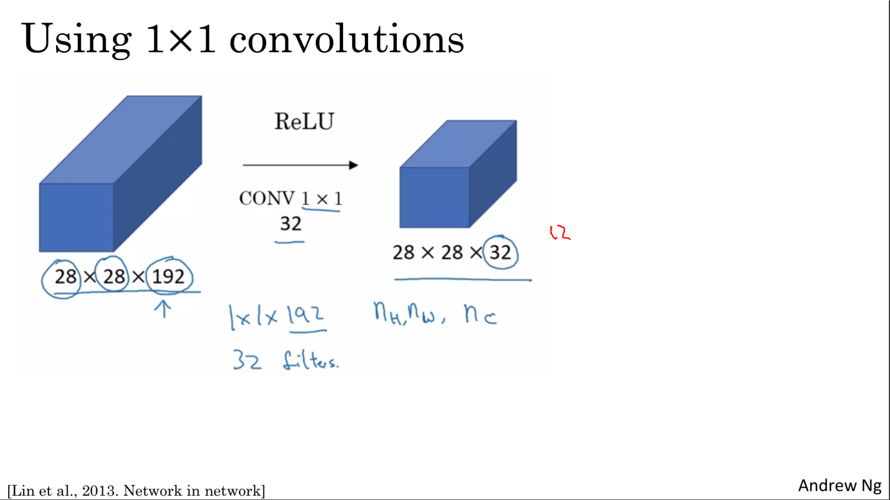

## Inception Network Motivation

When designing a layer for a ConvNet, you might have to pick, do you want a 1x3 filter, or 3x3, or 5x5, or do you want a pooling layer? Why should you do them all? And this makes the network architecture more complicated, but it also works remarkably well. 

So what the inception network or what an inception layer says is, instead choosing what filter size you want in a Conv layer, or even do you want a convolutional layer or a pooling layer? 
- Let's do them all : CONV 1x1, CONV 3x3, CONV 5x5, MAX POOL 
- And then what you do is just stack up this second volume next to the first volume.
- So you will have one inception module input 28 x 28 x 192, and output 28 x 28 x 256.
- Let the network learn whatever parameters it wants to use, whatever the combinations of these filter it wants

> 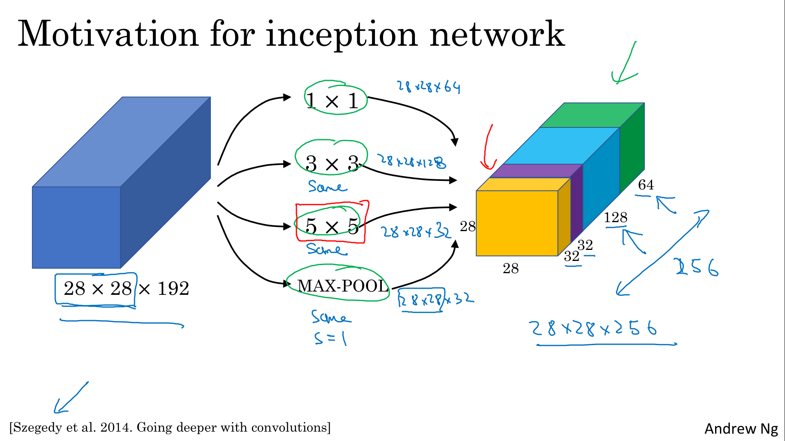

There is a problem with the inception layer as we've described it here, which is computational cost. 

Let's figure out what's the computational cost of the 5 x 5 filter (purple block in privious slide).

> 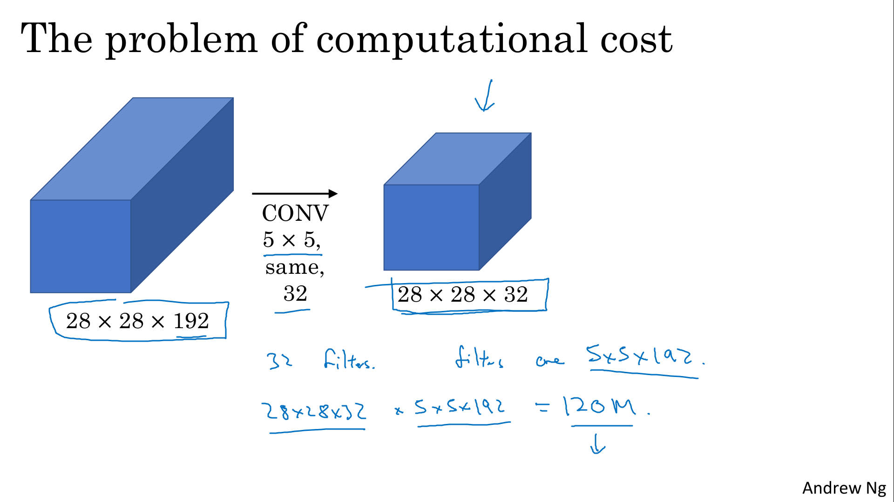

Total operation is 5*5*192*28*28*21 = 120 millions.

While you can do 120 million multiplies on the modern computer, this is still a pretty expensive operation. 


> 

Here is an alternative architecture for inputting 28 x 28 x 192, and outputting 28 x 28 x 32, to reduce the computational costs by about a factor of 10. 
- So notice the input and output dimensions are still the same.
- But what we've done is we're taking this huge volume we had on the left, and we shrunk it to this much smaller intermediate volume, which only has 16 instead of 192 channels
- Sometimes this is called a bottleneck layer

Total operation is 12.4 millions (conpared to 120 millions)

> 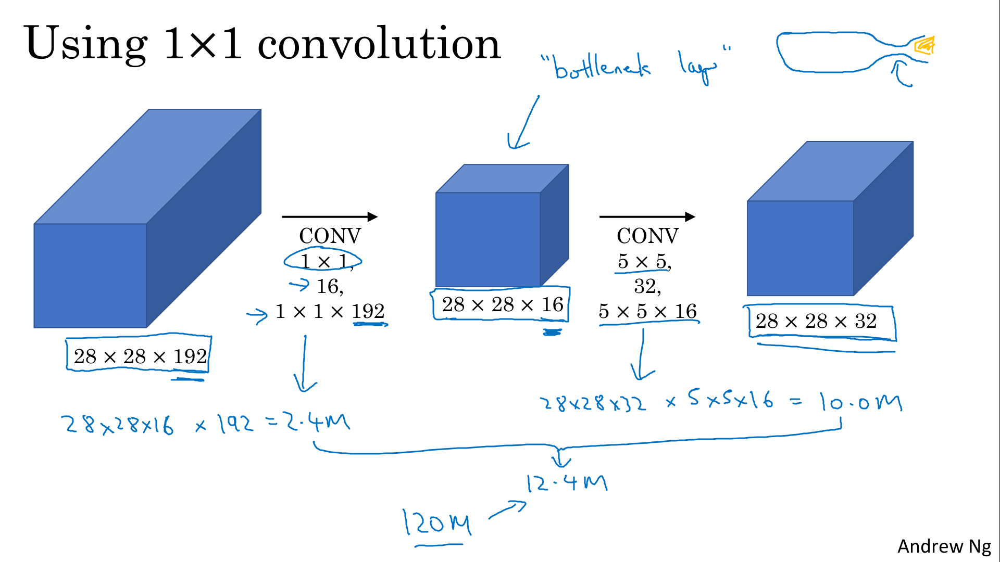


So to summarize :
- you don't want to have to decide, do you want a 1 x 1, or 3 x 3, or 5 x 5, or pooling layer, the inception module lets you say let's do them all
- and let's concatenate the results
- the problem of computational cost is solvd by using a one-by-one convolution

Now you might be wondering, does shrinking down the representation size so dramatically, does it hurt the performance of your neural network? It turns out that so long as you implement this bottleneck layer so that within reason, you can shrink down the representation size significantly, and it doesn't seem to hurt the performance, but saves you a lot of computation.

## Inception Network

You've already seen all the basic building blocks of the Inception network. Let's see how you can put these building blocks together to build your own Inception network.

**Inception module** takes as input the activation (output) from some previous layer (previous activation), with the following components:
1. [1x1 CONV followed by 5x5 CONV](#inception-network-motivation)
2. 1x1 CONV followed by 3x3 CONV, for the same computational cost reason
3. 1x1 CONV (doesn't need additional component)
4. 3x3 MAX POOL layer
    - we use padding (same CONV) for keeping width and height (28x28x192 output)
    - we add a 1-by-1 CONV with 32 channels to shring the number of channels

> 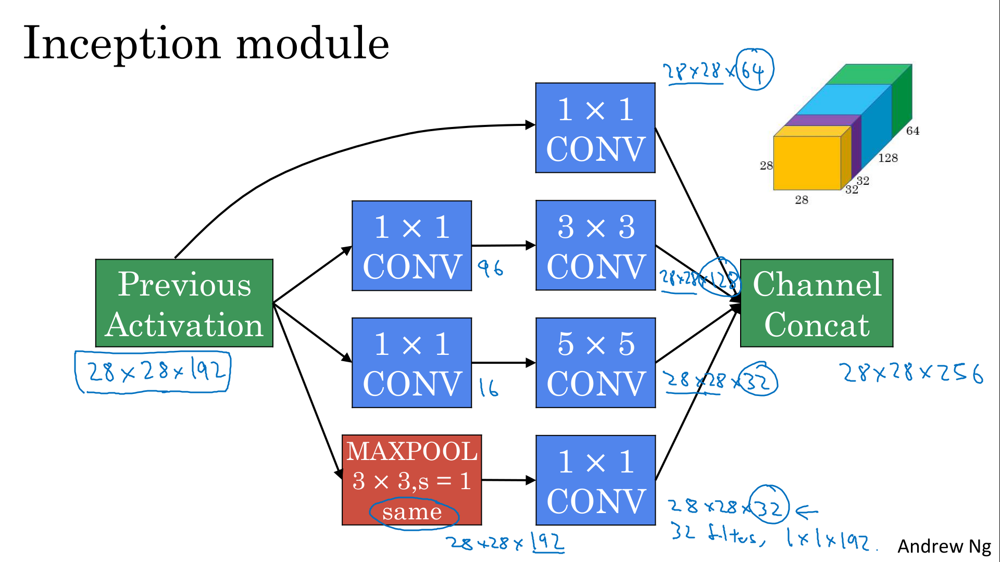

The inception network consists in putting together blocks of the Inception module :
- some extra max pooling layers to change the dimension
- the last few layers of the network is a fully connected layer followed by a softmax layer to try to make a prediction
- there are additional side branches depicted with green lines :
    - they help to ensure that intermediate layers are not too bad
    - they have a regularizing effect and helps prevent this network from overfitting
- Inception network was developed by authors at Google who called it GoogLeNet, spelled like that, to pay homage to the LeNet network. 

> 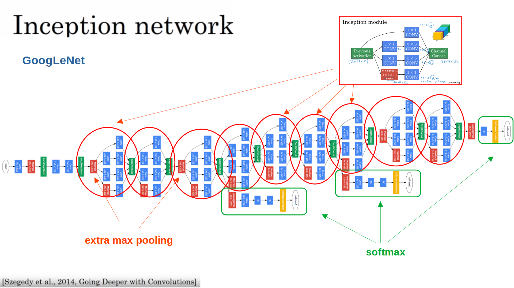

The name incpetion network come from thie meme : we need to go deeper

> 

## MobileNet

You've learned about 
- the ResNet architecture, 
- Inception net. 

MobileNets is another foundational convolutional neural network architecture used for computer vision. Using MobileNets will allow you to build and deploy new networks that work even in low compute environment, such as a mobile phone.

It's based on **depthwise separable convolution**.

> 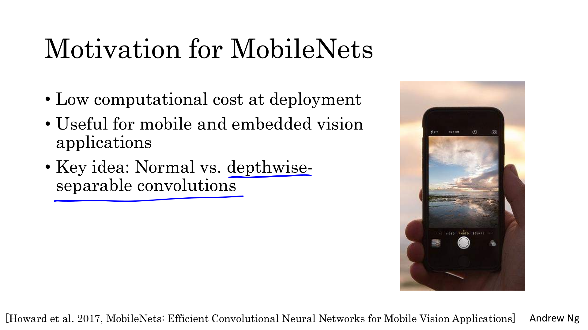

Normal convoultion, computal cost :
- 3x3x3=27 multiplication per value
- 4x4 values to compute (size of output)
- repeat the operation by the number of filters (5)

> 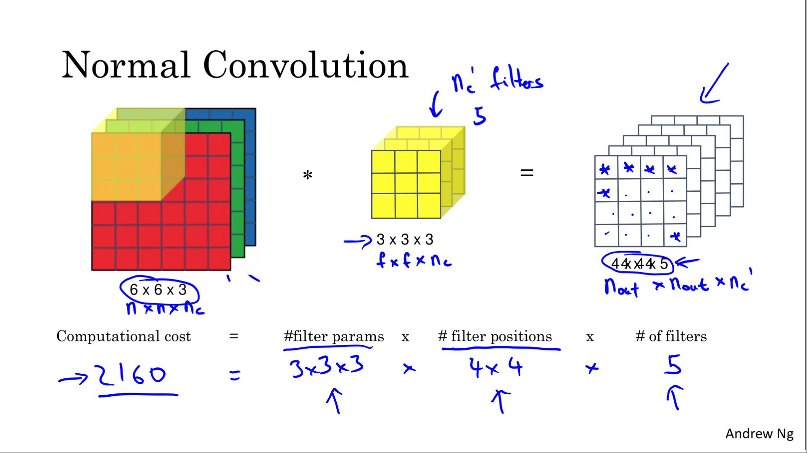

The depthwise separable convolution will take as input a 6x6x3 image and outputs 4x4xx5 with fewer computations than 2,160. In contrast to the normal convolution which you just saw, the depthwise separable convolution has two steps:
- first use a **depthwise** convolution, 
- followed by a **pointwise** convolution.

> 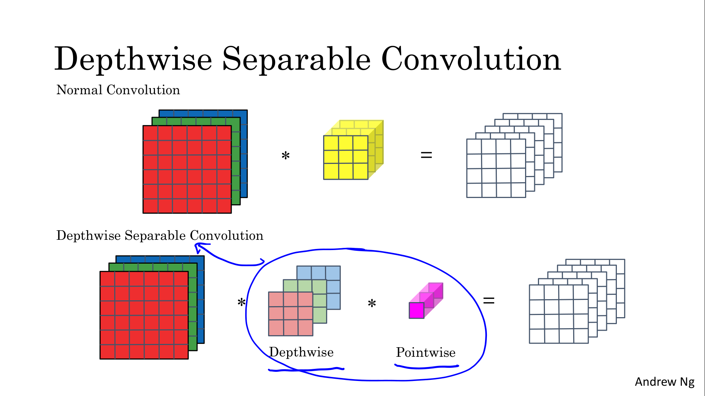

In a **depthwise** convolution, each filter has a 3x3x1 dimension instead of a 3x3x3 dimension. The difference is that :
- first filter is apply to first channel of image, 
- second filter is apply to second channel of image, 
- third filter is apply to third channel of image

> 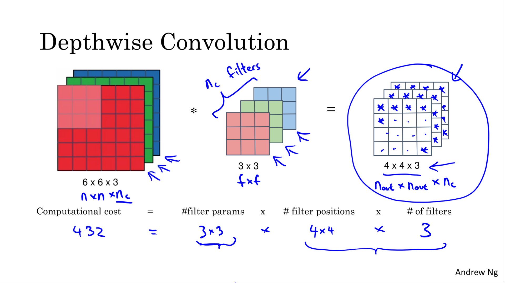

After the first step, we have a 4x4x3 but we want a 4x4x5 output. That's why we apply the second step

> 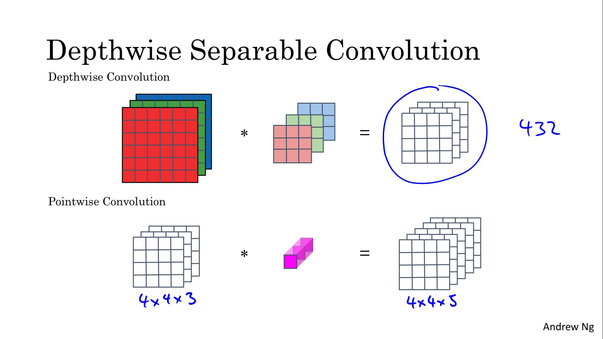

We apply 5 filters, each filter with a 1x1x3 dimension

> 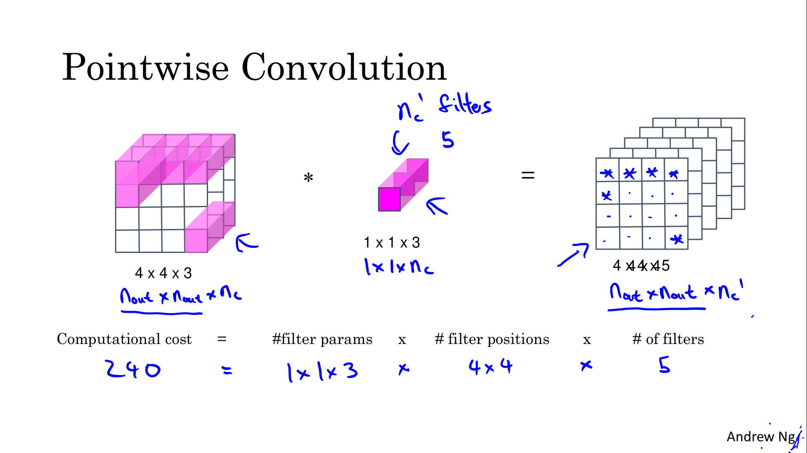

<!--
> 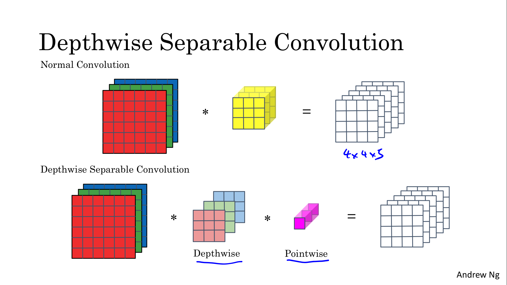
-->

The total cost is :

> 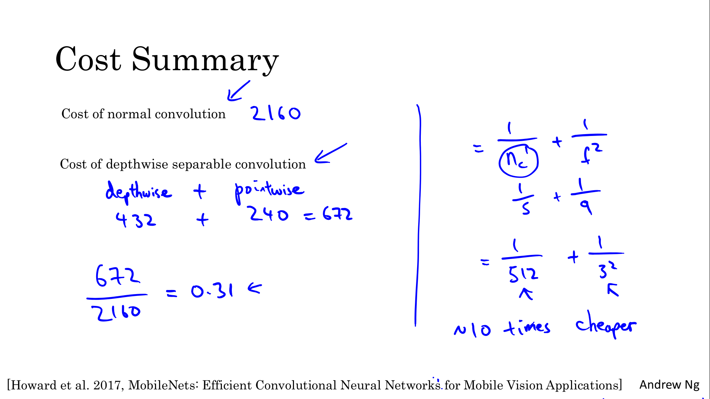

Now, something looks wrong with this diagram, doesn't it? Which is that this should be 3x3x6 not 3x3x9. But in order to make the diagrams in the next video look a little bit simpler, even when the number of channels is greater than three, I'm still going to draw the depthwise convolution operation as if it was this stack of 3 filters. 

> 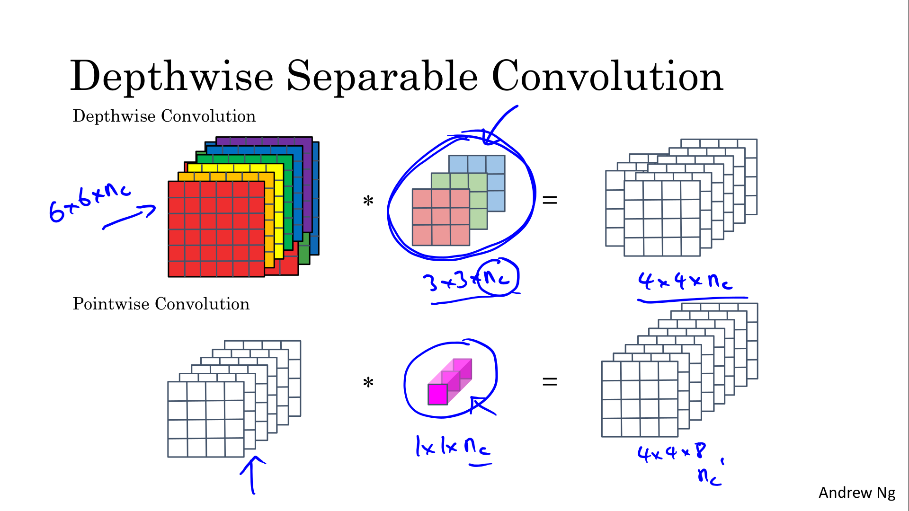

## MobileNet Architecture

The idea of MobileNet is everywhere that you previously have used an expensive convolutional operation, you can now instead use a much less expensive depthwise separable convolutional operation.

The MobileNet v1 paper had a specific architecture in which it use a 13 blocks, followed by Pooling layer, followed by a fully connected layer, followed by a Softmax in order for it to make a classification prediction

In this video, I want to share with you one more improvements on this basic MobileNet architecture, which is the **MobileNets v2 architecture**. In MobileNet v2, there are two main changes:
- the addition of a residual connection (see [ResNet](#resnets))
- the addition of an expansion layer


Notes : 
- This blocks (v2) is also called the bottleneck block.
- pointwise can also be called projection layer


> 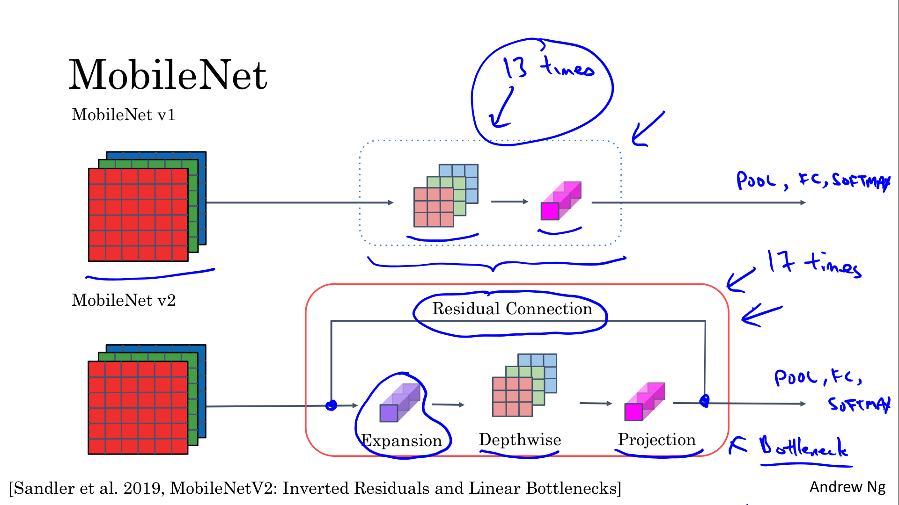

Detail on MobileNet V2 bottleneck block
1. expansion : 18 filters nxnx18 (input is nxnx3, factor of 6 is typical in MobileNet V2), thatś why is call expansion, go fron 3 channels to 18 channels
2. depthwise convolution (reminder, 18 channels even if on the slide only 3 colors-channels represented)
3. Pointwise convolution with 3 filters (call projection because you are projecting down from n x n x 18 down to n x n x 3)

 You might be wondering, why do we meet these bottleneck blocks? They accomplishes 2 things:
 - expansion increase the size of the representation within the bottleneck block. This allows the neural network to learn a richer function.
 - But when deploying on a mobile device,  you will often be heavy memory constraints. Pointwise convolution operation projects it back down to a smaller set of values, so that when you pass this the next block, the amount of memory needed to store these values is reduced back down

> 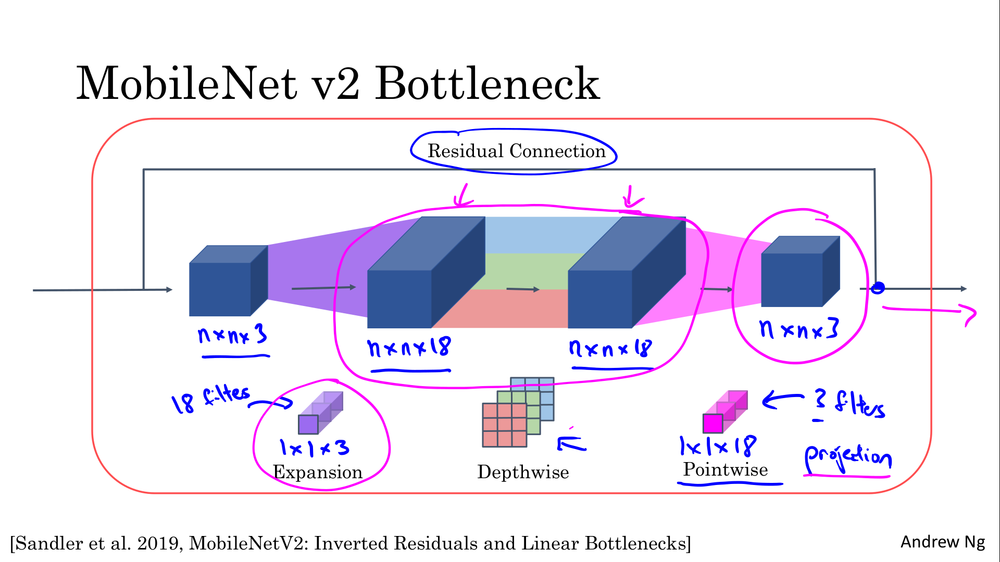

<!--
> 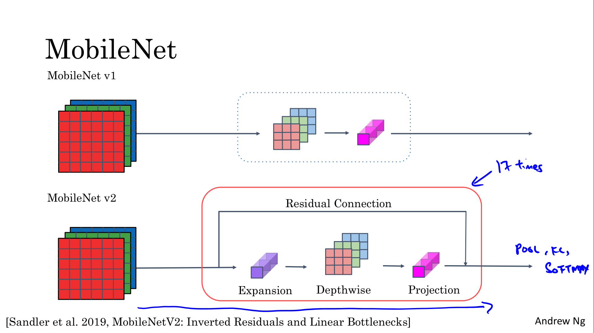
> 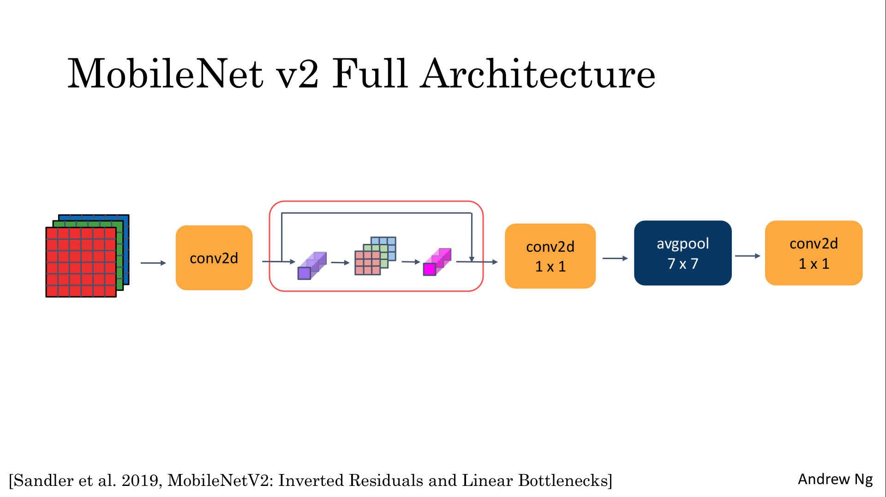
-->

## EfficientNet

MobileNet V1 and V2 gave you a way to implement a neural network, that is more computationally efficient. But is there a way to tune MobileNet, or some other architecture, to your specific device? 

The authors of the EfficientNet paper, Mingxing Tan and Quoc Le, observed that the three things you could do to scale things up or down: 
- resolution image (r)
- depth of the neural network (d)
- you can make the layers wider (w)

If you are ever looking to adapt a neural network architecture for a particular device, look at one of the open source implementations of EfficientNet, which will help you to choose a good trade-off between r, d, and w

The key idea behind EfficientNet is to scale up the neural network in a more efficient way than previous methods. Traditional scaling methods simply increase the depth, width, or resolution of a network independently, which can lead to diminishing returns or even reduced performance. In contrast, EfficientNet scales all three dimensions simultaneously and dynamically, using a compound scaling method that balances the different dimensions based on the available computational resources.

> 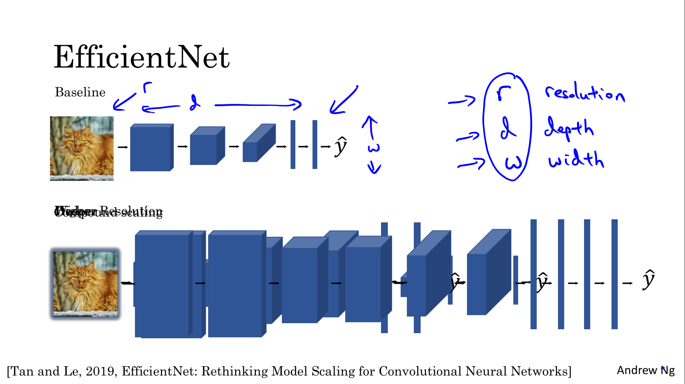

Summary on network seeen during week2 
> 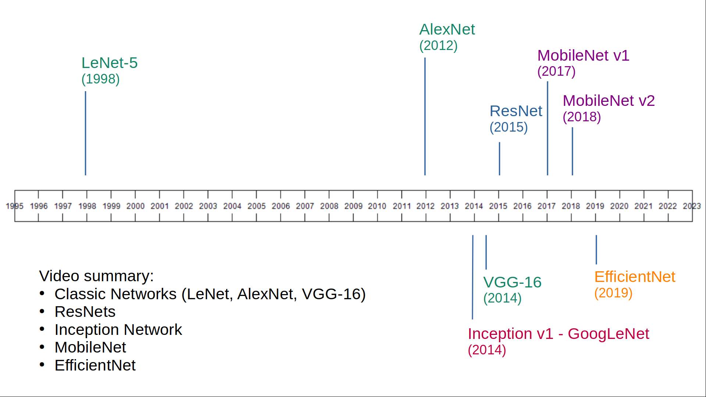

# Practical Advice for Using ConvNets

## Using Open-Source Implementation

It turns out that a lot of these neural networks are difficult or finicky to replicate because a lot of details about tuning of the hyperparameters such as learning decay and other things that make some difference to the performance.

But if you see a research paper whose results you would like to build on top of, one thing you should consider doing, one thing I do quite often it's just look online for an open-source implementation. Because if you can get the author's implementation, you can usually get going much faster than if you would try to reimplement it from scratch.

Example :  https://github.com/KaimingHe/deep-residual-networks (with Caffe framework)

One of the advantages of doing so also is that sometimes these networks take a long time to train, and someone else might have used multiple GPUs and a very large dataset to pretrain some of these networks. And that allows you to do transfer learning using these networks 

## Transfer Learning

The computer vision research community has been pretty good at posting lots of data sets on the Internet : 
 - Image Net, 
 - MS COCO, 
 - Pascal types of data sets, 
these are the names of different data sets that people have post online and a lot of computer researchers have trained their algorithms on.

Sometimes these training takes several weeks and might take many GPUs. The fact that someone else has done this and gone through the painful high-performance search process, means that you can often download open-source ways that took someone else many weeks or months to figure out and use that as a very good initialization for your own neural network.

Let's say your cats are called Tiger and Misty. You have a classification problem with three clauses. You probably don't have a lot of pictures of Tigger or Misty so your training set will be small. 


I recommend you go online and download some open-source implementation of a neural network and download not just the code but also the weights.

1. Small anount of data - Freeza all layers (``trainanbleParameter = 0`` or ``freeze = 1``) except softmax unit that you replace and train to outputs Tigger or Misty or neither.   
2. Medium amount of data - Freeze fewer layers
3. Lot of datas : keep weights as initial values for parameters and train all the mode
> 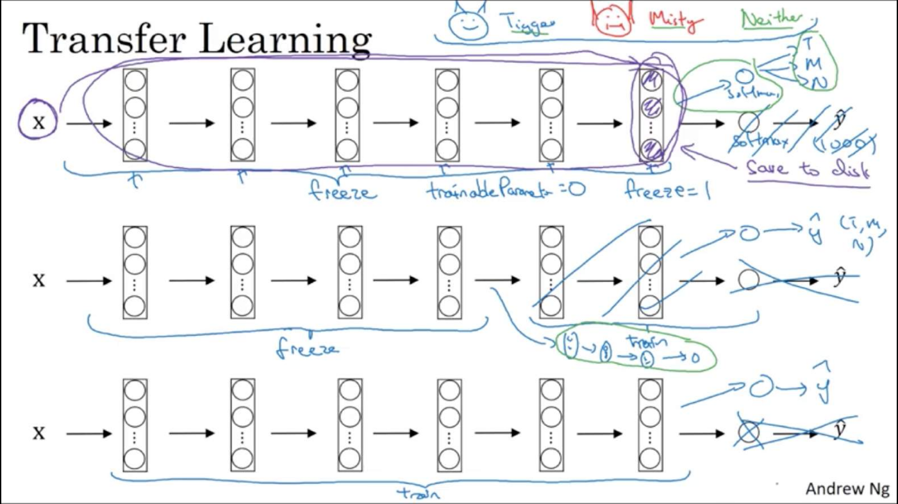


## Data Augmentation

> 
> 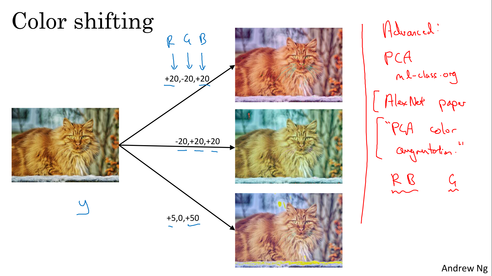
> 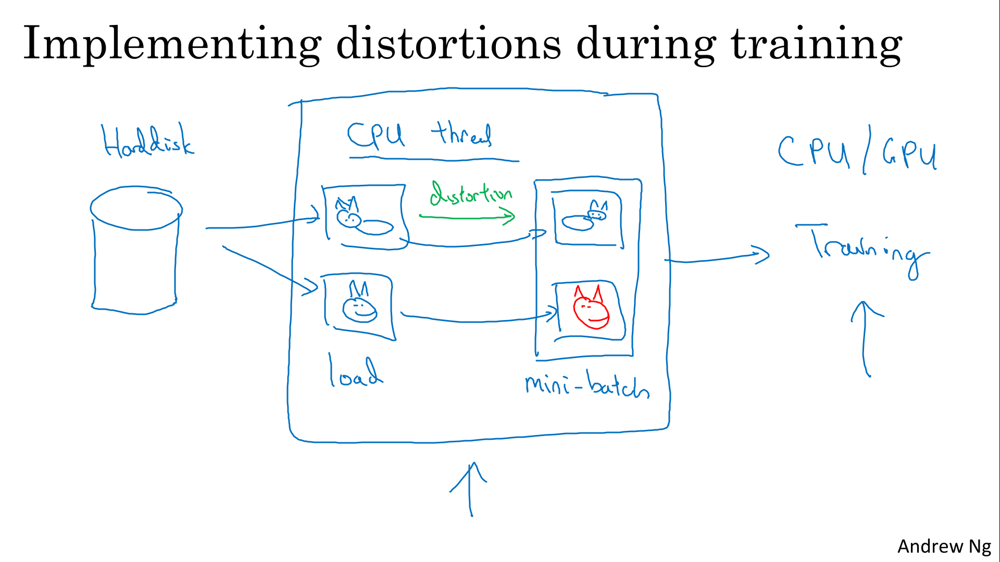

## State of Computer Vision

> 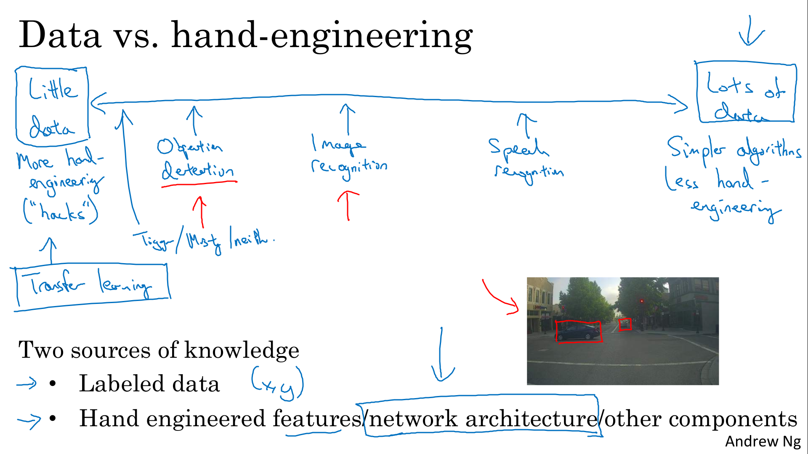
> 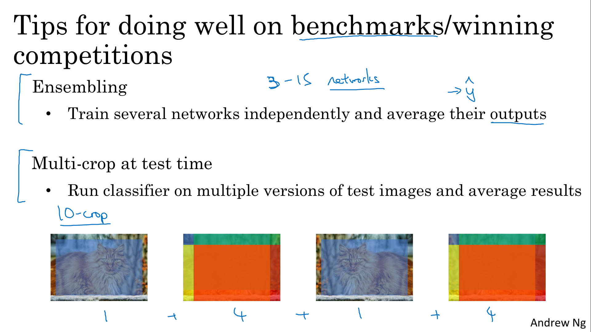
> 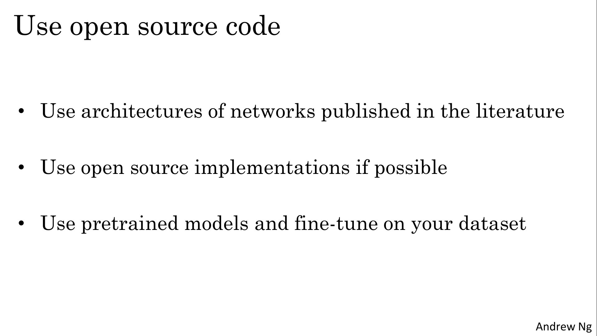

