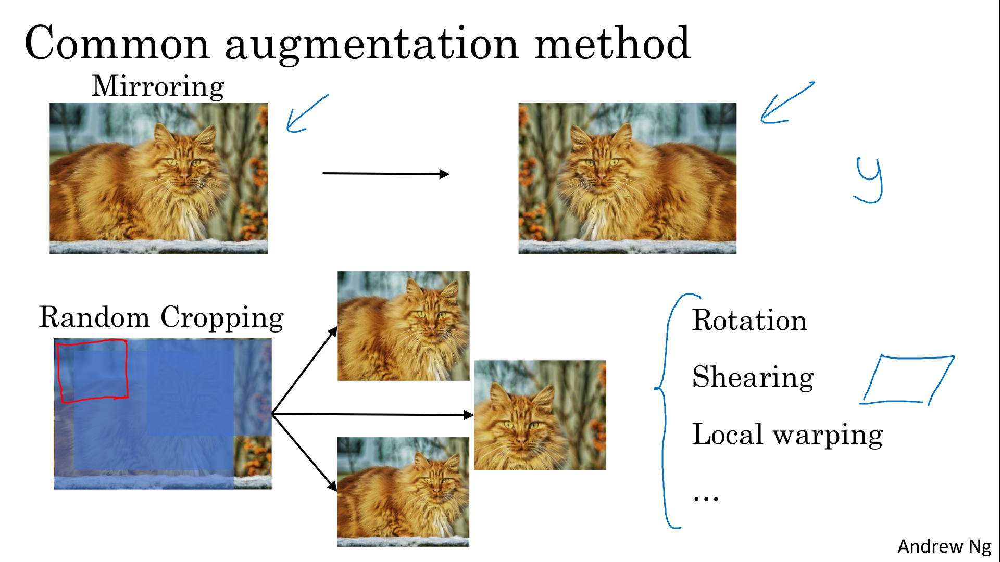

# Deep Convolutional Models: Case Studies

Discover some powerful practical tricks and methods used in deep CNNs, straight from the research papers, then apply transfer learning to your own deep CNN.

Learning Objectives
- Implement the basic building blocks of ResNets in a deep neural network using Keras
- Train a state-of-the-art neural network for image classification
- Implement a skip connection in your network
- Create a dataset from a directory
- Preprocess and augment data using the Keras Sequential API
- Adapt a pretrained model to new data and train a classifier using the Functional API and MobileNet
- Fine-tine a classifier's final layers to improve accuracy

# Case Studies

## Why look at case studies?

> 

## Classic Networks

> 
> 
> 

## ResNets

> 
> 

## Why ResNets Work?

> 
> 

## Networks in Networks and 1x1 Convolutions

> 
> 

## Inception Network Motivation

> 
> 
> 

## Inception Network

> 
> 
> 

## MobileNet

> 
> 
> 
> 
> 
> 
> 
> 
> 

## MobileNet Architecture

> 
> 
> 
> 

## EfficientNet

> 

# Practical Advice for Using ConvNets

## Using Open-Source Implementation

## Transfer Learning

> 

## Data Augmentation

> 
> 
> 

## State of Computer Vision

> 
> 
> 

