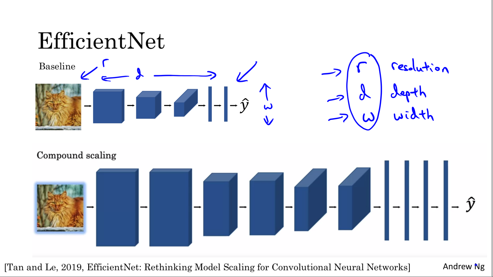

# Deep Convolutional Models: Case Studies

Discover some powerful practical tricks and methods used in deep CNNs, straight from the research papers, then apply transfer learning to your own deep CNN.

Learning Objectives
- Implement the basic building blocks of ResNets in a deep neural network using Keras
- Train a state-of-the-art neural network for image classification
- Implement a skip connection in your network
- Create a dataset from a directory
- Preprocess and augment data using the Keras Sequential API
- Adapt a pretrained model to new data and train a classifier using the Functional API and MobileNet
- Fine-tine a classifier's final layers to improve accuracy


# Case Studies

## Why look at case studies?


[Last week](../week1/README.md) we learned about the basic building blocks, such as convolutional layers, pooling layers, and fully connected layers of convnet. 

In the past few years, a lot of computer vision research has been done to put together these basic building blocks to form effective convolutional neural networks. 

As many may have learned to write code by reading other people's codes, a good way to gain intuition and how the build confidence is to read or to see other examples of effective confidence. It turns out that a neural network architecture that works well on one computer vision tasks often works well on other tasks as well.

We will see the following 
- standard networks :
    - LeNet-5
    - AlexNet
    - VGG
- ResNet, neural network trained a very deep 152 layer neural network
- Inception 

After seeing these neural networks, I think you have much better intuition about how to build effective convolutional neural networks. Even if you don't end up building computer vision applications yourself, I think you'll find some of these ideas very interesting and helpful for your work.

> 

## Classic Networks

The goal of LeNet-5 was to recognize handwritten digits. This neural network architecture is actually quite similar to the last [example you saw last week](../week1/README.md#cnn-example).
- Paper was written in **1998**, people didn't really use padding, which is why convolutional layer decrease width and height (28x28 -> 14x14 -> 10x10 -> 5x5)
- The number of channels does increase.
- A modern version of this neural network, we'll use a softmax layer with a 10 way classification output. Although back then, LeNet-5 actually use a different classifier at the output layer, one that's useless today.
- his neural network was small by modern standards, had about 60,000 parameters (10 million to 100 million parameters today is a standard)
- This type of arrangement of layers (CONV, POOL, CONV, POOL, FC, FC, OUTPUT) is quite common. 

Red comments are only for who wants to read the original paper :
- The activation function used in the paper was Sigmoid and Tanh. Modern implementation uses RELU in most of the cases.
- to save on computation as well as some parameters, the original LeNet-5 had some crazy complicated way where different filters would look at different channels of the input block.

> 

The second example of a neural network I want to show you is AlexNet, named after Alex Krizhevsky, who was the first author of the paper describing this work (**2012**)
- So this neural network actually had a lot of similarities to LeNet, but it was much bigger ( 60,000 parameters VS 60 million parameters)
- It used the RELU activation function.
- when this paper was written, GPUs was still a little bit slower, so it had a complicated way of training on two GPUs. 
- The original AlexNet architecture also had another set of a layer called a Local Response Normalization. And this type of layer isn't really used much


> 

- Instead of having a lot of hyperparameters lets have some simpler network. The simplicity of the VGG-16 architecture (quite uniform) made it quite appealing. 
    - CONV = 3 X 3 filter, s = 1, same
    - MAX-POOL = 2 X 2 , s = 2
- The 16 in the VGG-16 refers to the fact that this has 16 layers that have weights
- And this is a pretty large network, this network has a total of about 138 million parameters (pretty large even by modern standards). 


> 

But next, let's go beyond these classic networks and look at some even more advanced, even more powerful neural network architectures. Let's go onto the next video.

## ResNets

Very, very deep neural networks are difficult to train, because of vanishing and exploding gradient types of problems.

A residual block is a stack of layers set in such a way that the output of a layer is taken and added to another layer deeper in the block. The non-linearity is then applied after adding it together with the output of the corresponding layer in the main path. 

This by-pass connection is known as the shortcut or the skip-connection.

> 

This residual network is composed of 5 residual blocks.

With normal **plain networks**, because of the vanishing and exploding gradients problems, the performance decrease when the the network become too deep. With residual networks, the performance of the training keep on going down when adding more layers

> 

## Why ResNets Work?

A residual block is a fundamental building block in deep neural networks, especially in CNNs, that helps to address the vanishing gradient problem **during training**. Let's go through one example that illustrates why ResNets work so well.

We saw that if you make a network deeper, it can hurt your ability to train the network to do well on the training set.

For the sake our argument, let's say throughout this network we're using the ReLU activation functions. So, all the activations are going to be greater than or equal to zero, with the possible exception of the input X. 

```
a[l+2] = g( z[l+2] + a[l] )
	   = g( W[l+2] a[l+1] + b[l+2] + a[l] )
```

If we use L2 regularization, the value of W[l+2],b[l+2] shrink to zero ```a[l+2] ≈ g(a[l])```

As  we use ReLU and a[l] is also positive, ```a[l+2] ≈ g(a[l])```

That means that **identity function** is easy for a residual block to learn because of the shortcut connection, that's why adding these 2 additional layers doesn't hurt performance


But of course our goal is to not just not hurt performance, is to help performance and so you can imagine that if all of these heading units if they actually learned something useful then maybe you can do even better than learning the identity function

One more detail in the residual network that's worth discussing which is through this edition here, we're assuming that z[l+2] and a[l] have the same dimension. that's why ResNet use "same convolution" with padding

> 

Example of a plain network and a associated ResNet,

> 

## Networks in Networks and 1x1 Convolutions

With only one channel, one-by-one convolution doesn't make sense (exemple with 6x6x1)

But with an input 6x6x32, wwe can use a 1x1x32 convolution that perform an element-wise product then apply a ReLU non linearity.

One way to think about a one-by-one convolution is that it is basically having a fully connected neural network that applies to each of the 62 different positions. 

One-by-one convolution is sometimes also called network in network

> 

Example of where one-by-one convolution is useful. If you want to shrink the height and width, you can use a pooling layer. But to shrink the number of channel, you can use 32 filters (from 192 to 32 channels inthe below example) 


> 

## Inception Network Motivation

> 
> 
> 

## Inception Network

> 
> 
> 

## MobileNet

> 
> 
> 
> 
> 
> 
> 
> 
> 

## MobileNet Architecture

> 
> 
> 
> 

## EfficientNet

> 


# Practical Advice for Using ConvNets

## Using Open-Source Implementation

## Transfer Learning

> 

## Data Augmentation

> 
> 
> 

## State of Computer Vision

> 
> 
> 

