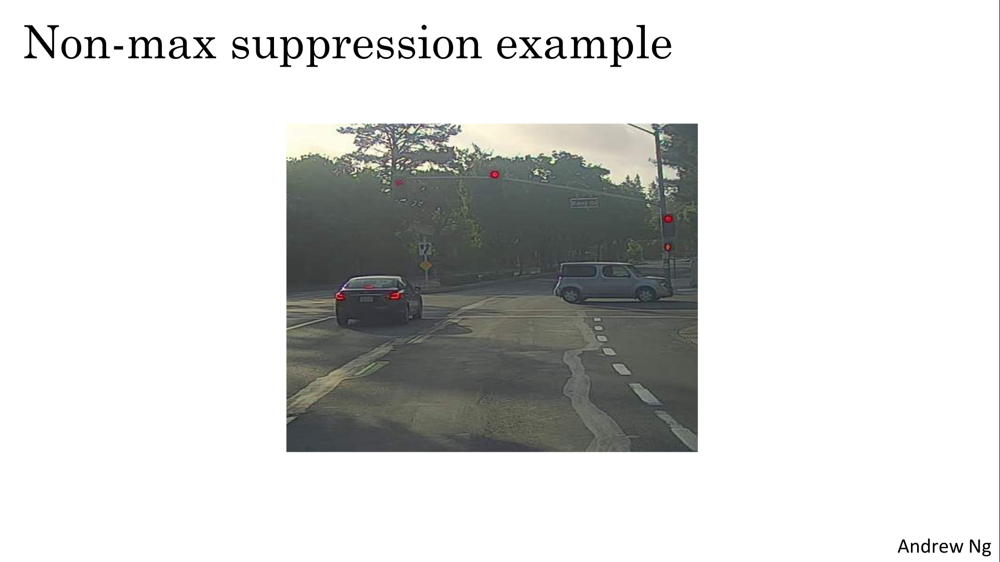

# Object Detection

Apply your new knowledge of CNNs to one of the hottest (and most challenging!) fields in computer vision: object detection.

Learning Objectives
- Identify the components used for object detection (landmark, anchor, bounding box, grid, ...) and their purpose
- Implement object detection
- Implement non-max suppression to increase accuracy
- Implement intersection over union
- Handle bounding boxes, a type of image annotation popular in deep learning
- Apply sparse categorical crossentropy for pixelwise prediction
- Implement semantic image segmentation on the CARLA self-driving car dataset
- Explain the difference between a regular CNN and a U-net
- Build a U-Net

# Detection Algorithms

## Object Localization

> 
> 
> 

## Landmark Detection

> 
## Object Detection

> 
> 

## Convolutional Implementation of Sliding Windows

> 
> 
> 

## Bounding Box Predictions

> 
> 
> 

## Intersection Over Union

> 

## Non-max Suppression

> 
> 
> 
> 

## Anchor Boxes

> 
> 
> 

## YOLO Algorithm

> 
> 
> 

## Region Proposals (Optional)

> 
> 

## Semantic Segmentation with U-Net

> 
> 
> 
> 
> 

## Transpose Convolutions

> 
> 

## U-Net Architecture Intuition

> 

## U-Net Architecture

> 
> 

