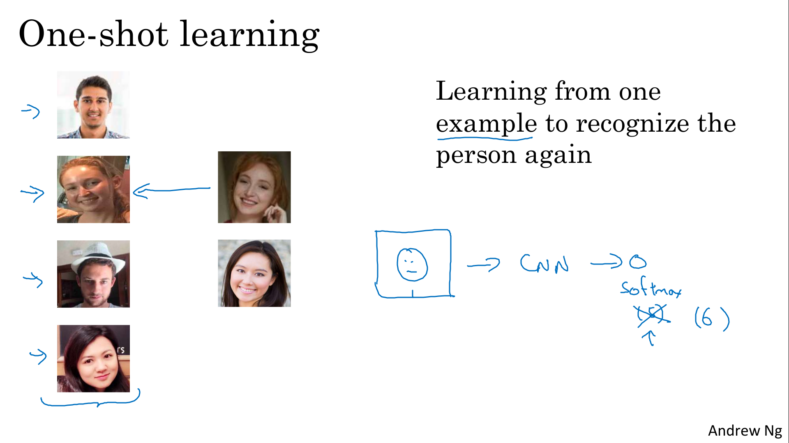
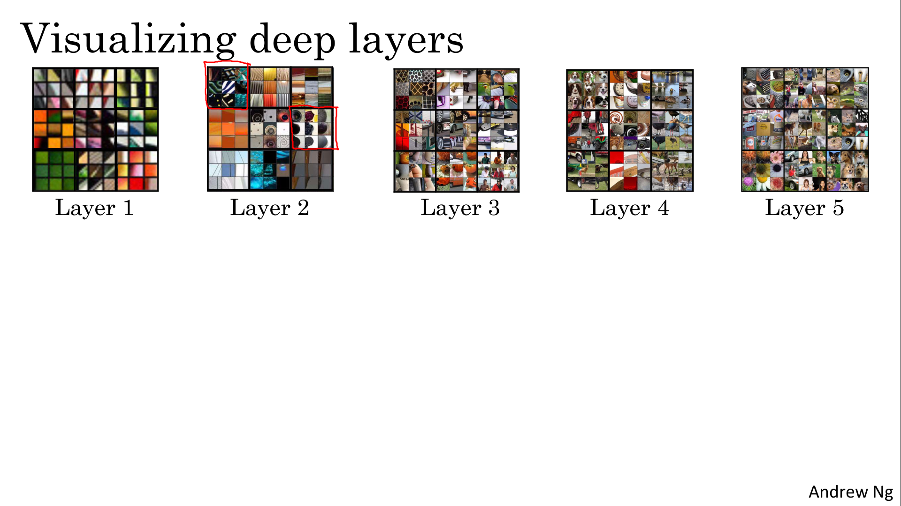
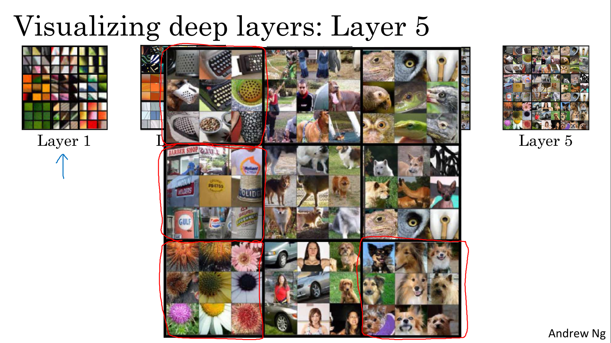
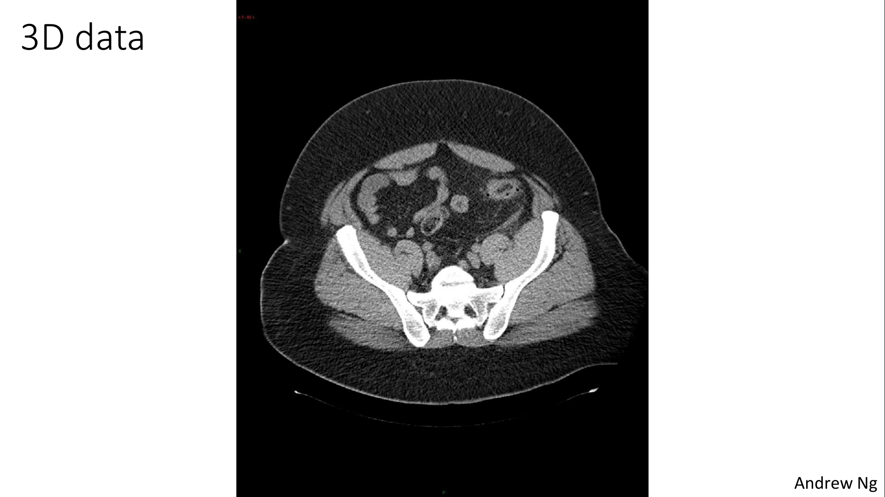

# Special Applications: Face recognition & Neural Style Transfer

Explore how CNNs can be applied to multiple fields, including art generation and face recognition, then implement your own algorithm to generate art and recognize faces!

Learning Objectives
- Differentiate between face recognition and face verification
- Implement one-shot learning to solve a face recognition problem
- Apply the triplet loss function to learn a network's parameters in the context of face recognition
- Explain how to pose face recognition as a binary classification problem
- Map face images into 128-dimensional encodings using a pretrained model
- Perform face verification and face recognition with these encodings
- Implement the Neural Style Transfer algorithm
- Generate novel artistic images using Neural Style Transfer
- Define the style cost function for Neural Style Transfer
- Define the content cost function for Neural Style Transfer

# Face Recognition

## What is Face Recognition?

- Face verification 
    - Output whether the input image is that of the claimed person
- Face recognition
    - Output ID if the image is any of the K persons in the database (or “not recognized”)

If you are building a facial recognition system based on your facial verification system, the verification system must be over 99.9% accurate before you can run it on a database of 100 people and have a good chance to be correct.

What we do in the next few videos is 
1. focus on building a face verification system as a building block and then if the accuracy is high enough, 
2. then you probably use that in a recognition system as well

> 

## One Shot Learning

One of the challenges of face recognition is that you need to solve the one-shot learning problem (you need to be able to recognize a person given just one single image)

Let's say you have a database of 4 pictures of employees in you're organization.

When someone shows up at the office :
- despite ever having seen only one image of Danielle, to recognize that this is actually the same person. 
- and in contrast, if it sees someone that's not in this database, then it should recognize that this is not any of the four persons in the database

So one approach you could try is to input the image of the person, feed it too a ConvNet with a softmax unit with 5 outputs (corresponding to each of these four persons or none of the above). Because you have such a small training set it is really not enough to train a robust neural network for this task

And also what if a new person joins your team? So now you have 5 persons you need to recognize, so there should now be six outputs. Do you have to retrain the ConvNet every time?

> 

So instead, to make this work, what you're going to do instead is learn a similarity function

> 

## Siamese Network

The job of the function d, which you learned about in the last video, is to input two faces and tell you how similar or how different they are. A good way to do this is to use a Siamese network

In a Siamese network :
- we use a convolutional network, 
- but we remove the last layer
- instead of making a classification by a softmax unit, we focus on the vector computed by a fully connected layer as an encoding of the input image.
- we define the function d as the distance between x1 and x2, the norm of the difference between the encodings of these two images.

> 

We train the neural network so that if two pictures, xi and xj, are of the same person, then you want that distance between their encodings to be small.

> 

## Triplet Loss

One way to learn the parameters of the neural network, so that it gives you a good encoding for your pictures of faces, is to define and apply gradient descent on the triplet loss function. 

In the terminology of the triplet loss, you have :
- an anchor image A, 
- a positive image P, 
- a negative image N

The learning objective is to have d(A,P) ≤ d(A,N). But if f always equals zero or f always outputs the same (encoding for every image is identical), this trivial solution satisfy the inequation. That why we add α the **margin paramter**

> 

Let's formalize the equation and define the triplet loss function. We start with the iniequation from previous slide and me take the max. 
The effect of **taking the max** is that so long as this is less than zero, then the loss is zero. Then so long as the difference is zero or less than equal to zero, the neural network doesn't care how much further negative it is. 

Note that :
- for training, you nee multiple pictures of the same person ( 10,000 pictures of 1,000 different persons, so on average 10 pictures by person)
- after having trained a system, you can then apply it to your one-shot learning problem where for your face recognition system with only a single picture of someone you might be trying to recognize

> 

In order to have a performant network, you cannot choose you training set randomly (if pictures ar too differents, you won´t push the algorithm), you need to chose "hard" negatives.

> 

Today's Face recognition systems, especially the large-scale commercial face recognition systems are trained on very large dataset (more tha 100 millions images). These dataset assets are not easy to acquire.
Fortunately, some of these companies have trained these large networks and posted parameters online. Rather than trying to train one of these networks from scratch, this is one domain where because of the sheer data volumes sizes, it might be useful for you to download someone else's pre-trained model rather than do everything from scratch yourself.

> 

## Face Verification and Binary Classification

> 
> 

# Neural Style Transfer

## What is Neural Style Transfer?

> 

## What are deep ConvNets learning?

> 
> 
> 
> 
> 
> 
> 
> 

## Cost Function

> 
> 

## Content Cost Function

> 

## Style Cost Function

> 
> 
> 
> 

## 1D and 3D Generalizations

> 
> 
> 
> 
> 
> 
> 
> 
> 
> 
> 
> 
> 