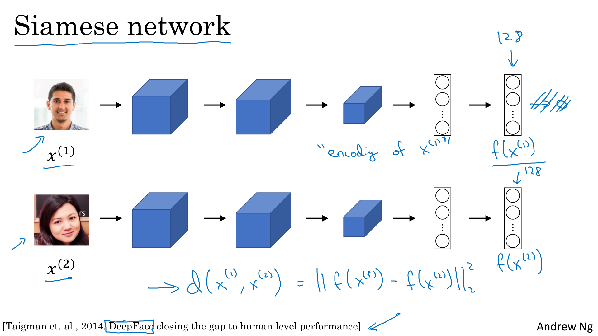

# Special Applications: Face recognition & Neural Style Transfer

Explore how CNNs can be applied to multiple fields, including art generation and face recognition, then implement your own algorithm to generate art and recognize faces!

Learning Objectives
- Differentiate between face recognition and face verification
- Implement one-shot learning to solve a face recognition problem
- Apply the triplet loss function to learn a network's parameters in the context of face recognition
- Explain how to pose face recognition as a binary classification problem
- Map face images into 128-dimensional encodings using a pretrained model
- Perform face verification and face recognition with these encodings
- Implement the Neural Style Transfer algorithm
- Generate novel artistic images using Neural Style Transfer
- Define the style cost function for Neural Style Transfer
- Define the content cost function for Neural Style Transfer

# Face Recognition

## What is Face Recognition?

> 

## One Shot Learning

> 
> 

## Siamese Network

> 
> 

## Triplet Loss

> 
> 
> 
> 

## Face Verification and Binary Classification

> 
> 

# Neural Style Transfer

## What is Neural Style Transfer?

> 

## What are deep ConvNets learning?

> 
> 
> 
> 
> 
> 
> 
> 

## Cost Function

> 
> 

## Content Cost Function

> 

## Style Cost Function

> 
> 
> 
> 

## 1D and 3D Generalizations

> 
> 
> 
> 
> 
> 
> 
> 
> 
> 
> 
> 
> 