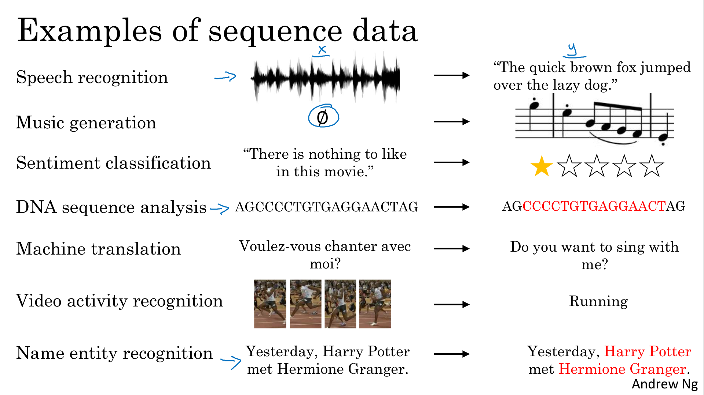
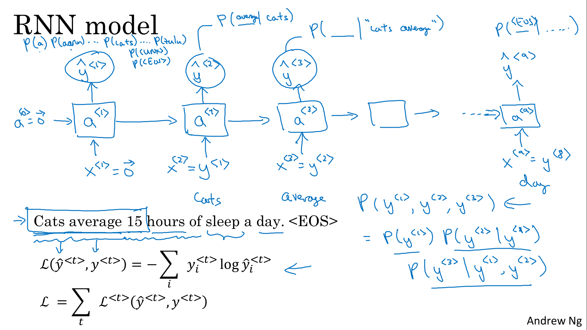
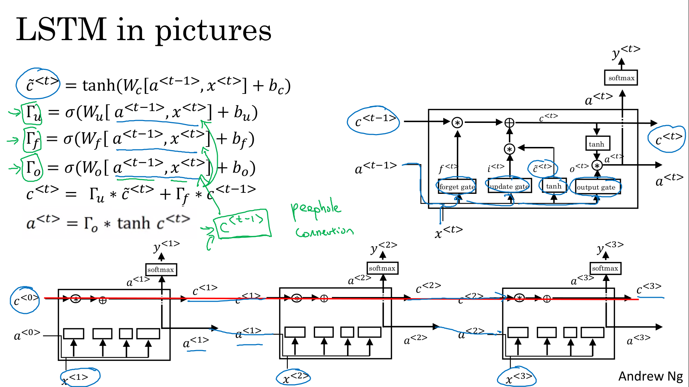

# Recurrent Neural Networks

Discover recurrent neural networks, a type of model that performs extremely well on temporal data, and several of its variants, including LSTMs, GRUs and Bidirectional RNNs,

Learning Objectives
- Define notation for building sequence models
- Describe the architecture of a basic RNN
- Identify the main components of an LSTM
- Implement backpropagation through time for a basic RNN and an LSTM
- Give examples of several types of RNN
- Build a character-level text generation model using an RNN
- Store text data for processing using an RNN
- Sample novel sequences in an RNN
- Explain the vanishing/exploding gradient problem in RNNs
- Apply gradient clipping as a solution for exploding gradients
- Describe the architecture of a GRU
- Use a bidirectional RNN to take information from two points of a sequence
- Stack multiple RNNs on top of each other to create a deep RNN
- Use the flexible Functional API to create complex models
- Generate your own jazz music with deep learning
- Apply an LSTM to a music generation task

# Recurrent Neural Networks

## Why Sequence Models?

Examples of sequence data

|Example|Type|Input|Output|
|-|-|-|-|
|Speech recognition|wave sequence|text sequence|
|Music generation|nothing or an integer with the type of music|wave sequence|
|Sentiment classification|text sequence|integer rating from one to five|
|DNA sequence analysis|DNA sequence corresponds to a protein|DNA Labels|
|Machine translation|text sequence (in one language)|text sequence (in other language)|
|Video activity recognition|video frames|label (activity)|
|Name entity recognition|text sequence|label sequence|

> 

## Notation

We want to find people name in the sentence. This problem is called entity recognition and is used by search engine to index people mentioned in the news articles in the last 24 hours.
We want the output where (this output representation is not the best one, just for ullustration) :
- 1 means its a name,
- 0 means its not a name

|||||||||||
|-|-|-|-|-|-|-|-|-|-|
|input|x<1>|x<2>|x<3>|x<4>|x<5>|x<6>|x<7>|x<8>|x<9>|
||Harry|Potter|and|Hermione|Granger|invented|a|new|spell|
|output|y<1>|y<2>|y<3>|y<4>|y<5>|y<6>|y<7>|y<8>|y<9>|
||1|1|0|1|1|0|0|0|0|

Notation:
- x<t> is t-th word
- y<t> is the output of the t-th word
- Tx is the size of the input sequence
- Ty is the size of the output sequence.

We introduce the concept of i-th example :
- x(i)\<t> is t-th word of the i-th input example,
- Tx(i) is the length of the i-th example.

> 

- Representing words: we build a *dictionary* that is a vocabulary list that contains all the words in our training sets
- Vocabulary sizes in modern applications are from 30,000 to 50,000. 100,000 is not uncommon. Some of the bigger companies use even a million.
- We use *one-Hot representation* for a specific word : vector with 1 in position of the word in the dictionary and 0 everywhere else
- We add a token in the vocabulary with name <UNK> (unknown text)

> 

<!--
> 
-->

## Recurrent Neural Network Model

Why not to use a standard network ?
- Inputs, outputs can be different lengths in different examples
- Neural network architecture doesn't share features learned across different positions of text ("Harry Potter" is a name even if found in another part, at a different position in the text)

> 

Let's build a recurrent neural network
1. The first word you will read x<1> feed a neural network layer to predict y<1>
2. The second word x<2> feed the same neural network layer, but instead of just predicting y<2> using only x<2>, it also gets a<1> computed in step 1
3. a<0> is usually initialized with zeros (may be initialized randomly)

There are 2 representation :
- on the left side, each step are represented
- on the right side, we have a concentrated notation with only one layer represented

RNN vs, BRNN
- In RNN, we used earlier values in the sequence, so y<3> is predicted with x<3>, but also with x<1> and x<2> that come with the pass through connection (via a<2>)
- In BRNN (Bidirectional RNN), we also use inofrmation from x<4>, x<5>
- That means that with RNN, the sentence "He sad : Teddy..." we cannot be sure that "Teddy" is part of a person name

> 

So in summary, we define the following forward propagation. We define 3 vectors parameters :

|Parameters|Input|Output|comment|
|-|-|-|-|
|Wax|x<1>|a<1>|parameters are the same for each step with input x<1>, x<2>, etc.|
|Waa|a<0>|a<1>|parameters are the same for each step with input a<1>, a<2>, etc.|
|Wya|a<0>|y<1>|parameters are the same for each step with input a<1>, a<2>, etc.|

Note that :
- the activation function of a is usually tanh or ReLU
- the activation function for y depends on your task (sigmoid and softmax). In name entity recognition task we will use sigmoid because we only have two classes.

> 

We can simplify the notation by defining Wa as the horizontal compression of Waa and Wax

||Waa|Wax|Wa|
|-|-|-|-|
|Nb row|100|100|100|
|Nb Columns|100|10'000|10'100|

> 

## Backpropagation Through Time

As usual, when you implement this in one of the programming frameworks, often, the programming framework will automatically take care of backpropagation. But I think it's still useful to have a rough sense of how backprop works in RNNs.

In backprop, as you might already have guessed, you end up carrying backpropagation calculations in basically the opposite direction of the forward prop arrows

> 

- Computational graph for forward propagation is in green,
- We use standard logistic regression loss, also called cross-entropy loss function
- back propagation is in red
- these graphes allow you to compute all the appropriate quantities (derivatives,  parameters, ) - finally apply gradient descent

In the backpropagation procedure the most significant recursive calculation is the chain a<Tx>, ..., a<2>, a<1> which goes from right to left. The backpropagation here is called backpropagation **through time** because we pass activation a from one sequence element to another like backwards in time. That phrase really makes it sound like you need a time machine to implement this output, but I just thought that backprop through time is just one of the coolest names for an algorithm.

> 

## Different Types of RNNs

So far we have seen only one RNN architecture in which Tx equals TY. In some other problems, they may not equal so we need different architectures.

> 

This video is inspired by Andrej Karpathy blog, The Unreasonable Effectiveness of Recurrent Neural Networks. http://karpathy.github.io/2015/05/21/rnn-effectiveness/

|Use case|input|output|architecture type|
|-|-|-|-|
|entity recognition, Tx=Ty, described before|text|booleans|Many to Many|
|sentiment clasification|text|integer (1 to 5)| Many to One|
|standard NN||| One to One|

> 

|Use case|input|output|architecture type|
|-|-|-|-|
|music generation|integer (genre of music)|set of notes (music)|One to Many|
|Machine translation, Tx<!=Ty|English text|French text|Many to Many|

Technically, there's one other architecture which we'll talk about only in week four, which is attention based architectures.

> 

To summarize:

> 

## Language Model and Sequence Generation

Let's say we want the speech recognition want to predict if a sentence is :
- The apple and pair salad
- The apple and pear salad
The way a speech recognition system picks the second sentence is by using a language model which tells it what is the probability of either of these two sentences. 

What a language model does is, given any sentence `𝑃(y<1>, y<2>, ..., y<T_y>)`, its job is to tell you what is the probability of that particular sentence

This is a fundamental component for both :
- speech recognition systems 
- machine translation systems

> 

How do you build a language model using a RNN, you need 
1. Get a training set comprising a large corpus of English text. The word corpus is an NLP terminology that just means a large body or a very large set of English sentences 
2. Then tokenize this training set 
    - form a vocabulary 
    - map each of the word to a one-hot vector
    - add an extra token &lt;EOS> (End Of Sentence) 
    - add an extra token &lt;UNK> (UNKnown) when word not found in vocabulary

Note that when doing the tokenization step, you can decide whether or not the period should be a token as well
(a period `.`  is a form of punctuation used to end a declarative sentence)

> 

The probability is computed with : `𝑃(y<1>, y<2>, ..., y<Ty>) = 𝑃(y<1>) * 𝑃(y<1>) ... * 𝑃(y<Ty>)`

Given the sentence `Cats average 15 hours of sleep a day <EOS>` (9 words).

|Output|Input|Probability|applied to|
|-|-|-|-|
|$\hat{y}^{<1>}$|x<1>=0|Probability to have 'Cats' as the first word. This is a 10.002 Softmax output (10,000 words vocabulary + EOS + UNK|`P(Cats)`|
|$\hat{y}^{<2>}$|x<2>=y<1>=Cats|Probability of having a word given previously "Cats"| `P(average \| Cats)`|
|$\hat{y}^{<3>}$|x<3>=y<2>=average|Probability of having a word given previously "Cats average"| `P(15 \| Cats average)`|

With then define the cost function with the Softmax loss function 

 If you train this RNN on a large training set, what it will be able to do is :
- given any initial set of words such as `cats average 15` or `cats average 15 hours of`, it can predict what is the chance of the next word
- Given a new sentence `y<1>,y<2>,y<3>`, you can calculate the probability of the sentence `p(y<1>,y<2>,y<3>) = p(y<1>) * p(y<2>|y<1>) * p(y<3>|y<1>,y<2>)`

> 

## Sampling Novel Sequences

After you train a sequence model, one of the ways you can informally get a sense of what is learned is to have a sample novel sequences.

1. First time step
    - we first pass a<0> = x<1> = 0 vector
    - we randomly generate a sample according to the softmax distribution using the numpy command  `np.random.choice`
    - we get for example the word `the`
2. Second step
    - the second time step is expecting y<1> as input, we use ŷ<1> (the word `the`) that you just sampled in the first step as the input to the second timestep
    - we get the probability of getting a specific word knowing the first word `the`
    - we use the probability with the numpy command  `np.random.choice` to generate the second word...
3. until you get &lt;EOS>

> 

So far we have to build a word-level language model but we can also build a character-level language model.

In the character-level language model, the vocabulary will contain [a-zA-Z0-9], punctuation, special characters...

Advantages:
 - You don't have to worry about &lt;UNK>.

Disadvantages:
- much longer sequences.
- not as good as word level language models at capturing long range dependencies with the earlier parts of the sentence 
- More computationally expensive to train

The trend in natural language processing is that for the most part, word level language model are still used, but as computers gets faster there are more and more applications where people are, at least in some special cases, starting to look at more character level models

> 

Fun examples:

> 

## Vanishing Gradients with RNNs

#### Vanishing

The problems of the basic RNN algorithm is that it runs into vanishing gradient problems. 

Language can have very long-term dependencies:
- The **cat**, which already ate a bunch of food that was delicious ..., **was** full.
- The **cats**, which already ate a bunch of food that was delicious, and apples, and pears, ..., **were** full.

It turns out that the basic RNN we've seen so far is not very good at capturing very long-term dependencies.

We've seen the [vanishing gradient](../../c2-improving-deep-neural-networks/week1/README.md#vanishing--exploding-gradients) for standard neuronal network. For very deep neural network (100 years or even much deeper), you would carry out forward prop from left to right and then backprop. The gradient from the output has a very hard time propagating back to affect the weights the computations of the earlier layers.

In the context of a recurrent neural network (RNN), there is a problem that is similar. The forward propagation goes from left to right, and the backpropagation goes from right to left. 

However, this can be challenging because the error associated with the later time steps `ŷ<Ty>` may not have a significant impact on the computations from earlier time steps. It's very difficult for the error to backpropagate all the way to the beginning of the sequence, and therefore to modify how the neural network is doing computations earlier in the sequence.

In other words, it can be difficult for the neural network to recognize the need to remember certain information. In practice, it may be challenging to train a neural network to effectively memorize information over time. Because of this vanishing problem, the basic RNN model : 
- has many local influences, meaning that the output is mainly influenced by values close to it
- it's difficult for the output to be strongly influenced by an input that was very early in the sequence.

#### Exploding

Vanishing gradients tends to be the biggest problem with training RNNs. Although when exploding gradients happens it can be catastrophic because the exponentially large gradients can cause your parameters to become so large that your neural network parameters get really messed up. You might often see NaNs (not a number), meaning results of a numerical overflow in your neural network computation

One of the ways solve exploding gradient is to apply gradient clipping means if your gradient is more than some threshold - re-scale some of your gradient vector so that is not too big. 

> 

## Gated Recurrent Unit (GRU)

This is a visualization of the RNN unit of the hidden layer of the RNN that will be used to explain the GRU or the gated recurrent unit.

> 

- GRU unit has a new variable C (memory Cell). Memory cell provides a bit of memory. For example, whether cat was singular or plural.
- in GTU, `c<t> = a<t>`, but `c` introduced for LSTM
- `c̃<t>` is a candidate for replacing `c<t>`
- The key idea of the GRU is to have a update gate `Γu` 
    - `Γu` is a  sigmoid function is either very close to 0 or very close to 1
    - if `Γu ≈ 0`, `c<t> = c<t-1>`, so we keep the previous value
    - if `Γu ≈ 1`, `c<t> = c̃<t>`, we keep a new value
    
|t|0|1|2|3|...|t1|...|
|-|-|-|-|-|-|-|-|
|Word|The|cat|which|already|...|was|full|
|Γu|0|1|0|0|0|1 |...|
|`c<t>`||`c<1>=c̃<1>`|`c̃<1>`|`c̃<1>`|`c̃<1>`|`c<t1>=c̃<t1>`||

If you have 100 dimensional or hidden activation value, then `c<t>`, `c̃<t>`, `Γu` would be the same dimension
- If `Γu` is 100 dimensional vector, then it is really a 100 dimensional vector of bits, the value is mostly zero and one
- So `Γu` tells you of this 100 dimensional memory cell which are the bits you want to update
    - one bit could be use to keep in memory singular or plural (cat vs cats)
    - another bit could be use to keep in memory that you are talking about food (ate)
- In practice `Γu` won't be exactly zero or one

> 

Full GRU unit, we introduce `Γt`, this gate tells you how relevant is `c<t-1>` to computing the next candidate for `c<t>`

Why not use a simpler version from the previous slides? It turns out that over many years, researchers have experimented with many different possible versions of how to design these units to try to have longer range connections. To try to have model long-range effects and also address vanishing gradient problems. The GRU is one of the most commonly used versions that researchers have converged to and then found as robust and useful for many different problems.

> 

The other common version is called an LSTM, which stands for Long, Short-term Memory, which we'll talk about in the next video. But GRUs and LSTMs are two specific instantiations of this set of ideas that are most commonly used.

## Long Short Term Memory (LSTM)

> 
> 
> 

## Bidirectional RNN

> 
> 

## Deep RNNs

> 
