# Sequence Models & Attention Mechanism
{: .no_toc}

Augment your sequence models using an attention mechanism, an algorithm that helps your model decide where to focus its attention given a sequence of inputs. Then, explore speech recognition and how to deal with audio data.

Learning Objectives
- Describe a basic sequence-to-sequence model
- Compare and contrast several different algorithms for language translation
- Optimize beam search and analyze it for errors
- Use beam search to identify likely translations
- Apply BLEU score to machine-translated text
- Implement an attention model
- Train a trigger word detection model and make predictions
- Synthesize and process audio recordings to create train/dev datasets
- Structure a speech recognition project

  

    Table of contents
  

  {: .text-delta }
1. TOC
{:toc}

# Various Sequence To Sequence Architectures

##  Basic Models

In this week, we work on sequence-to-sequence models, which are useful for everything from machine translation to speech recognition.

Machine Translation:
- First, we have encoder network
    - built as a RNN, GRU or LSTM, that feed in the input French words one word at a time
    - After ingesting the input sequence the RNN then outputs a vector that represents the input sentence.
- Then a decoder
    - which takes as input the encoding
    - then can be trained to output the translation one word at a time
    - until end of sequence.
- One of the most remarkable recent results in deep learning is that this model works.
    - Given enough pairs of French and English sentences, if you train a model to input a French sentence and output the corresponding English translation, this will actually work decently well.
    - This model simply uses an encoding network whose job it is to find an encoding of the input French sentence, and then use a decoding network to then generate the corresponding English translation

> 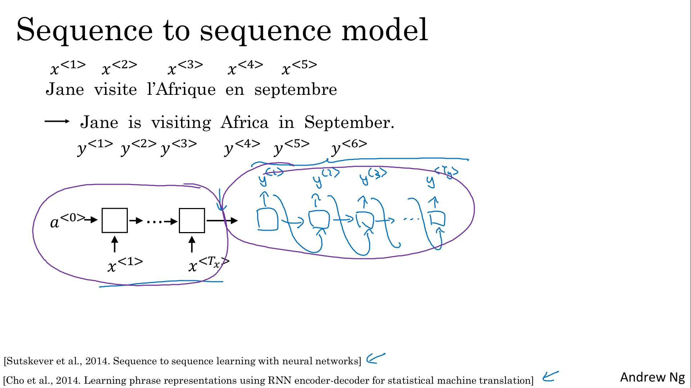

Image captioning:
- An architecture very similar to this also works for image captioning.
- First a pre-trained CNN (AlexNet) as an encoder for the image,
    - we get rid of this final Softmax unit,
    - so the pre-trained AlexNet can give you a 4096-dimensional feature vector than encodes and represents the image
- Then the decoder (RNN)
    - similarly at the translation machine
- Model works pretty well for captioning

> 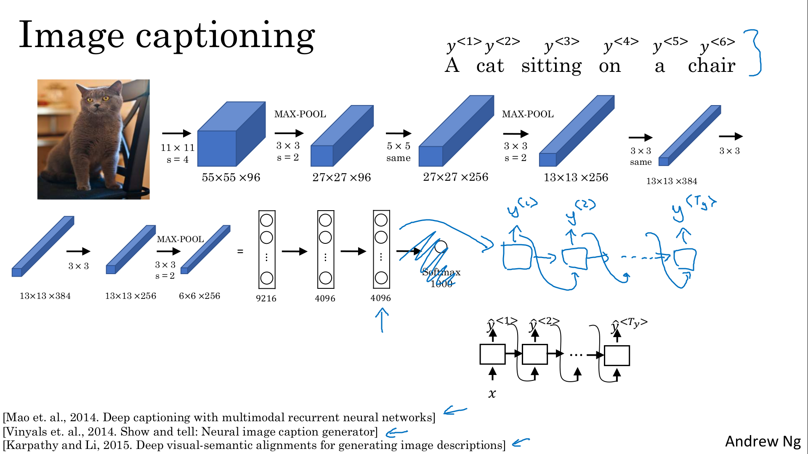

There are some differences between how you'll run a model like this (machine translation or picture captioning) that generates a sequence compared to the one used for synthesizing a novel text using a language model.

One of the key differences is you don't want to randomly choose in translation, you may be want the most likely translation. Or you don't want to randomly choose in caption but you want the best caption and most likely caption.

Let's see in the next video how you go about generating that.

##  Picking the Most Likely Sentence

The machine translation is very similar to a **conditional language model**.

- In language modeling (network we had built in the [first week](../week1/), the model allows you to estimate the probability of a sentence. That's what a language model does (schema upper in the slide)
- The decoder part of the machine translation model is identical to the language model,
    - except that instead of always starting along with the vector of all zeros,
    - it has an encoder network that figures out some representation for the input sentence
- Instead of modeling the probability of any sentence, machine translation is now modeling the probability of the output English translation **conditioned on** some input French sentence. In other words, we estimate the probability of an English translation.

> 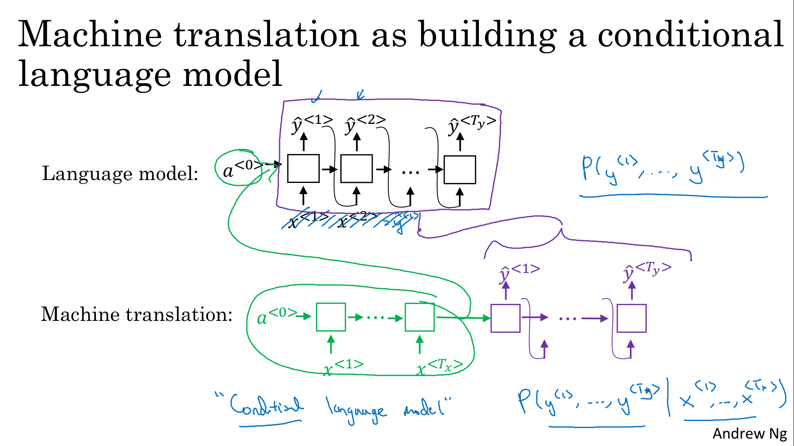

This now tells you what is the probability of different English translations of that French input. And, what you do not want is to sample outputs at random, sometimes you may sample a bad output:

|Translation|Comment|
|-|-|
|Jane is visiting Africa in September.|Good translation|
|Jane is going to be visiting Africa in September.| sounds a little awkward, not the best one|
|In September, Jane will visit Africa.||
|Her African friend welcomed Jane in September.|Bad translation|

So, when you're using this model for machine translation, you're not trying to sample at random from this distribution. Instead, what you would like is to find the English sentence, y, that **maximizes** that conditional probability. The most common algorithm is the beam search, which we will explain in the next video.

> 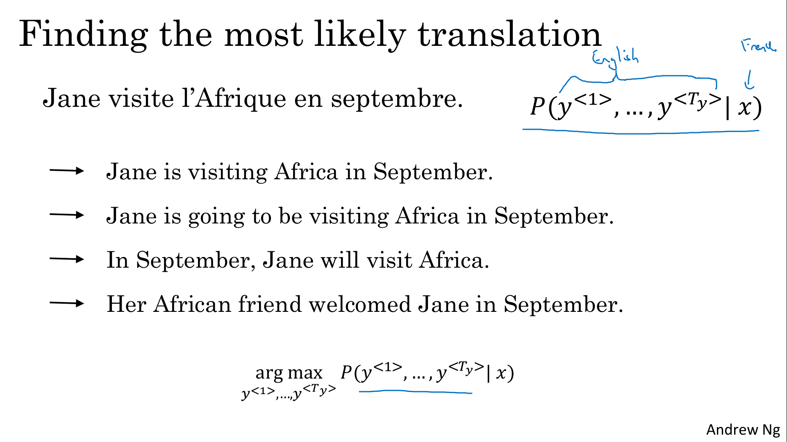

But, before moving on to describe beam search, you might wonder, why not just use greedy search? So, what is greedy search?

Greedy search is an algorithm from computer science which says to
- generate the first word just pick whatever is the most likely first word according to your conditional language model
- you then pick whatever is the second word that seems most likely
- and so on

And it turns out that the greedy approach doesn't really work.

The first sentence "Jane is visiting Africa in September." i sa better solution (no unnecessary words)

But, if the algorithm has picked "Jane is" as the first two words, because "going" is a more common English word, probably the chance of "Jane is going," given the French input, this might actually be higher than the chance of "Jane is visiting," given the French sentence.

I know this was may be a slightly hand-wavey argument, but,
- this is an example of a broader phenomenon, where if you want to find the sequence of words, y1, y2, ... that together maximize the probability, it's not always optimal to just pick one word at a time.
- the total number of combinations of words in the English sentence is exponentially larger (10'000 vocabulary, 10 words in sentence, so you have 10'00010 possible sentences) and it's impossible to rate them all, which is why the most common thing to do is use an approximate search algorithm

> 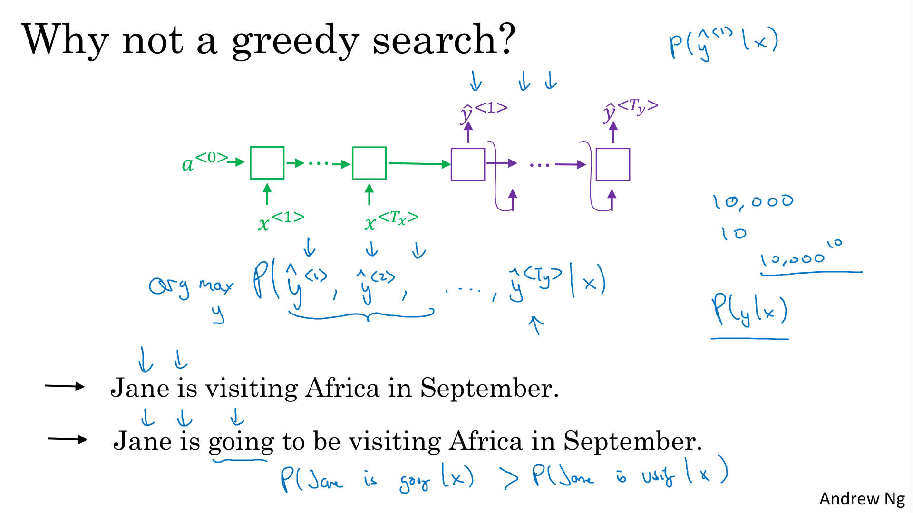

So, to summarize:
- machine translation can be posed as a conditional language modeling problem
- one major difference between this and the earlier language modeling problems is rather than wanting to generate a sentence at random, you may want to try to find the most likely English sentence, most likely English translation
- but the set of all English sentences of a certain length is too large to exhaustively enumerate
- So, we have to resort to a search algorithm

##  Beam Search

Let's just try Beam Search using our running example of the French sentence, `"Jane visite l'Afrique en Septembre"`. Hopefully being translated into, `"Jane, visits Africa in September"`.

Whereas greedy search will pick only the one most likely words and move on, Beam Search instead can consider multiple alternatives. The algorithm has a parameter beam width. Lets take B = 3 which means the algorithm will get 3 outputs at a time.

- Run the input French sentence through this encoder network
- First step of Beam search
    - decode the network, this is a softmax output overall 10,000 possibilities.
    - then you would take those 10,000 possible outputs and keep in memory which were the top 3 (`in`, `Jane`, `September`)

> 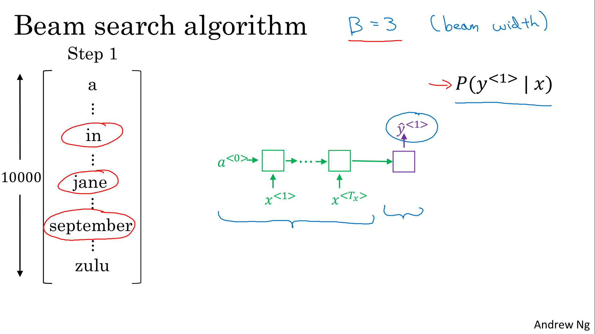

- Second step, having picked `in`, `Jane` and `September` as the 3 most likely choice of the first word, what Beam search will do now, is for each of these three choices consider what should be the second word
    - For the first word `in`, we have the following, we compute the probability to find the second word : p(y&lt;2&gt;&nbsp;| x, &quot;in&quot; ) = p(y&lt;1&gt;|x) * p(y&lt;2&gt;|x,y&lt;1&gt;)
    - Notice that we need to find the probability to find the pair of the first and second words that is most likely, p(y&lt;1&gt;,y&lt;2&gt;|x)
    - By the rules of conditional probability, it can be expressed as p(y&lt;1&gt;,y&lt;2&gt;|x) = p(y&lt;1&gt;|x) * p(y&lt;2&gt;|x,y&lt;1&gt;)

> 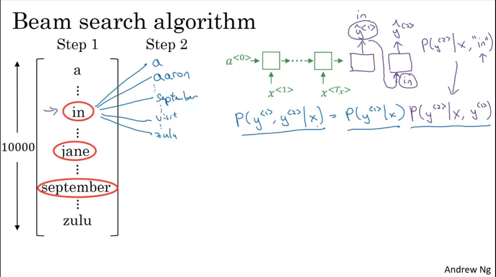

We do the same thing for the first word `Jane` and `september`.

So for this second step of beam search because we're continuing to use a B=3, and because there are 10,000 words in the vocabulary you'd end up considering 30'000 options according to the probably the first and second words and then pick the top three:
- in september
- Jane is
- Jane visit

Note that
- you can reject `september` as candidate for the first word (because not selected in top 3)
- every step you instantiate 3 copies of the network to evaluate these partial sentence fragments and the output, but these 3 copies of the network can be very efficiently used to evaluate all 30,000 options for the second word

> 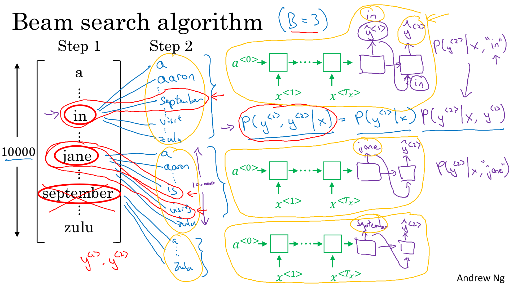

Let's just quickly illustrate one more step of beam search.

So said that the most likely choices for first two words were `in September`, `Jane is`, and `Jane visits`. And for each of these pairs of words, we have p(y&lt;1&gt;,y&lt;2&gt;|x), the probability of having y&lt;1&gt; and y&lt;2&gt; given the the French sentence X

We implment step 3, similary at step 2

> 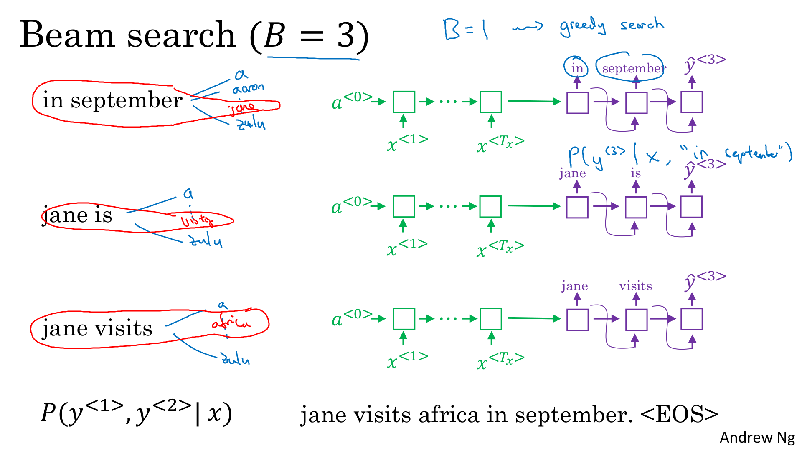

##  Refinements to Beam Search

- Beam search consists to maximize the probability P(y&lt;1&gt;&nbsp;| x) * P(y&lt;2&gt;&nbsp;| x, y&lt;1&gt;) * ... * P(y&lt;t&gt;&nbsp;| x, y&lt;y(t-1)&gt;) (formalized in a mathematical language below)
- But multiplying a lot of numbers less than 1 will result in a very tiny number, which can result in numerical underflow
- Idea is to maximize the logarithmic of that product :
    - logarithmic function is a strictly monotonically increasing function
    - log of a product becomes a sum of a log
- Problem remaining for long sentences, there is an undesirable to tends to prefer unnaturally very short translations :
    - first objective function is a multiplication of small numbers, so is sentence size increase, function will decrease
    - same with second objective function : addition of negative numbers
- To tackle that problem we normalize with Tyα
    - α is another hyperparameter
    - α = 0, no normalization
    - α = 1, full normalization

> 

How can we choose best `B`?
- B very large, then you consider a lot of possibilities, you get better result because you're consuming a lot of different options, but it will be slower.
- B very small, you get a worse result because you are just keeping less possibilities in mind as the algorithm is running, but you get a result faster and the memory requirements will also be lower
- B=10, it's not uncommon
- B=100, considered very large for a production system
- B=1000 or B=3000 is not uncommon for research systems, but when beam is very large, there is often diminishing returns

Unlike exact search algorithms like BFS (Breadth First Search) or DFS (Depth First Search), Beam Search runs faster but is not guaranteed to find the exact solution.

> 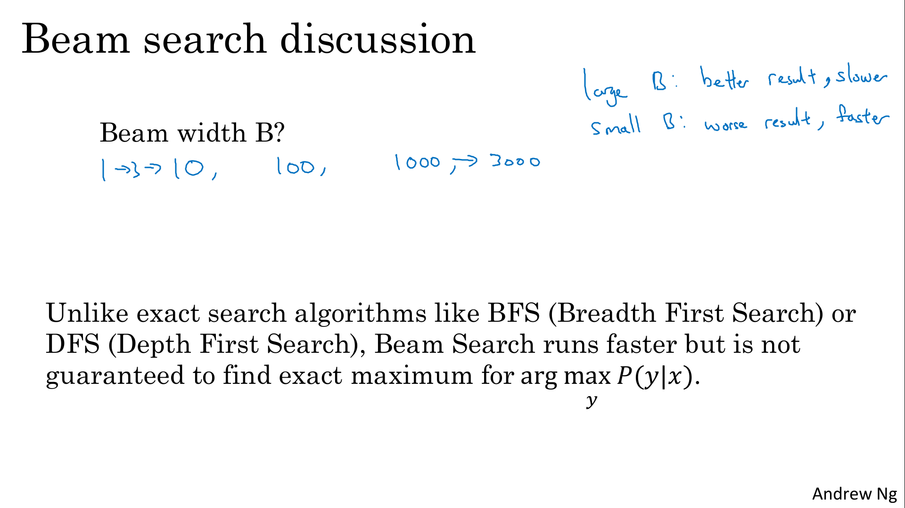

##  Error Analysis in Beam Search

We already seen in [Error analysis](../../c3-structuring-ml-projects/week2/README.md#error-analysis) in "Structuring Machine Learning Projects" course.

Beam search is an approximate search algorithm, also called a heuristic search algorithm. And so it doesn't always output the most likely sentence.

In this video, you'll learn how error analysis interacts with beam search and how you can figure out whether
- it is the beam search algorithm that's causing problems (and worth spending time on)
- or whether it might be your RNN model that is causing problems (and worth spending time on)

It's always tempting to collect more data (as seen in other courses) and similarly it's always tempting to increase bean width
But how do you decide whether or not improving the search algorithm is a good use of your time? Idea is to compare `p(y*|x)` and `p(ŷ|x)`

Let's take an example:
- "`Jane visite l’Afrique en septembre.`", French sentence to translate
- "`Jane visits Africa in September.`" - right answer given by human, in your DEV data set, called `y*`
- "`Jane visited Africa last September.`" - answer produced by model, called `ŷ`

> 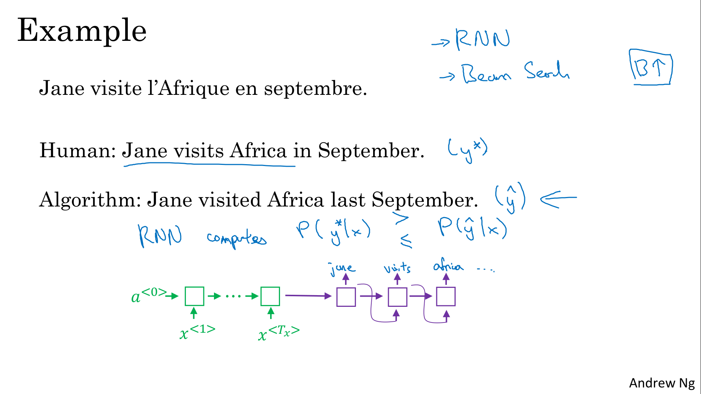

We compute `p(y*|x)` and `p(ŷ|x)` as output of the RNN model

Case 1 - p(y*|x) > p(ŷ|x):
- RNN computing P(y|x)
- beam search's job was to try to find a value of y that gives that arg max
- y* attains a higher value, so ŷ is not the higher value
- So Beam Search is failing its job

Case 2 - p(y*|x) < p(ŷ|x):
- y* is a better translation (it's the one given by human in training set)
- RNN predict p(y*|x) < p(ŷ|x)
- RNN model is at fault

> 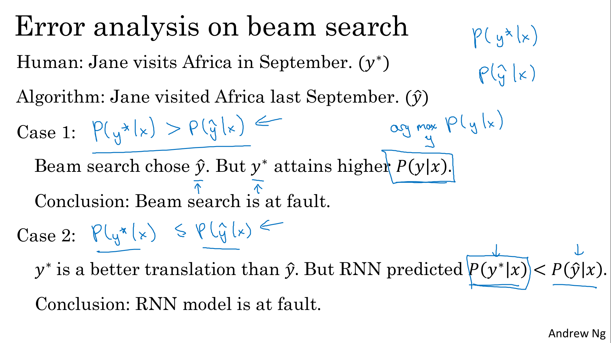

So the error analysis process looks as follows. You go through the development set and find the mistakes that the algorithm made in the development set. Following the reasoning of previous slide, you will get counts and decide what to work on next

> 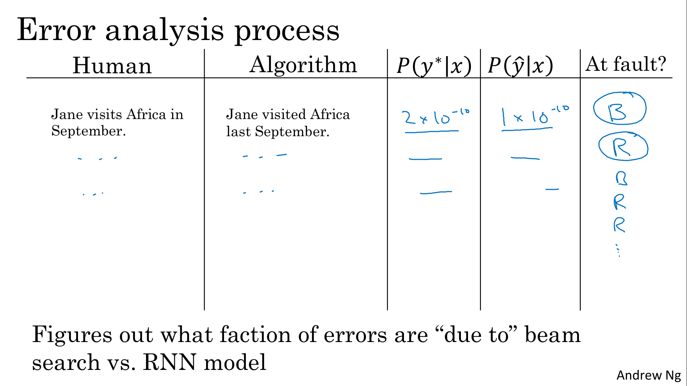

##  Bleu Score (Optional)

How do you evaluate a machine translation system if there are multiple equally good answers?

BLEU (bilingual evaluation understudy) is an algorithm for evaluating the quality of text which has been machine-translated from one natural language to another.

The intuition is so long as the machine generated translation is pretty close to any of the references provided by humans, then it will get a high BLEU score

(paper has been incredibly influential and quite readable)

One way to measure how good the machine translation output is, is to look at each the words in the output and see if it appears in the references. With that approach the sentence "`the the the the the the the the`" would have a precision of `7/7`

So instead, what we're going to use is a modified precision measure in which we will give each word credit only up to the maximum number of times it appears in the reference sentences: `the` appears twice in reference 1, and once in reference 2, so modified precision is `2/7`

> 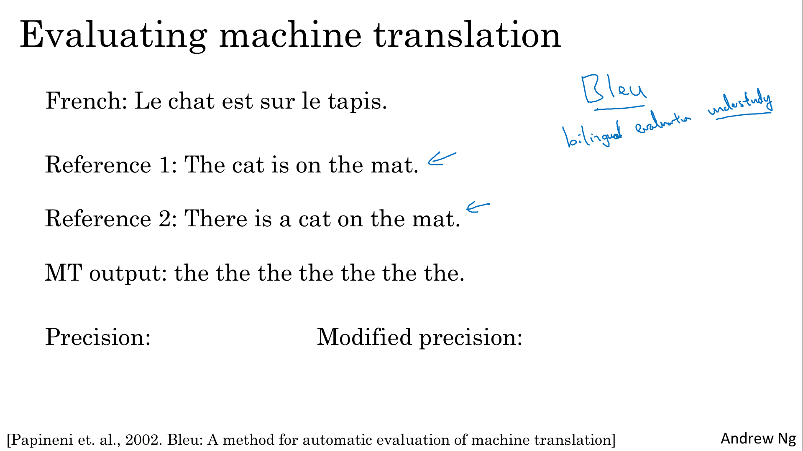

So far, we've been looking at words in isolation. In the BLEU score, you don't want to just look at isolated words. You maybe want to look at pairs of words as well. Let's define a portion of the BLEU score on bigrams (bigrams just means pairs of words appearing next to each other)

- Bigrams in MT output are `The cat`, `cat the`, `the cat`, `cat on`, ...
- For each Bigram, we count the maximum number of times a bigram (`The cat`) appears in either Reference 1 or Reference 2
- we sum up the number of counts of bigrams over the sum of total bigrams

> 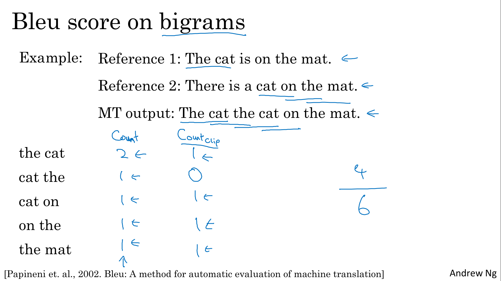

Mathematic formulation below.

And one thing that you could probably convince yourself of is if the MT output is exactly the same as either Reference 1 or Reference 2, then all of these values P1 (unigram), and P2 (bigram) and so on, they'll all be equal to 1.0. So to get a modified precision of 1.0

> 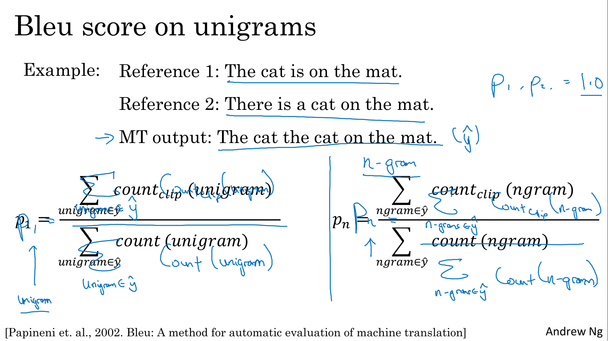

Finally, let's put this together to form the final BLEU score. We compute P1, P2, P3 and P4, and combine them together using the following formula.

In order to punish candidate strings that are too short, define the **brevity penalty** to be

> 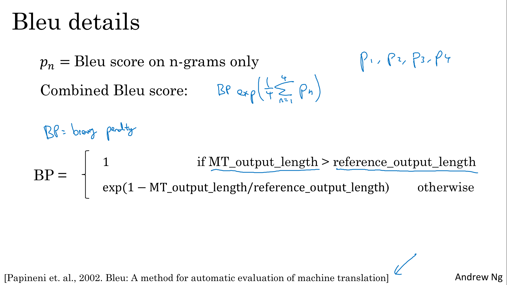

In practice, few people would implement a BLEU score from scratch. There are open source implementations that you can download and just use to evaluate your own system.

Today, BLEU score is used to evaluate many systems that generate text, such as machine translation systems, as well as image captioning systems.

##  Attention Model Intuition

For most of this week, you've been using a **Encoder-Decoder** architecture for machine translation (one RNN reads in a sentence and then different RNN outputs a sentence). There's a modification to this called the **Attention Model**, that makes all this work much better.

The attention algorithm has been one of the most influential ideas in deep learning.

Get a very long French sentence like this :
> 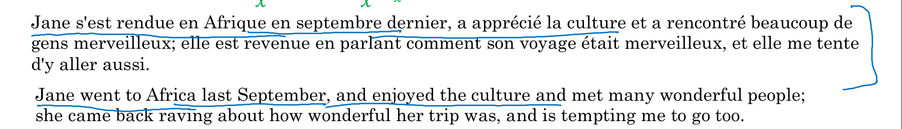

What we are asking this green encoder in your network to do is :
- to read in the whole sentence
- then memorize the whole sentences
- and store it in the activations conveyed here.

Then for the purple network, the decoder network,  then generate the English translation.

Now, the way a human translator would translate this sentence is different. Thee human translator would read the first part of the sentence, and generate part of the translation. Look at the second part, generate a few more words, and so on. He would work part by part through the sentence, because it's just really difficult to memorize the whole long sentence like that.

Encoder-Decoder architecture above is that, it works quite well for short sentences, so we might achieve a relatively high Bleu score, but for very long sentences (longer than 30 or 40 words) the performance decreases

The Attention Model which translates maybe a bit more like humans might, looking at part of the sentence at a time.

> 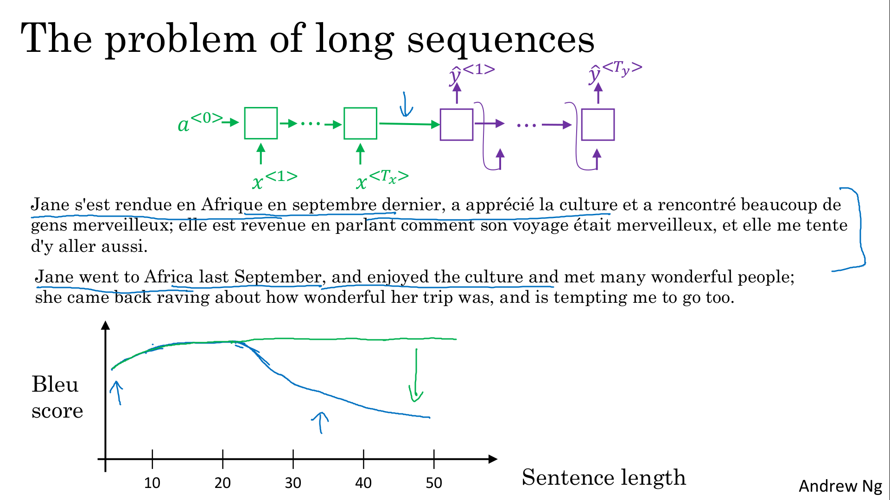

- We use a [Bidirectional RNN](../week1/README.md#bidirectional-rnn) to encode the French sentence to translate
- We use another [RNN](../week1/README.md#recurrent-neural-network-model) to generate the English translations
- We define **attention weights** that explain how much you should pay attention to this each French words when translating:
    - `α<1,1>`  denote how much should you be paying attention to this first French word when generating the first english words
    - `α<1,2>`  denote how much should you be paying attention to this 2nd French word when generating the first english words
    - ...
    - `α<2,1>`  denote how much should you be paying attention to this first French word when generating the 2nd english words
    - ...
    - `α<t,t'>` the attention weighs that tells how much should you be paying attention to the t'-th French word when generating the t-th English word
- When generating the 2nd Eglish word, and so computing activation `S<2>`,  we define the **context** denoted `c` putting together:
    - `α<1,1>`, `α<1,2>`, ...
    - `S<1>`

> 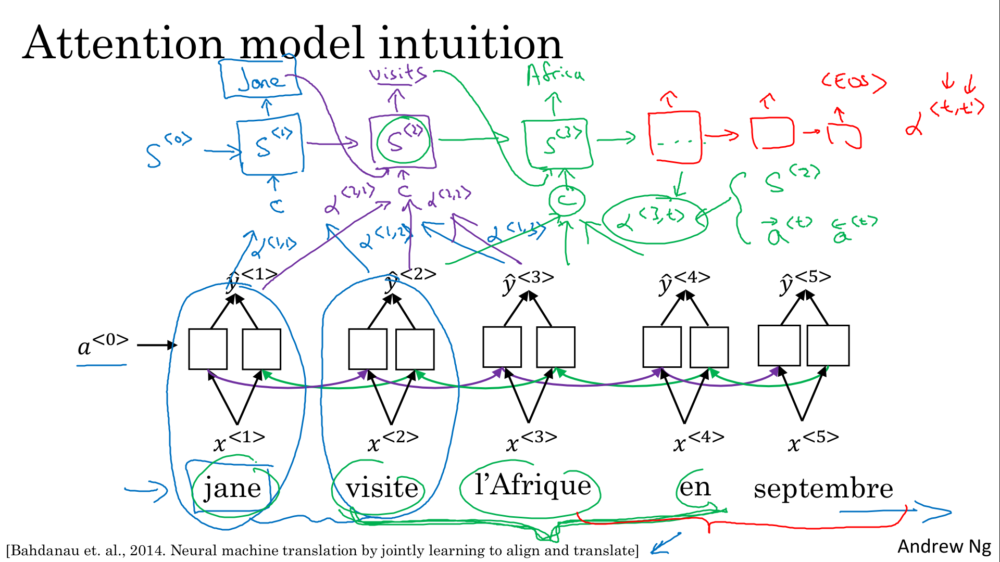

##  Attention Model

Attention model allows a neural network to pay attention to only part of an input sentence while it's generating a translation, much like a human translator might.

Let's now formalize that intuition into the exact details of how you would implement an attention model

### Time 1 - Encoder 

Assuming an input sentence, a bidirectional RNN (bidirectional GRU or more commonly a bidirectional LSTM) is used to compute features for each word. The features from both forward and backward occurrences are concatenated into a feature vector for each time step. A forward-only RNN generates the translation, considering a context vector influenced by attention parameters.

> 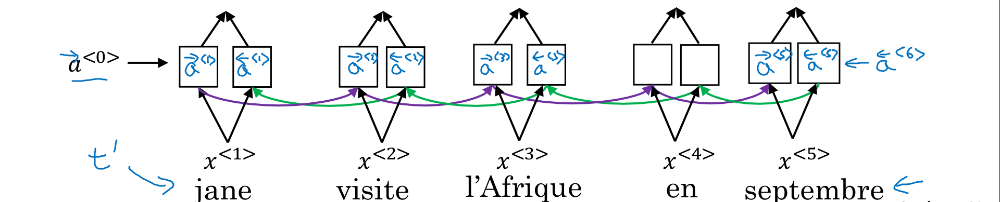

And then to simplify the notation going forwards at every time step, even though you have the features computed from the forward occurrence and from the backward occurrence in the bidirectional RNN

> 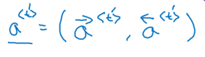

### Decoder s<1>

Next, we have our forward only single direction RNN with state `S` to generate the translation. 
`S<1>` generates `y<1>` with the context `c<1>` denoted `c` that depends on the attention parameters `α<1,1>`, `α<1,2>`... that tells us how much the context would depend on the activations we're getting from the different time steps. 

> 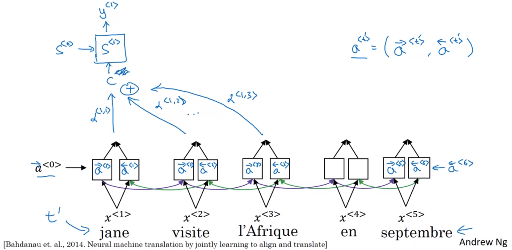

The context is the sum of the features from the different time steps weighted by these attention weights. 

> 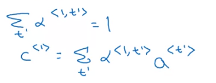

`α<t,t'>` is the amount of attention that's `y<t>` should pay to `a<t'>`. So in other words, when you're generating the t-th output words, how much you should be paying attention to the t'-th input word

### Decoder s<2>

So that's one step of generating the output and then at the next time step, you generate the second output (in green below)

> 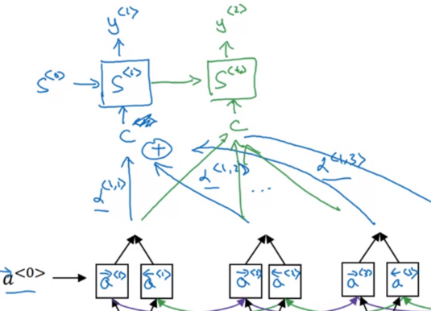

If we isolate that part of the network, we have a standard RNN using context as vector `c<1>`, `c<2>`...

> 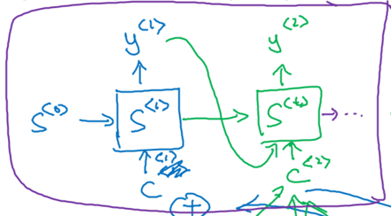

<!-- > 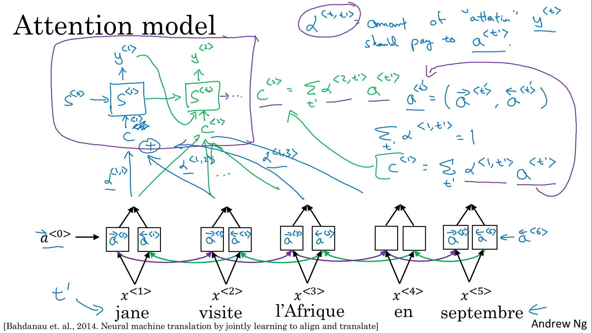 -->

So the only remaining thing to do is to define how to actually compute these attention weights `α<t,t'>` 

We are going to softmax the attention weights so that their sum is 1:
> 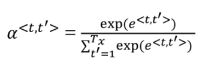

We compute `e<t,t'>` using a small neural network (usually, one hidden layer in neural network because computed a lot), with inputs :
- `s<t-1>` the neural network state from the previous time step
- `a<t'>` the features from time step t'

It seems pretty natural that `𝛼<t,t'>` and `e<t,t'>` should depend on :
- the previous activation state `s<t-1>` 
- and `a<t'>`. 

And it turns out that if you implemented this whole model and train it with gradient descent, the whole thing actually works.

One downside to this algorithm is that it does take quadratic time or quadratic cost to run this algorithm. If you have `Tx` word in input and generate `Ty` words, then the total number of these attention parameters are going to be `Tx * Ty`. Although in machine translation applications where neither input nor output sentences is usually that long maybe quadratic cost is actually acceptable. Although, there is some research work on trying to reduce costs as well.

Now, so far up in describing the attention idea in the context of machine translation. Without going too much into detail this idea has been applied to other problems as well like image captioning (look at the picture and write a caption for that picture)

> 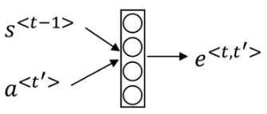

> 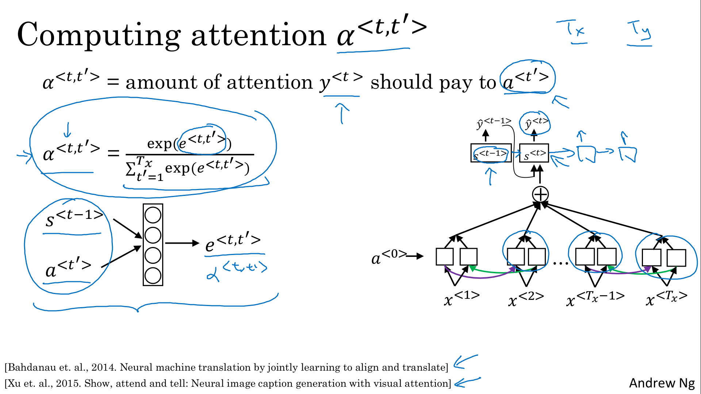

Two examples :
- Generate normalized format for a Date (cf. exercice)
- Visualization of the attention weights

> 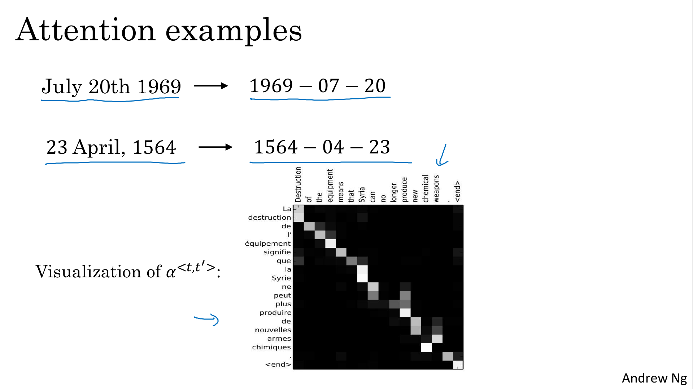

# Speech Recognition - Audio Data

##  Speech Recognition

So, what is the speech recognition problem? You're given an audio clip, and your job is to automatically find a text transcript
If you plot an audio clip :
- The horizontal axis is time 
- The vertical is changes in air pressure 

The human ear has physical structures that measures the amounts of intensity of different frequencies, and similarly a common pre-processing step for audio data is to run your raw audio clip and generate a spectrogram
- The horizontal axis is time, 
- The vertical axis is frequencies, and intensity of different colors shows the amount of energy

Once upon a time, speech recognition systems used to be built using phonemes. But with end-to-end deep learning, we're finding that phonemes representations are no longer necessary. You can built systems that input an audio clip and directly output a transcript without needing to use hand-engineered representations 

One of the things that made this possible was going to much larger data sets, 
- 300 hours for academic, 3000 h for academia
- 10,000 hours and sometimes over a 100,000 hours of audio for commercial systems

> 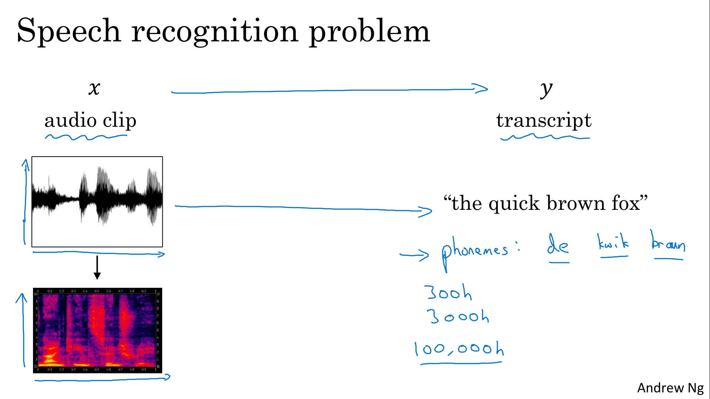

In the last video, we're talking about the attention model. So, one thing you could do is actually do that, where on the horizontal axis, you take in different time frames of the audio input, and then you have an attention model try to output the transcript like, "the quick brown fox", or what it was said

> 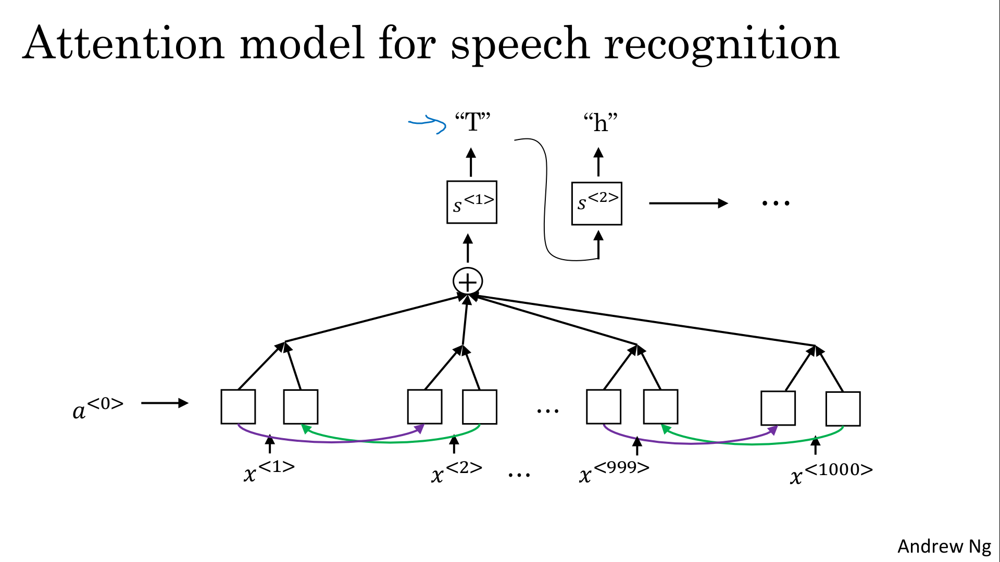

One other method that seems to work well is to use the CTC (Connection Temporal Classification) cost for speech recognition  
Note that `space` anf `blank` is different 

> 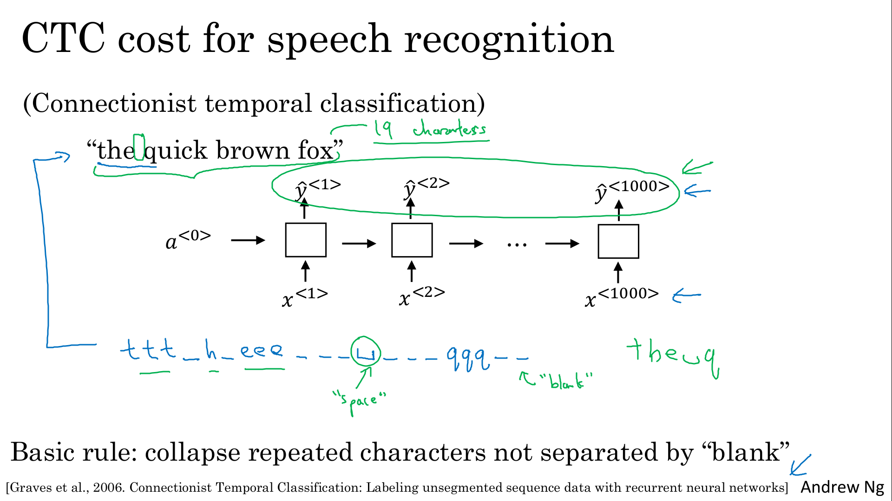

##  Trigger Word Detection

The literature on trigger detection algorithm is still evolving so there isn't wide consensus yet on what's the best algorithm for triggered word detection. So I'm just going to show you one example of an algorithm you can use :

> 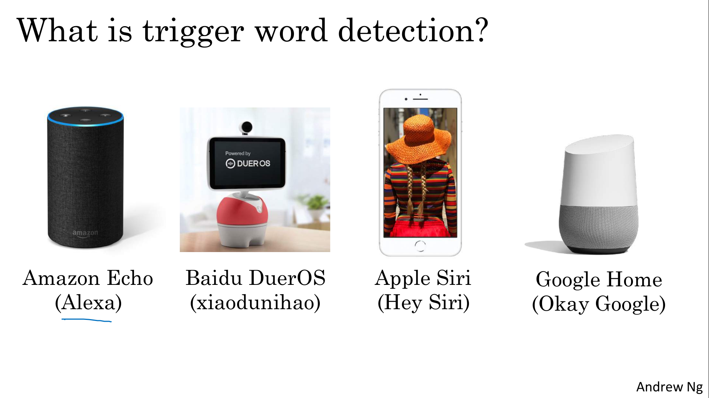

1. Process audio clip `X` to obtain `x<1>`, `x<2>`, ...
2. Label `Y` 
    - `0` represents the non-trigger word, 
    - `1` detected trigger words

One slight disadvantage of this is it creates a very imbalanced training set to have a lot more `0` than `1`. So one other thing you could do (little bit of a hack), but could make the model easier to train is to generate multiple `1` for a fixed period of time before reverting back to `0`.

> 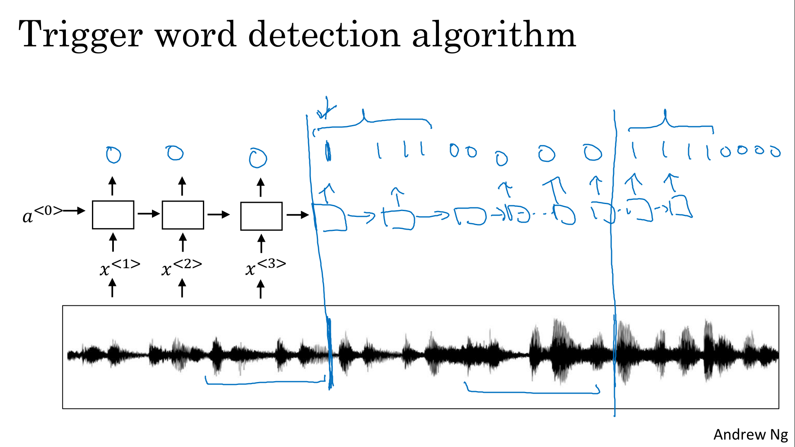