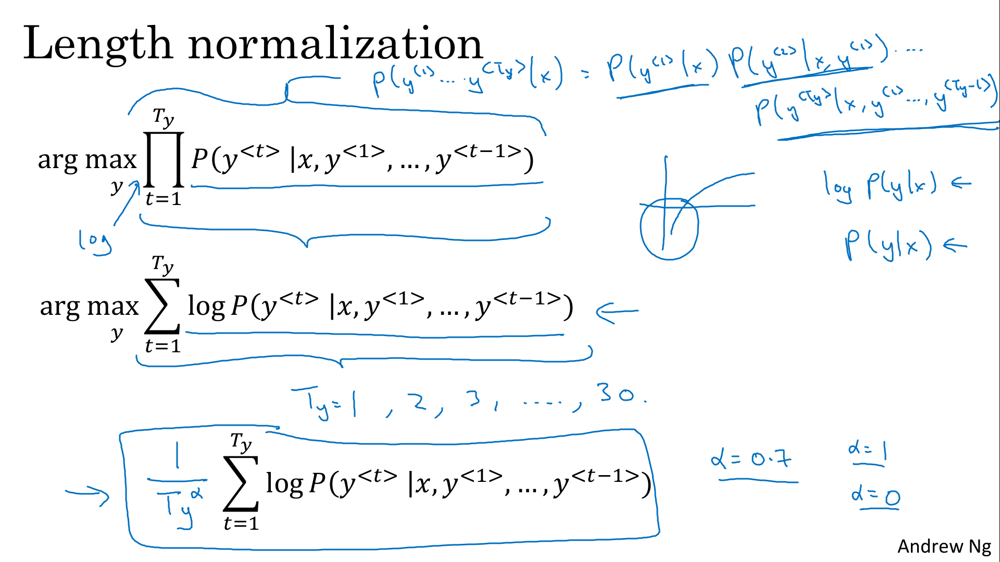

# Sequence Models & Attention Mechanism

Augment your sequence models using an attention mechanism, an algorithm that helps your model decide where to focus its attention given a sequence of inputs. Then, explore speech recognition and how to deal with audio data.

Learning Objectives
- Describe a basic sequence-to-sequence model
- Compare and contrast several different algorithms for language translation
- Optimize beam search and analyze it for errors
- Use beam search to identify likely translations
- Apply BLEU score to machine-translated text
- Implement an attention model
- Train a trigger word detection model and make predictions
- Synthesize and process audio recordings to create train/dev datasets
- Structure a speech recognition project

# Various Sequence To Sequence Architectures

##  Basic Models

> 
> 

##  Picking the Most Likely Sentence

> 
> 
> 

##  Beam Search

> 
> 
> 

##  Refinements to Beam Search

> 
> 

##  Error Analysis in Beam Search

> 
> 
> 

##  Bleu Score (Optional)

> 
> 
> 
> 

##  Attention Model Intuition

> 
> 

##  Attention Model

> 
> 
> 

# Speech Recognition - Audio Data

##  Speech Recognition

> 
> 
> 

##  Trigger Word Detection

> 
> 
