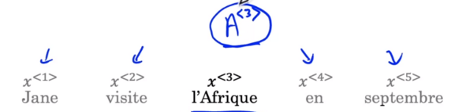
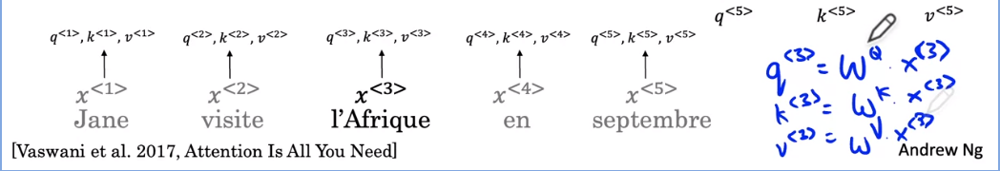
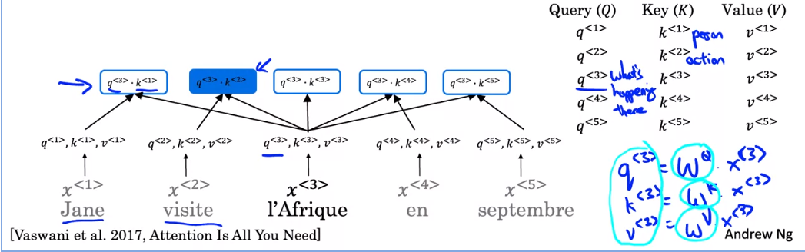
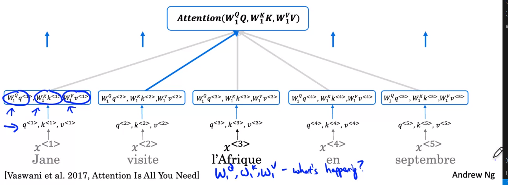
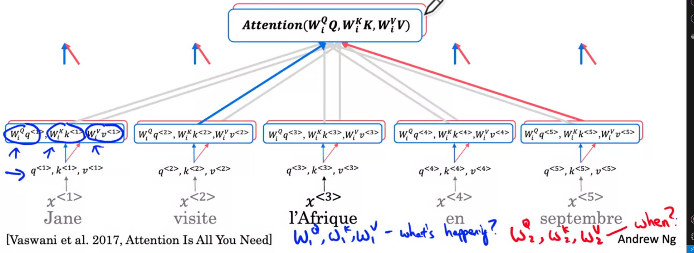
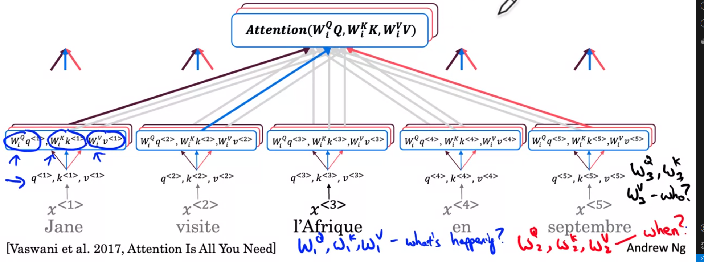

# Transformer Network

Learning Objectives
- Create positional encodings to capture sequential relationships in data
- Calculate scaled dot-product self-attention with word embeddings
- Implement masked multi-head attention
- Build and train a Transformer model
- Fine-tune a pre-trained transformer model for Named Entity Recognition
- Fine-tune a pre-trained transformer model for Question Answering
- Implement a QA model in TensorFlow and PyTorch
- Fine-tune a pre-trained transformer model to a custom dataset
- Perform extractive Question Answering

# Transformers

## Transformer Network Intuition

One of the most exciting developments in deep learning has been the transformer Network, or sometimes called Transformers. This is an architecture that has completely taken the NLP world by storm. And many of the most effective algorithms for NLP today are based on the transformer architecture.

- We have started this course with the RNN and found that it had some problems with vanishing gradients, which made it hard to capture long range dependencies and sequences. 
- We then looked at the GRU 
- And then the LSTM model as a way to resolve many of those problems where you may use of gates to control the flow of information. And so each of these units had a few more computations

So as we move from our RNNs to GRU to LSTM :
- the models became more complex.
- the models are still sequential. Each unit was like a bottleneck to the flow of information

The transformer architecture allows to run the computations for an entire sequence in parallel.

> 

The major innovation of the transformer architecture is combining 
- the use of attention based representations 
- and a CNN convolutional neural network style of processing. 

An RNN processes one output at the time. This is a very sequential way of processing tokens. It contrasts with a CNN or ConvNet that can take input a lot of pixels. Yeah, or maybe a lot of words and can compute representations for them in parallel

 To understand the attention network, there will be two key ideas 
 - Self attention
    - The goal of self attention is, if you have a sentence of 5 words, to compute 5 representations for these five words
    - In an attention based way of computing representations for all the words in your sentence in parallel 
 - Multi headed attention 
    - It's basically a for loop over the self attention process
    - So you end up with multiple versions of these representations
    
And it turns out that these representations, which will be very rich representations, can be used for machine translation or other NLP tasks to create effectiveness

> 

## Self-Attention

To use attention with a style more like CNNs, you need to calculate **self-attention**, where you compute **attention-based representations** for each of the words in your input sentence : 

|1|2|3|4|5|
|-|-|-|-|-|
|Jane|Visite|l'Afrique|en|septembre|
|`A<1>`|`A<2>`|`A<3>`|`A<4>`|`A<5>`|

One way to represent `l'Afrique` would be to just use [word embeddings](../week2/#word-representation) we've learn previously.  

But depending on the context, we could think Africa as :
- a site of historical interests 
- or as a holiday destination, 
- or as the world's second largest continent. 

Depending on how you're thinking of `l'Afrique`, you may choose to represent it differently, and that's what this representation `A<3>` will do.  

It will look at the surrounding words to try to figure out what's actually going on in how we're talking about Africa in this sentence, and find the most appropriate representation for this.

> 

In terms of the actual calculation, it won't be too different from the [attention mechanism](../week3/#attention-model) you saw previously as applied in the context of RNNs, except we'll compute these representations in parallel for all five words in a sentence. 

You can see the equations have some similarities :
- both based on softmax
- you can think of the exponent terms `q.k<i>` as being a kind of attention values.

For each word, example `A<3>` you have 3 vectors that are input values to compute the attention value for each words :
- `q<3>` called **query**
- `k<3>` called **key**
- `v<3>` called **value**

> 

Let's step through the computations you need to go from the words `l'Afrique` to the self-attention representation `A<3>`.

- `x<3>` is the word embedding for `l'Afrique,`
- We use 3 matrices, `Wq`, `Wk`, and `Wv` that are parameters of the learning algorithm that will allow to compute these query, key, and value vectors for each word. 

> 

So what are these query, key and value vectors supposed to do? They come from a loose analogy to a databases concepts where you can have queries and also key-value pairs
- `q<3>` is a question that you get to ask about l'Afrique, like : "what's happening there? "
- we compute the inner product between `q<3>` and `k<1>`, between `Query 3` and `Key 1`, and this will tell us how good word<1> (`Jane`) is to answer to the question of what's happening in Africa. 
- in our example, for intuition, we find out that `k<1>` is a person, and `k<2>` is an action, then you may find that `q<3>.k<2>` has the largest value, and this may be intuitive example that suggests that `visite`, gives you the most relevant contexts for what's happening about `l'Afrique`. 

> 

- then we compute a softmax function over these 5 values
- then multiply by `v<i>`
- and sum them over `i`

> 

## Multi-Head Attention

Let's jump in and learn about the multi head attention mechanism. The notation gets a little bit complicated, but the thing to keep in mind is basically just a big four loop over the self attention mechanism that you learned about in the last video.

> 

Each time you calculate self attention for a sequence is called a `head`.

### First head

For the sake of intuition, you might find it useful to think of $W_1^Q$, $W_1^K$ and $W_1^V$ as being learned to help ask and answer the question, `what's happening ?` 

We could see on diagram that word `visite` gives the best answer (highlighted blue arrow)

> 

$W_2^Q$, $W_2^K$ and $W_2^V$ as being learned to help ask and answer the question, `when ?` 

We could see on diagram that word `septembre` gives the best answer (highlighted red arrow)

> 

$W_3^Q$, $W_3^K$ and $W_3^V$ as being learned to help ask and answer the question, `who ?` 

We could see on diagram that word `Jane` gives the best answer (highlighted black arrow)

> 

In this conceptual description of multi head attention, I described computing these different values for the different heads as if you would do them in a big `for loop`. But in practice you can actually compute these different heads values in parallel because no one has value depends on the value of any other head.

## Transformer Network

> 

# Conclusion

## Conclusion and Thank You!

> 
> 
