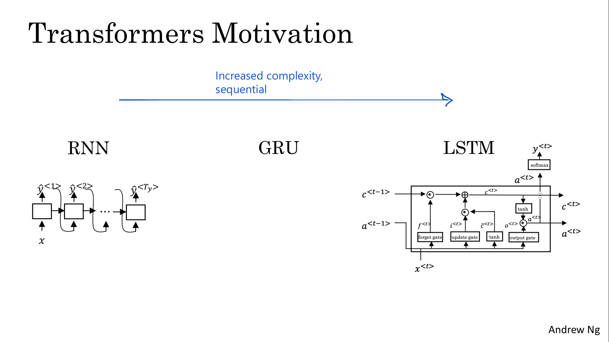
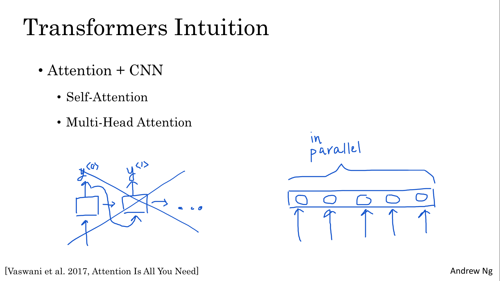
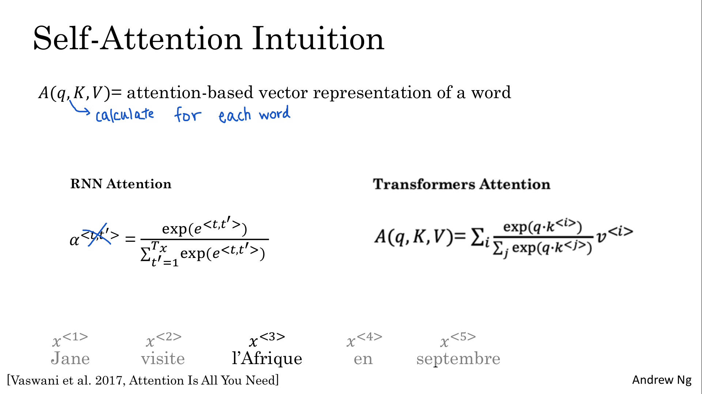
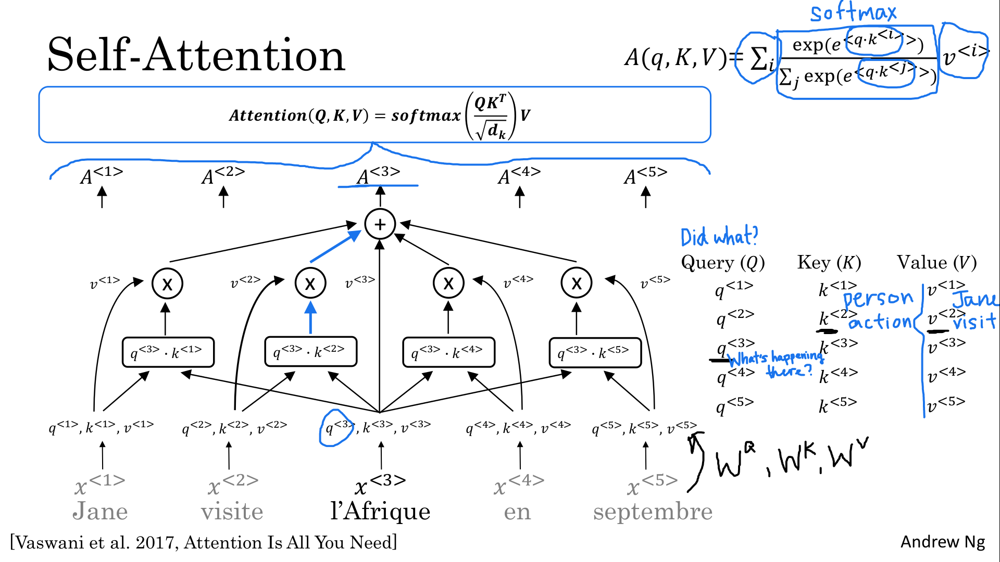
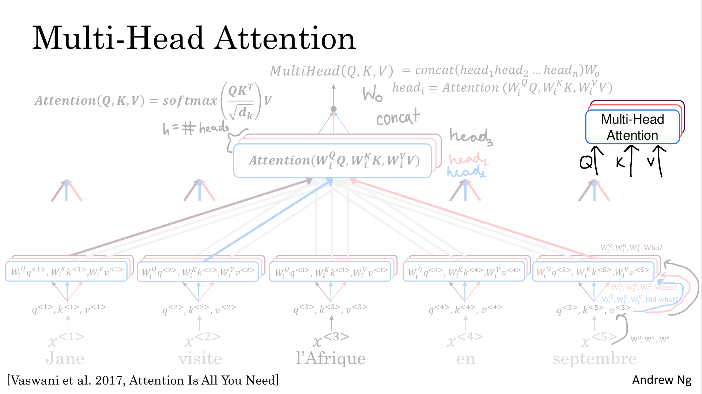
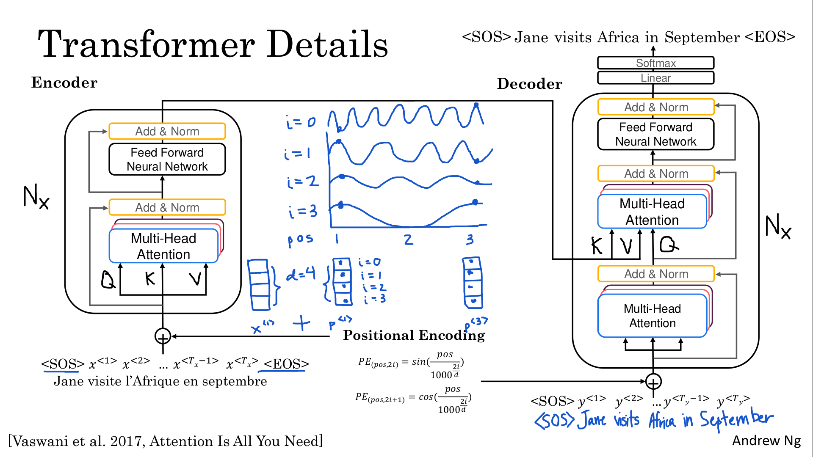
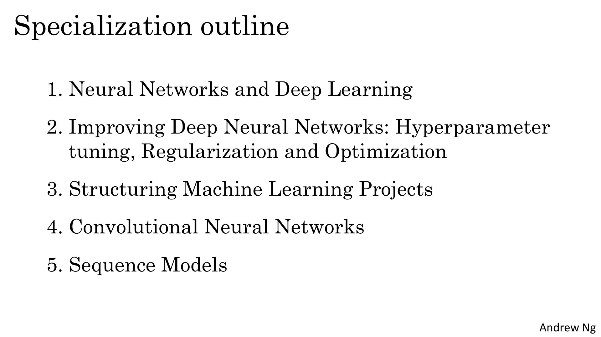
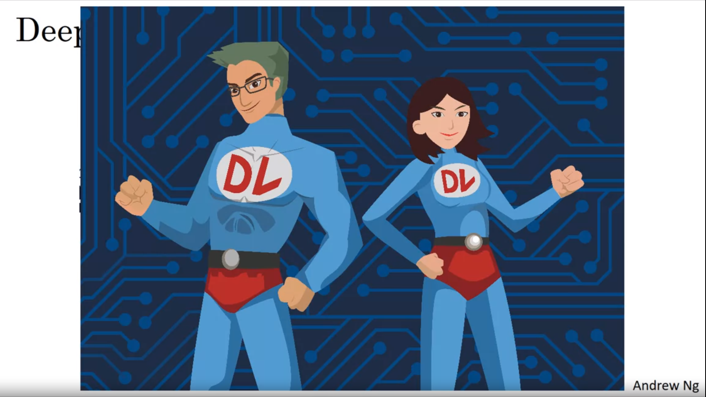

# Transformer Network

Learning Objectives
- Create positional encodings to capture sequential relationships in data
- Calculate scaled dot-product self-attention with word embeddings
- Implement masked multi-head attention
- Build and train a Transformer model
- Fine-tune a pre-trained transformer model for Named Entity Recognition
- Fine-tune a pre-trained transformer model for Question Answering
- Implement a QA model in TensorFlow and PyTorch
- Fine-tune a pre-trained transformer model to a custom dataset
- Perform extractive Question Answering

# Transformers

## Transformer Network Intuition

One of the most exciting developments in deep learning has been the transformer Network, or sometimes called Transformers. This is an architecture that has completely taken the NLP world by storm. And many of the most effective algorithms for NLP today are based on the transformer architecture.

- We have started this course with the RNN and found that it had some problems with vanishing gradients, which made it hard to capture long range dependencies and sequences. 
- We then looked at the GRU 
- And then the LSTM model as a way to resolve many of those problems where you may use of gates to control the flow of information. And so each of these units had a few more computations

So as we move from our RNNs to GRU to LSTM :
- the models became more complex.
- the models are still sequential. Each unit was like a bottleneck to the flow of information

The transformer architecture allows to run the computations for an entire sequence in parallel.

> 

The major innovation of the transformer architecture is combining 
- the use of attention based representations 
- and a CNN convolutional neural network style of processing. 

An RNN processes one output at the time. This is a very sequential way of processing tokens. It contrasts with a CNN or ConvNet that can take input a lot of pixels. Yeah, or maybe a lot of words and can compute representations for them in parallel
> 

## Self-Attention

> 
> 

## Multi-Head Attention

> 

## Transformer Network

> 

# Conclusion

## Conclusion and Thank You!

> 
> 
