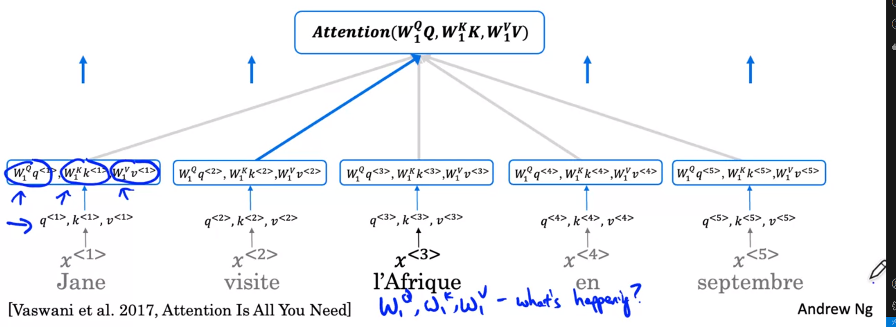
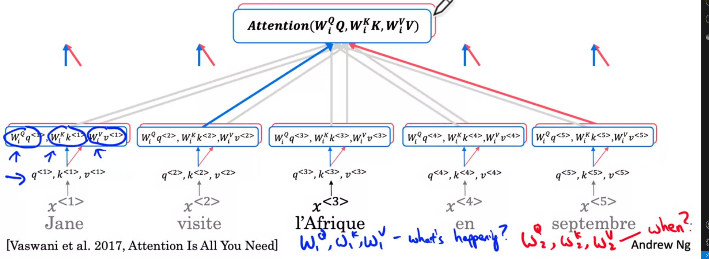
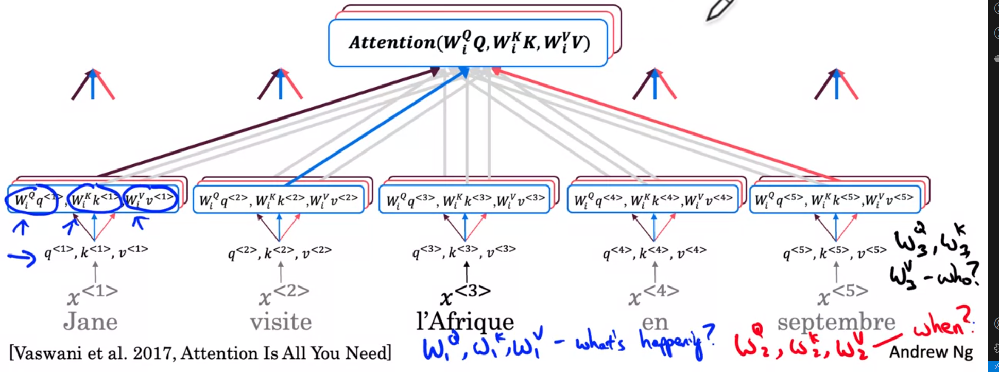
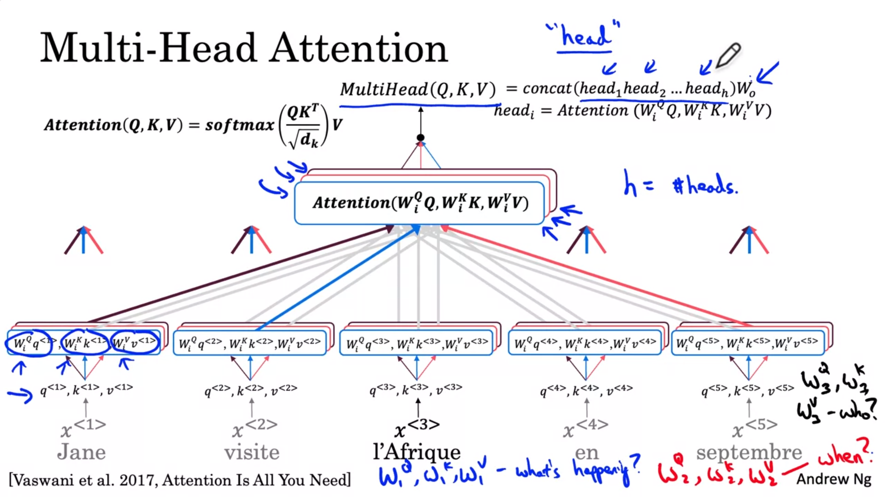
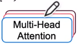
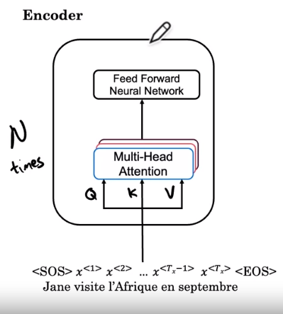
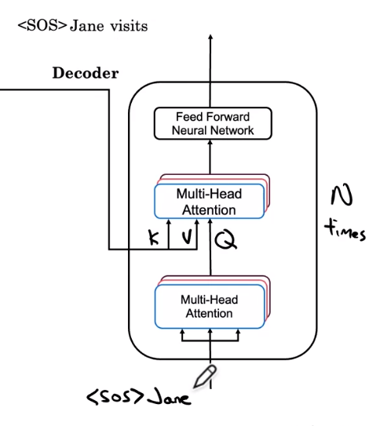
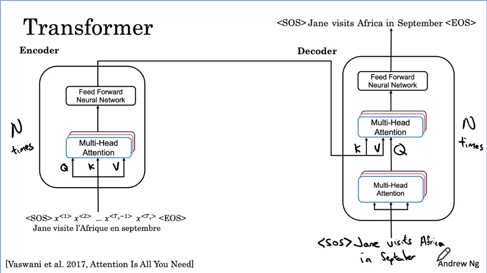
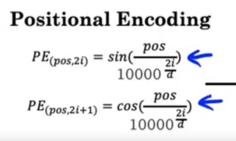
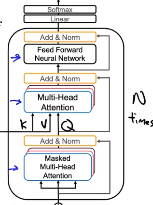

# Transformer Network
{: .no_toc}

Learning Objectives
- Create positional encodings to capture sequential relationships in data
- Calculate scaled dot-product self-attention with word embeddings
- Implement masked multi-head attention
- Build and train a Transformer model
- Fine-tune a pre-trained transformer model for Named Entity Recognition
- Fine-tune a pre-trained transformer model for Question Answering
- Implement a QA model in TensorFlow and PyTorch
- Fine-tune a pre-trained transformer model to a custom dataset
- Perform extractive Question Answering

  

    Table of contents
  

  {: .text-delta }
1. TOC
{:toc}

# Transformers

## Transformer Network Intuition

One of the most exciting developments in deep learning has been the transformer Network, or sometimes called Transformers. This is an architecture that has completely taken the NLP world by storm. And many of the most effective algorithms for NLP today are based on the transformer architecture.

- We have started this course with the RNN and found that it had some problems with vanishing gradients, which made it hard to capture long range dependencies and sequences. 
- We then looked at the GRU 
- And then the LSTM model as a way to resolve many of those problems where you may use of gates to control the flow of information. And so each of these units had a few more computations

So as we move from our RNNs to GRU to LSTM :
- the models became more complex.
- the models are still sequential. Each unit was like a bottleneck to the flow of information

The transformer architecture allows to run the computations for an entire sequence in parallel.

> 

The major innovation of the transformer architecture is combining 
- the use of attention based representations 
- and a CNN convolutional neural network style of processing. 

An RNN processes one output at the time. This is a very sequential way of processing tokens. It contrasts with a CNN or ConvNet that can take input a lot of pixels. Yeah, or maybe a lot of words and can compute representations for them in parallel

 To understand the attention network, there will be two key ideas 
 - Self attention
    - The goal of self attention is, if you have a sentence of 5 words, to compute 5 representations for these five words
    - In an attention based way of computing representations for all the words in your sentence in parallel 
 - Multi headed attention 
    - It's basically a for loop over the self attention process
    - So you end up with multiple versions of these representations
    
And it turns out that these representations, which will be very rich representations, can be used for machine translation or other NLP tasks to create effectiveness

> 

## Self-Attention

To use attention with a style more like CNNs, you need to calculate **self-attention**, where you compute **attention-based representations** for each of the words in your input sentence : 

|1|2|3|4|5|
|-|-|-|-|-|
|Jane|Visite|l'Afrique|en|septembre|
|`A<1>`|`A<2>`|`A<3>`|`A<4>`|`A<5>`|

One way to represent `l'Afrique` would be to just use [word embeddings](../week2/#word-representation) we've learn previously.  

But depending on the context, we could think Africa as :
- a site of historical interests 
- or as a holiday destination, 
- or as the world's second largest continent. 

Depending on how you're thinking of `l'Afrique`, you may choose to represent it differently, and that's what this representation `A<3>` will do.  

It will look at the surrounding words to try to figure out what's actually going on in how we're talking about Africa in this sentence, and find the most appropriate representation for this.

> 

In terms of the actual calculation, it won't be too different from the [attention mechanism](../week3/#attention-model) you saw previously as applied in the context of RNNs, except we'll compute these representations in parallel for all five words in a sentence. 

You can see the equations have some similarities :
- both based on softmax
- you can think of the exponent terms `q.k<i>` as being a kind of attention values.

For each word, example `A<3>` you have 3 vectors that are input values to compute the attention value for each words :
- `q<3>` called **query**
- `k<3>` called **key**
- `v<3>` called **value**

> 

Let's step through the computations you need to go from the words `l'Afrique` to the self-attention representation `A<3>`.

- `x<3>` is the word embedding for `l'Afrique,`
- We use 3 matrices, `Wq`, `Wk`, and `Wv` that are parameters of the learning algorithm that will allow to compute these query, key, and value vectors for each word. 

> 

So what are these query, key and value vectors supposed to do? They come from a loose analogy to a databases concepts where you can have queries and also key-value pairs
- `q<3>` is a question that you get to ask about l'Afrique, like : "what's happening there? "
- we compute the inner product between `q<3>` and `k<1>`, between `Query 3` and `Key 1`, and this will tell us how good word<1> (`Jane`) is to answer to the question of what's happening in Africa. 
- in our example, for intuition, we find out that `k<1>` is a person, and `k<2>` is an action, then you may find that `q<3>.k<2>` has the largest value, and this may be intuitive example that suggests that `visite`, gives you the most relevant contexts for what's happening about `l'Afrique`. 

> 

- then we compute a softmax function over these 5 values
- then multiply by `v<i>`
- and sum them over `i`

> 

## Multi-Head Attention

Let's jump in and learn about the multi head attention mechanism. The notation gets a little bit complicated, but the thing to keep in mind is basically just a big four loop over the self attention mechanism that you learned about in the last video.

Each time you calculate self attention for a sequence is called a `head`.

### First head

For the sake of intuition, you might find it useful to think of $W_1^Q$, $W_1^K$ and $W_1^V$ as being learned to help ask and answer the question, `what's happening ?` 

We could see on diagram that word `visite` gives the best answer (highlighted blue arrow)

> 

### Second head

$W_2^Q$, $W_2^K$ and $W_2^V$ as being learned to help ask and answer the question, `when ?` 

We could see on diagram that word `septembre` gives the best answer (highlighted red arrow)

> 

### Third head

$W_3^Q$, $W_3^K$ and $W_3^V$ as being learned to help ask and answer the question, `who ?` 

We could see on diagram that word `Jane` gives the best answer (highlighted black arrow)

> 

### Multi-head together

In the literature, the number of heads is usually represented by the lower case letter `h`.

And you can think of each of these `heads` as a different feature. And when you pass these features to a new network you can calculate a very rich representation of the sentence. 

Calculating the output of the multi headed attention is :
1. computing the `h` heads 
2. then using the concatenation 
3. And then finally multiplied by a matrix $W_0$

> 

In this conceptual description of multi head attention, I described computing these different values for the different heads as if you would do them in a big `for loop`. But in practice you can actually compute these different heads values in parallel because no one has value depends on the value of any other head.

In the next slide, we use the following formalism to represent all the components described in this section

> 

## Transformer Network

### Encoder

You've learned about self attention, you've learned about multi headed attention. Let's put it all together to build a transformer network.

Up until this point, for the sake of simplicity, I've only been talking about the embeddings for the words in the sentence. But in many sequences sequence translation task, will be useful to also at the start of sentence or the `<SOS>` and the end of sentence or the `<EOS>` tokens which I have in this example.

So this is exactly what you saw on the last slide where you feed in the values Q K and V computed from the embeddings and the weight matrices W. This layer then produces a matrix that can be passed into a feed forward neural network. Which helps determine what interesting features there are in the sentence. In the transformer paper, this block, this encoding block is repeated N times and a typical value for N is six.

This layer then produces a matrix that can be passed into a **feed forward neural network** which helps determine what interesting features there are in the sentence. In the transformer paper, this block, this encoding block is repeated N times and a typical value for N is 6.

> 

So after, maybe about six times through this block, we will then feed the output of the encoder into a decoder block. 

### Decoder

The decoders block's job is output the English translation.

- First multi-headed attention block
   - When we're just getting started, the only thing we know is that the translation will start with `<SOS>` token that is used to compute `Q`, `K` and `V` for first multi-headed attention block.
- Second multi-headed attention block
   - This first blocks, output is used to generate the `Q` matrix for the next multi head attention block.
   - And the output of the encoder is used to generate `K` and `V`. 
- the multi- head detention block outputs the values which are fed to feed for neural network. 

This decoder block is also going to be repeated N times, maybe 6 times where you take the output and feed it back to the input. And the job of this new network is to predict the next word in the sentence that will be taken as input

> 

### Connecting Encoder and Decoder

> 

But beyond these main ideas, there are a few extra bells and whistles to transform it. Let me brief these steps through these extra bells and whistles that makes the transformer network work even better.

#### Positional encoding of the input

If you recall the self attention equations, there's nothing that indicates the position of a word. Is this word, the first word in the sentence, in the middle of the last word in the sentence. But the position within the sentence can be extremely important to translation. 

> 

So let's say for example that your word embedding is a vector with 4 values. We create a positional encoding vector of the same dimension p<1> for x<1>

In this equation, 
- `pos` denotes the numerical position of the word (Jane, `pos` is equal to `1`)
- `i` refers to the different dimensions of the encoding 
- `d` is equal to 4 as the dimension of this factor. 

The position encoding is unique for each word

In addition to adding these position encodings to the embeddings, you'd also pass them through the network with **residual connections**. These residual connections are similar to those you previously seen in the [resNet](../../c4-convolutional-neural-netowrks/week2/#resnets). And their purpose in this case is to pass along positional information through the entire architecture.

#### Add and norm

In addition to positional encoding, the transformer network also uses a layer very similar to a [batch norm](../../c2-improving-deep-neural-networks/week3/#why-does-batch-norm-work). 

That is very similar to the batch norm layer that you're already familiar with. For the purpose of this video, don't worry about the differences. Think of it as playing a role very similar to the batch norm and just helps speed up learning. 

#### Output Linear and softmax layer

And finally for the output of the decoder block, there's actually also a linear and then a softmax layer to predict the next word one word at a time.

> 

### Masked multi-head attention

In case you read the literature on the transformer network, you may also hear something called the **masked multi-head attention**. We should only draw it over here. Mast multi -head attention is important only during the training process 

> 

Masked multi-head attention is important only during the training process where you're using a data set of correct french to English translations to train your transformer.

So previously we step through how the transformer performs prediction, one word at the time, but how does it train?

Let's say your data set has the correct french to English translation, `Jane Visite freak on September` and `Jane visits Africa in September`. When training you have access to the entire correct English translation. And because you have the full correct output you don't actually have to generate the words one at a time during training. Instead, what masking does is it blocks out the last part of the sentence to mimic what the network will need to do at test time or during prediction. 

In other words, all that masked multi-head attention does is repeatedly pretends that the network had perfectly translated the first few words and hides the remaining words to see if, given a perfect first part of the translation, the neural network can predict the next word in the sequence accurately.

Since the paper attention is all you need came out, there have been many other iterations of this model such as BERT or DistilBERT, which you get to explore yourself this week.

# Conclusion

## Conclusion and Thank You!

> 
> 
